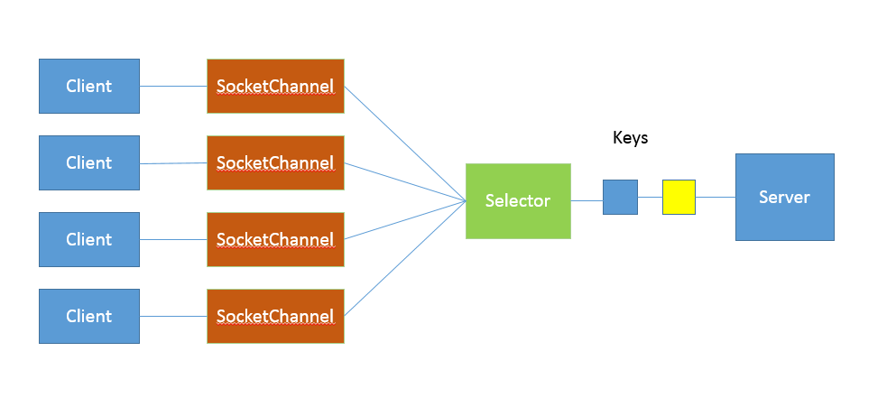

# 模块一 Java基础

## 第1讲 | 谈谈你对Java平台的理解？

> 标准回答

1. Java本身是一种面向对象语言，最显著的特性有两个方面
   - “书写一次，到处运行”（Write once，run anywhere），能够非常容易的获取跨平台能力
   - 垃圾收集（GC，Garbage Collection），Java通过垃圾回收器（GC）回收分配内存，大部分情况下，程序员不需要自己操心内存的分配和回收
2. Java的运行环境
   - JRE（Java Runtime Environment），Java运行环境，包含JVM和java类库，以及一些模块等
   - JDK（Java Development Kit），可以看做JRE的超集，提供了更多的工具，比如编译器各种诊断工具等
3. “Java是解释执行”的理解
   - java的源代码，首先会通过javac编译成字节码（bytecode）
   - 然后再运行时，通过Java虚拟机（JVM）内嵌的`解释器`将`字节码`解释转换成最终的`机器码`
   - 但是常见的JVM，例如Oracle JDK提供的Hotspot JVM，提供了JIT（Just In Time）编译器，就是通常所说的`动态编译器`
   - JIT能够在运行的时候，将`热点代码`编译成`机器码`，这种情况下部分的热点代码就属于`编译执行`，而不再是解释执行了

> 知识拓展

对于java平台的理解，可以从其他方面简明扼要的描述，例如

- Java语言特性：包括泛型，Lambda等语言特性
- 基础类库：包括集合，IO/NIO，网络，并发，安全等基础类库
- JVM的基础概念还有机制：java类的加载机制，常用JDK版本内嵌的Class-Loader，垃圾回收器的原理等


> java的解释执行和编译执行

java通常被分为编译期和运行时，javac将java源代码编译成“.class”文件，文件中是字节码，然后运行在jvm虚拟机上。Java通过字节码和Java虚拟机（JVM）这种跨平台的抽象，屏蔽了操作系统和硬件的细节，这个也是实现“一次编译，到处运行”的基础。


在运行时，java会通过类加载器（Class-Loader）加载字节码，解释或者编译执行。

- 在主流Java的版本中，如JDK8实际是解释和编译混合的一种模式，即所谓的混合模式（-Xmixed）。
- 通常运行在server模式的JVM，会进行成千上万次调用以收集足够的信息进行高效的编译，
- client模式的门限是1500次
- Oracle HotSpot JVM 内置了两个不同的 JIT compiler
  - C1模式对应client模式，适用于对于启动速度敏感的应用，比如普通的java桌面应用
  - C2对应server模式，它的优化是为了长时间运行的服务端应用设置的


JVM虚拟机启动的时候，可能指定不同的参数对运行模式进行选择

- 指定 “-Xint” ，就是告诉JVM只能解释执行，不对代码进行编译，这种模式抛弃是JIT可能带来的性能优势。毕竟解释器（interpreter）是逐条读入的，逐条解释运行的。
- “-Xcomp”，告诉JVM关闭解释器，不要进行解释执行，或者叫做最大优化级别。但是这个方式会导致JVM启动变慢了很多。同时有些JIT编译器优化方式，比如分支预测，如果不进行profiling（剖析），往往并不能进行有效优化。

除了常用的java的使用模式（混合模式，解释执行，编译执行），还有一种新的编译方式，就是AOT（Ahead-of-Time Compilation），直接将字节码编译成机器代码，避免了JIT的预热的各方面的开销。比如Oracle JDK 9就引入实验性的AOT特性，并且增加了jaotc工具。利用一下命令可以把某个类或者某个模块编译成AOT库

```java

jaotc --output libHelloWorld.so HelloWorld.class
jaotc --output libjava.base.so --module java.base
```

然后在启动的时候指定即可

```java

java -XX:AOTLibrary=./libHelloWorld.so,./libjava.base.so HelloWorld
```

而且，Oracle JDK 支持分层编译和 AOT 协作使用，这两者并不是二选一的关系。

参考相关文档：http://openjdk.java.net/jeps/295


> 对于解释器和编译器的理解

https://www.cnblogs.com/zhanghongqiang/p/4431216.html

**Java编译器（javac.exe）**: 将java源程序编译成中间代码字节码文件（.class文件），是最基本的开发工具

**Java解释器（java.exe）**: 又译为`直译器`是一种电脑程序，能够把高级编译语言一行一行直接转译运行。解释器不会一次把整个程序转译出来，而是每次运行程序的时候都要先转成另一种语言再作运行，因此解释器的运行速度比较慢。它是需要一行一行的转译程序。

Java应用程序的开发周期包括编译、下载 、解释和执行几个部分

- **Java编译程序**将Java源程序翻译为JVM可执行的字节码。
- **Java编译器**却不将对变量和方法的引用编译为数值引用，也不确定程序执行过程中的内存布局，而是将这些符号引用信息保留在字节码中，由解释器在运行过程中创立内存布局，然后再通过查表来确定一个方法所在的地址。这样就有效的保证了Java的可移植性和安全性。
- 运行JVM字节码的工作是由**解释器**来完成的。解释执行过程分三部进行：`代码的装入`、`代码的校验`和`代码的执行`。


Java字节码的执行有两种方式：

- 即时编译方式：解释器先将字节码编译成机器码，然后再执行该机器码。
- 解释执行方式：解释器通过每次解释并执行一小段代码来完成Java字节码程 序的所有操作。
- 通常采用的是第二种方法。由于JVM规格描述具有足够的灵活性，这使得将字节码翻译为机器代码的工作具有较高的效率。


> 精华理解

需要强调的一点是，java并不是编译机制，而是解释机制。Java字节码的设计充分考虑了JIT这一即时编译方式，可以将字节码直接转化成高性能的本地机器码，这同样是虚拟机的一个构成部分。

Java特性：

- 面向对象（封装，继承，多态）
- 平台无关性（JVM运行.Class文件）
- 语言（泛型，Lambda表达式）
- 类库（集合，并发，网络，IO/NIO）
- JRE（Java运行环境，JVM，类库）
- JDK（Java开发工具，包括JRE，javac，诊断工具）


Java是解析运行么？

​	不正确

- Java源代码经过javac编译成字节码文件（.class文件）
- .class文件再经过JVM解释或者编译运行
  - 解释：.class文件经过JVM内嵌的解释器解释执行
  - 编译：存在JIT（Just In Time Compiler 即时编译器）把经常运行的代码作为`热点代码`编译与本地平台相关的机器码，并进行各种层次的优化
  - AOT编译器：Java 9 提供的 直接将所有代码编译成机器码执行

## 第2讲 | Exception和Error有什么区别？

> 典型回答

Exception和Error都是集成Throwable类，在java中只有Throwable类型的实例才可以被抛出（throw）或者捕获（catch），它是异常处理机制的基本组成类型。

Error是指绝大情况下，不可能出现的情况。绝大部分的Error会导致程序（比如JVM自身）处于非正常的、不可恢复的状态，既然是非正常的情况，所以不便于也不需要进行捕捉，常见的比如说OutOfMemoryError之类，都是Error的子类。

Exception是程序正在运行中，可以预料的意外情况，可能并且应该被捕获，进行相应的处理。

Exception又分为可检查（checked）异常和不可检查（unchecked）异常

- 可检查异常在源代码里必须显示的进行捕获处理，这是编译期检查的一部分
- 不可检查异常就是所谓的运行时异常，RuntimeExecpiton,除此异常外都是可检查异常。类似NullPointerException、ArrayIndexOutOfMemoryError之类，通常是可以编码避免的逻辑错误，具体根据需要来判断是否需要捕获，并不会在编译期强制要求


> 考点分析

**1、理解Throwable，Exception、Error的设计和分类**

Throwable常见子类

- Exception
  - NoSuchFileException（找不到字段）
  - InstantiationException（实例化异常）
  - NoSuchMethodException（找不到方法）
  - ClassNotFountException（找不到类）
  - SQLException（SQL异常）
  - IOException（IO异常）
    - EOFException（文件已结束）
    - FileNotFoundException（文件未找到）
  - RuntimeException
    - StringIndexOutOfBoundsException（字符串索引越界）
    - ClassCastException（类型转换异常）
    - ArrayIndexOutOfMemoryError（数组索引越界）
    - SecurityException（安全异常）
    - NullPointException（空指针异常）
    - NumberFormatException（转换数字异常）
- Error
  - ThreadDeath（线程死亡）
  - VirtualMachineError（虚拟机错误）
    - UnknownError（未知错误）
    - OutOfMemoryError（内存溢出错误）
    - StackOverflowError（栈溢出错误）
    - InternalError（内部错误）
      - ZipError（Zip错误）

**2、NoClassDefFoundError 和 ClassNotFoundException 有什么区别？**

当应用程序运行的过程中尝试使用类加载器去加载Class文件的时候，如果没有在classpath中查找到指定的类，就会抛出ClassNotFoundException。

一般情况下，当我们使用Class.forName()或者ClassLoader.loadClass以及使用ClassLoader.findSystemClass()在运行时加载类的时候，如果类没有被找到，那么就会导致JVM抛出ClassNotFoundException。


当JVM在加载一个类的时候，如果这个类在编译时是可用的，但是在运行时找不到这个类的定义的时候，JVM就会抛出一个NoClassDefFoundError错误。比如当我们在new一个类的实例的时候，如果在运行是类找不到，则会抛出一个NoClassDefFoundError的错误。

3、针对异常的处理方式

try-catch-finally 块，throw、throws

> 知识扩展

**异常处理的基本原则**

- 尽量不要捕获类似Exception这样的通用异常，而是应该捕获特定异常。保证程序不会捕获到我们不希望捕获的异常。
- 不要生吞（swallow）异常，就是不要在catch之后不做出任处理，这样会导致出现问题后很难去判断错误究竟在哪。
- 捕获异常之后尽量不要使用`e.printStackTrace();`，会导致很难判断异常到底输出到哪里去了。


**Throw early，catch late原则**

所谓的**Throw early**原则指的是"让错误尽早被抛出"，不要等到我们的代码执行到一半再抛出异常，这样很有可能导致一部分的变量处于异常状态，从而引发出更多的错误

```java

/**
 *
 * 针对fileName为null的情况应该在使用这个参数之前就进行校验，并且抛出异常
 */
public void readPreferences(String fileName){
    //...perform operations...
    InputStream in = new FileInputStream(fileName);
    //...read the preferences file...
}
```

**Catch late**原则的意思是捕获异常后，如果不知道如何处理，应该选择保留原有异常的cause信息，直接选择抛出或者构成新的异常抛出。等到了更高的层面再选择捕获处理。
 原因在于，到了更高的层面，我们的业务逻辑会变得更加清晰，这个时候我们会更清楚合适的处理方法。


**从性能角度分析Java的异常处理：**

- try-catch代码段会产生额外的性能开销，或者换个角度说，它往往会影响JVM对代码进行优化，所以建议仅捕获有必要的代码段，尽量不要一个大的try包住整段的代码。
- Java 每实例化一个 Exception，都会对当时的栈进行快照，这是一个相对比较重的操作。如果发生的非常频繁，这个开销可就不能被忽略了。

> 问题思考：

对于异常处理编程，不同的编程范式也会影响到异常处理策略，比如，现在非常火热的反应式编程（Reactive Stream），因为其本身是异步、基于事件机制的，所以出现异常情况，决不能简单抛出去。可以有什么好的方式处理？


另外，由于代码堆栈不再是同步调用那种垂直的结构，这里的异常处理和日志需要更加小心，我们看到的往往是特定 executor 的堆栈，而不是业务方法调用关系。对于这种情况，有什么好的方式处理？


## 第3讲 | 谈谈final、finally、 finalize有什么不同？

> 典型回答

final用来修饰类，方法，变量。final修饰的类代表不可以集成，final修饰的变量代表不可以修改，而final修饰的方法表示不可以重写。

finally则是Java保证重点代码一定要被执行的一种机制。我们可以使用try-finally或者try-catch-finally来进行类似关闭JDBC链接，保证unlock锁等动作。

finalize是基础类java.lang.Obect的一个方法。它的设计目的是保证对象在垃圾收集之前完成特定资源的回收。finalize机制现在已经不推荐使用，并且在JDK9开始被标记为的deprecated。

> 考点分析

考察你对性能、并发、对象生命周期或垃圾收集基本过程等方面的理解。

推荐使用 final 关键字来明确表示我们代码的语义、逻辑意图，这已经被证明在很多场景下是非常好的实践

- 我们可以将方法声明为final，这样就可以明确的告知别人，这些行为是不许修改的
- 使用final修饰参数或者变量，可以清楚地避免意外赋值导致的编程错误，甚至有人明确推荐将所有的方法参数、本地变量、成员变量生命成final
- final变量产生了某种程度的不可变（immutable）的效果，所以，可以用于保护只读数据，尤其是在并发编程中，因为明确的不能再赋值final的值，有利于减少额外的同步开销，可以省去一些防御性拷贝的必要

对于 finally，明确知道怎么使用就足够了。需要关闭的连接等资源，更推荐使用 Java 7 中添加的 try-with-resources 语句，因为通常 Java 平台能够更好地处理异常情况

对于 finalize，我们要明确它是不推荐使用的，业界实践一再证明它不是个好的办法，在 Java 9 中，甚至明确将 Object.finalize() 标记为 deprecated！如果没有特别的原因，不要实现 finalize 方法，也不要指望利用它来进行资源回收。


> 知识扩展

**1、final不是immutable**

例如以下代码：

```java
 final List<String> strList = new ArrayList<>();
 strList.add("Hello");
 strList.add("world");  
//List.of()方法创建的本身就是不可变的，所以unmodifiableStrList.add 就会抛出异常
 List<String> unmodifiableStrList = List.of("hello", "world");
 unmodifiableStrList.add("again");
```

final只能够约束strList这个引用不可以被复制，但是strList对象的行为不会被final影响，依然可以继续add添加元素。

如果真的希望对象本身不是可变的，那么需要相应的类支持不可变的行为。


**2、finalize真的这么不堪？**

finalize 的执行是和垃圾收集关联在一起的，一旦实现了非空的 finalize 方法，就会导致相应对象回收呈现数量级上的变慢

finalize 被设计成在对象被垃圾收集前调用，这就意味着实现了 finalize 方法的对象是个“特殊公民”，JVM 要对它进行额外处理。finalize 本质上成为了快速回收的阻碍者，可能导致你的对象经过多个垃圾收集周期才能被回收。

从另一个角度，我们要确保回收资源就是因为资源都是有限的，垃圾收集时间的不可预测，可能会极大加剧资源占用。这意味着对于消耗非常高频的资源，千万不要指望 finalize 去承担资源释放的主要职责，最多让 finalize 作为最后的“守门员”，况且它已经暴露了如此多的问题。


3、有什么机制可以替换finalize码？

Java 平台目前在逐步使用 java.lang.ref.Cleaner 来替换掉原有的 finalize 实现。**Cleaner** 的实现利用了幻象引用（PhantomReference），这是一种常见的所谓 post-mortem 清理机制。

吸取了 finalize 里的教训，每个 Cleaner 的操作都是独立的，它有自己的运行线程，所以可以避免意外死锁等问题。

> 引申思考

**1、什么是immutable？**


**2、Cleaner的大致内容？**


## 第4讲 | 强引用、软引用、弱引用、幻象引用有什么区别？

> 典型回答

不同的引用类型，主要体现的是**对象不同的可达性（reachable）状态和垃圾收集的影响**

**强引用（“Strong” Reference）**

- 最常见的普通对象引用，只要还有强引用指向一个对象，那么这个对象就表示还“活着”，垃圾收集器就不会碰这种对象。对
- 于一个普通的对象，如果没有其他的引用关系，只要超过了引用的作用域或者显式的将相应（强）引用复制为null，就是可以被垃圾收集了，具体回收时机还是要看垃圾收集策略。

**软引用（Soft Reference）**

- 是一种相对强引用弱化了一些的引用，可以让一些对象豁免垃圾收集，只有当JVM认为内存不足的时候，才会去视图回收软引用所指向的对象。
- JVM会在抛出OutOfMemoryError之前，清理所有软引用对象。
- 软引用通常用来实现内存敏感的缓存，如果内存还有空闲，就可以暂时保留缓存，当内存不足时清理掉，这样就保证了使用缓存的同事，不会耗尽内存。

**弱引用（Weak Reference）**

- 并不能使对象豁免垃圾收集，仅仅是提供了一种访问在弱引用状态下对象的途径，这就可以用来构建一种没有特定约束的关系
- 比如，维护一种非强制的映射关系，如果试图获取对象的时候，对象还在就使用它，对象不在就重新实例化。它同样是很多缓存实现的选择

虚引用/幻象引用（Phantom reference）

- 不能通过它访问对象。
- 虚引用仅仅提供了一种确保对象被finalize之后，做某些事情的机制
- 比如通常用来做所谓的Post-Mortem清理机制

> 知识扩展

**1、对象可达性状态流转分析**


该图定义了Java的不同可达级别（reachability level）

- 强可达（Strongly Reachable），就是当一个对象可以有一个或者多个线程可以不通过各种引用就可以访问到的情况。比如新创建一个对象，那么创建它的线程对它就是强可达
- 软可达（Softly Reachable），就是当我们通过软引用才能够访问到的对象
- 弱可达（Weakly Reachable），就是无法通过强引用或者软引用访问到，只能通过弱引用才能访问到的状态。这是十分临近 finalize 状态的时机，当弱引用被清除的时候，就符合 finalize 的条件了。
- 幻象可达（Phantom Reachable），上面流程图已经很直观了，就是没有强、软、弱引用关联，并且 finalize 过了，只有幻象引用指向这个对象的时候。
- 当然，还有一个最后的状态，就是不可达（unreachable），意味着对象可以被清除了。

所有引用类型，都是抽象类 java.lang.ref.Reference 的子类，它提供了get（）方法

```
T		get()		Returns this reference object's referent
```

除了幻象引用（因为gei永远返回的是null），如果对象还没有被销毁，都可以通过 get 方法获取原有对象。

这意味着，利用软引用和弱引用，我们可以将访问到的对象，重新指向强引用，也就是人为的改变了对象的可达性状态！

所以，对于软引用、弱引用之类，垃圾收集器可能会存在二次确认的问题，以保证处于弱引用状态的对象，没有改变为强引用。


**2. 引用队列（ReferenceQueue）使用**

谈到各种引用的编程，就必然要提到引用队列。

我们在创建各种引用并关联到相应对象时，可以选择是否需要关联引用队列，JVM 会在特定时机将引用 enqueue 到队列里，我们可以从队列里获取引用（remove 方法在这里实际是有获取的意思）进行相关后续逻辑。

尤其是幻象引用，get 方法只返回 null，如果再不指定引用队列，基本就没有意义了。

示例代码中，利用引用队列，我们可以在对象处于相应状态时（对于幻象引用），执行后期处理逻辑。

```java
//创建一个新的对象
        Object object = new Object();
        //创建一个引用队列
        ReferenceQueue referenceQueue = new ReferenceQueue();
        //将对象放入到引用队列中
        PhantomReference<Object> p = new PhantomReference<>(object,referenceQueue);
        //去除object对象的强引用
        object = null;
        //执行垃圾回收
        System.gc();
        try{

            Reference<Object> ref = referenceQueue.remove(1000L);
            if(ref!=null){
                //do something
            }
        }catch (InterruptedException e){

        }
```

**3、显式地影响软引用垃圾收集**

软引用通常会在最后一次引用后，还能保持一段时间，默认值是根据堆剩余空间计算的（以 M bytes 为单位）。从 Java  1.3.1 开始，提供了 -XX:SoftRefLRUPolicyMSPerMB 参数，我们可以以毫秒（milliseconds）为单位设置。比如，下面这个示例就是设置为 3 秒（3000 毫秒）。

```
-XX:SoftRefLRUPolicyMSPerMB=3000
```

**4、诊断 JVM 引用情况**

如果你怀疑应用存在引用（或 finalize）导致的回收问题，可以有很多工具或者选项可供选择，比如 HotSpot JVM 自身便提供了明确的选项（PrintReferenceGC）去获取相关信息，我指定了下面选项去使用 JDK 8 运行一个样例应用：

```

-XX:+PrintGCDetails -XX:+PrintGCTimeStamps -XX:+PrintReferenceGC
```

这是 JDK 8 使用 ParrallelGC 收集的垃圾收集日志，各种引用数量非常清晰。

```

0.403: [GC (Allocation Failure) 0.871: [SoftReference, 0 refs, 0.0000393 secs]0.871: [WeakReference, 8 refs, 0.0000138 secs]0.871: [FinalReference, 4 refs, 0.0000094 secs]0.871: [PhantomReference, 0 refs, 0 refs, 0.0000085 secs]0.871: [JNI Weak Reference, 0.0000071 secs][PSYoungGen: 76272K->10720K(141824K)] 128286K->128422K(316928K), 0.4683919 secs] [Times: user=1.17 sys=0.03, real=0.47 secs] 
```

**注意：JDK 9 对 JVM 和垃圾收集日志进行了广泛的重构，类似 PrintGCTimeStamps 和 PrintReferenceGC 已经不再存在**


## 第5讲 | String、StringBuffer、StringBuilder有什么区别？

> 典型回答

String 是 Java 语言非常基础和重要的类，提供了构造和管理字符串的各种基本逻辑。它是典型的 Immutable 类，被声明成为 final class，所有属性也都是 final 的。也由于它的不可变性，类似拼接、裁剪字符串等动作，都会产生新的 String 对象。由于字符串操作的普遍性，所以相关操作的效率往往对应用性能有明显影响。


StringBuffer 是为解决上面提到拼接产生太多中间对象的问题而提供的一个类，我们可以用 append 或者 add 方法，把字符串添加到已有序列的末尾或者指定位置。StringBuffer 本质是一个**线程安全**的可修改字符序列，它保证了线程安全，也随之带来了额外的性能开销，所以除非有线程安全的需要，不然还是推荐使用它的后继者，也就是 StringBuilder。

StringBuilder 是 Java 1.5 中新增的，在能力上和 StringBuffer 没有本质区别，但是它去掉了线程安全的部分，有效减小了开销，是绝大部分情况下进行字符串拼接的首选。


> 知识扩展

**1、字符串设计和实现考量**

String 是 Immutable 类的典型实现，原生的保证了基础线程安全，因为你无法对它内部数据进行任何修改，这种便利甚至体现在拷贝构造函数中，由于不可变，Immutable 对象在拷贝时不需要额外复制数据。

StringBuffer 实现的一些细节，它的线程安全是通过把各种修改数据的方法都加上 synchronized 关键字实现的，非常直白。其实，这种简单粗暴的实现方式，非常适合我们常见的线程安全类实现，不必纠结于 synchronized 性能之类的，有人说“过早优化是万恶之源”，考虑可靠性、正确性和代码可读性才是大多数应用开发最重要的因素。

为了实现修改字符序列的目的，StringBuffer 和 StringBuilder 底层都是利用可修改的（char，JDK 9 以后是 byte）数组，二者都继承了 AbstractStringBuilder，里面包含了基本操作，区别仅在于最终的方法是否加了 synchronized。

目前的实现是，构建时初始字符串长度加 16（这意味着，如果没有构建对象时输入最初的字符串，那么初始值就是 16）。我们如果确定拼接会发生非常多次，而且大概是可预计的，那么就可以指定合适的大小，避免很多次扩容的开销。扩容会产生多重开销，因为要抛弃原有数组，创建新的（可以简单认为是倍数）数组，还要进行 arraycopy。


**2、字符串缓存**

String 在 Java 6 以后提供了 intern() 方法，目的是提示 JVM 把相应字符串缓存起来，以备重复使用。在我们创建字符串对象并调用 intern() 方法的时候，如果已经有缓存的字符串，就会返回缓存里的实例，否则将其缓存起来。一般来说，JVM 会将所有的类似“abc”这样的文本字符串，或者字符串常量之类缓存起来。

一般使用 Java 6 这种历史版本，并不推荐大量使用 intern，为什么呢？魔鬼存在于细节中，被缓存的字符串是存在所谓 PermGen 里的，也就是臭名昭著的“永久代”，这个空间是很有限的，也基本不会被 FullGC 之外的垃圾收集照顾到。所以，如果使用不当，OOM 就会光顾。

在后续版本中，这个缓存被放置在堆中，这样就极大避免了永久代占满的问题，甚至永久代在 JDK 8 中被 MetaSpace（元数据区）替代了。而且，默认缓存大小也在不断地扩大中，从最初的 1009，到 7u40 以后被修改为 60013。

幸好在 Oracle JDK 8u20 之后，推出了一个新的特性，也就是 G1 GC 下的字符串排重。它是通过将相同数据的字符串指向同一份数据来做到的，是 JVM 底层的改变，并不需要 Java 类库做什么修改。


3、String 自身的演化

如果你仔细观察过 Java 的字符串，在历史版本中，它是使用 char 数组来存数据的，这样非常直接。但是 Java 中的 char 是两个 bytes 大小，拉丁语系语言的字符，根本就不需要太宽的 char，这样无区别的实现就造成了一定的浪费。密度是编程语言平台永恒的话题，因为归根结底绝大部分任务是要来操作数据的。

在 Java 9 中，我们引入了 Compact Strings 的设计，对字符串进行了大刀阔斧的改进。将数据存储方式从 char 数组，改变为一个 byte 数组加上一个标识编码的所谓 coder，并且将相关字符串操作类都进行了修改。另外，所有相关的 Intrinsic 之类也都进行了重写，以保证没有任何性能损失。

在通用的性能测试和产品实验中，我们能非常明显地看到紧凑字符串带来的优势，即`更小的内存占用、更快的操作速度`。

## 第6讲 | 动态代理是基于什么原理？

> 典型回答

反射机制是 Java 语言提供的一种基础功能，赋予程序在运行时自省（introspect，官方用语）的能力。通过反射我们可以直接操作类或者对象，比如获取某个对象的类定义，获取类声明的属性和方法，调用方法或者构造对象，甚至可以运行时修改类定义。

动态代理是一种方便运行时动态构建代理、动态处理代理方法调用的机制，很多场景都是利用类似机制做到的，比如用来包装 RPC 调用、面向切面的编程（AOP）。

实现动态代理的方式很多，比如 JDK 自身提供的动态代理，就是主要利用了上面提到的反射机制。还有其他的实现方式，比如利用传说中更高性能的字节码操作机制，类似 ASM、cglib（基于 ASM）、Javassist 等。

> 考点分析

功能才是目的，实现的方法有很多。总的来说，这道题目考察的是 Java 语言的另外一种基础机制： 反射，它就像是一种魔法，引入运行时自省能力，赋予了 Java 语言令人意外的活力，通过运行时操作元数据或对象，Java 可以灵活地操作运行时才能确定的信息。而动态代理，则是延伸出来的一种广泛应用于产品开发中的技术，很多繁琐的重复编程，都可以被动态代理机制优雅地解决

从考察知识点的角度，这道题涉及的知识点比较庞杂，所以面试官能够扩展或者深挖的内容非常多，比如：

- 考察你对反射机制的了解和掌握程度。
- 动态代理解决了什么问题，在你业务系统中的应用场景是什么？
- JDK 动态代理在设计和实现上与 cglib 等方式有什么不同，进而如何取舍？

> 知识扩展

**1、反射机制及其演进**

关于反射，有一点我需要特意提一下，就是反射提供的 AccessibleObject.setAccessible(boolean flag)。它的子类也大都重写了这个方法，这里的所谓 accessible 可以理解成修饰成员的 public、protected、private，这意味着我们可以在运行时修改成员访问限制！


setAccessible 的应用场景非常普遍，遍布我们的日常开发、测试、依赖注入等各种框架中。比如，在 O/R Mapping 框架中，我们为一个 Java 实体对象，运行时自动生成 setter、getter 的逻辑，这是加载或者持久化数据非常必要的，框架通常可以利用反射做这个事情，而不需要开发者手动写类似的重复代码。

另一个典型场景就是绕过 API 访问控制。我们日常开发时可能被迫要调用内部 API 去做些事情，比如，自定义的高性能 NIO 框架需要显式地释放 DirectBuffer，使用反射绕开限制是一种常见办法。

在 Java 9 以后，这个方法的使用可能会存在一些争议，因为 Jigsaw 项目新增的模块化系统，出于强封装性的考虑，对反射访问进行了限制。Jigsaw 引入了所谓 Open 的概念，只有当被反射操作的模块和指定的包对反射调用者模块 Open，才能使用 setAccessible；否则，被认为是不合法（illegal）操作。

因为反射机制使用广泛，根据社区讨论，目前，Java 9 仍然保留了兼容 Java 8 的行为，但是很有可能在未来版本，完全启用前面提到的针对 setAccessible 的限制，即只有当被反射操作的模块和指定的包对反射调用者模块 Open，才能使用 setAccessible，我们可以使用下面参数显式设置。

```

--illegal-access={ permit | warn | deny }
```

**2、动态代理**

首先，动态代理是一个代理机制。如果熟悉设计模式中的代理模式，我们会知道，代理可以看作是对调用目标的一个包装，这样我们对目标代码的调用不是直接发生的，而是通过代理完成。

通过代理可以让调用者与实现者之间解耦。比如进行 RPC 调用，框架内部的寻址、序列化、反序列化等，对于调用者往往是没有太大意义的，通过代理，可以提供更加友善的界面。

我们可以看 JDK 动态代理的一个简单例子。下面只是加了一句 print，在生产系统中，我们可以轻松扩展类似逻辑进行诊断、限流等。

```java

public class MyDynamicProxy {
    public static  void main (String[] args) {
        HelloImpl hello = new HelloImpl();
        MyInvocationHandler handler = new MyInvocationHandler(hello);
        // 构造代码实例
        Hello proxyHello = (Hello) Proxy.newProxyInstance(HelloImpl.class.getClassLoader(), HelloImpl.class.getInterfaces(), handler);
        // 调用代理方法
        proxyHello.sayHello();
    }
}
interface Hello {
    void sayHello();
}
class HelloImpl implements  Hello {
    @Override
    public void sayHello() {
        System.out.println("Hello World");
    }
}
 class MyInvocationHandler implements InvocationHandler {
    private Object target;
    public MyInvocationHandler(Object target) {
        this.target = target;
    }
    @Override
    public Object invoke(Object proxy, Method method, Object[] args)
            throws Throwable {
        System.out.println("Invoking sayHello");
        Object result = method.invoke(target, args);
        return result;
    }
}

```

上面的 JDK Proxy 例子，非常简单地实现了动态代理的构建和代理操作。首先，实现对应的 InvocationHandler；然后，以接口 Hello 为纽带，为被调用目标构建代理对象，进而应用程序就可以使用代理对象间接运行调用目标的逻辑，代理为应用插入额外逻辑（这里是 println）提供了便利的入口。

从 API 设计和实现的角度，这种实现仍然有局限性，因为它是以接口为中心的，相当于添加了一种对于被调用者没有太大意义的限制。我们实例化的是 Proxy 对象，而不是真正的被调用类型，这在实践中还是可能带来各种不便和能力退化。

JDK Proxy 的优势：

- 最小化依赖关系，减少依赖意味着简化开发和维护，JDK 本身的支持，可能比 cglib 更加可靠。
- 平滑进行 JDK 版本升级，而字节码类库通常需要进行更新以保证在新版 Java 上能够使用。
- 代码实现简单。

基于类似cglib框架的优势：

- 有的时候调用目标可能不便实现额外接口，从某种角度看，限定调用者实现接口是有些侵入性的实践，类似 cglib 动态代理就没有这种限制。
- 只操作我们关心的类，而不必为其他相关类增加工作量。
- 高性能。


## 第7讲 | int和Integer有什么区别？

> 典型回答

int 是我们常说的整形数字，是 Java 的 8 个原始数据类型（Primitive Types，boolean、byte 、short、char、int、float、double、long）之一。Java 语言虽然号称一切都是对象，但原始数据类型是例外。

Integer 是 int 对应的包装类，它有一个 int 类型的字段存储数据，并且提供了基本操作，比如数学运算、int 和字符串之间转换等。在 Java 5 中，引入了自动装箱和自动拆箱功能（boxing/unboxing），Java 可以根据上下文，自动进行转换，极大地简化了相关编程。

关于 Integer 的值缓存，这涉及 Java 5 中另一个改进。构建 Integer 对象的传统方式是直接调用构造器，直接 new 一个对象。但是根据实践，我们发现大部分数据操作都是集中在有限的、较小的数值范围，因而，在 Java 5 中新增了静态工厂方法 valueOf，在调用它的时候会利用一个缓存机制，带来了明显的性能改进。按照 Javadoc，这个值默认缓存是 -128 到 127 之间。

> 知识扩展

**1、理解自动装箱，拆箱**

自动装箱实际上算是一种语法糖。什么是语法糖？可以简单理解为 Java 平台为我们自动进行了一些转换，保证不同的写法在运行时等价，它们发生在编译阶段，也就是生成的字节码是一致的。

像前面提到的整数，javac 替我们自动把装箱转换为 Integer.valueOf()，把拆箱替换为 Integer.intValue()，这似乎这也顺道回答了另一个问题，既然调用的是 Integer.valueOf，自然能够得到缓存的好处啊。

原则上，建议避免无意中的装箱、拆箱行为，尤其是在性能敏感的场合，创建 10 万个 Java 对象和 10 万个整数的开销可不是一个数量级的，不管是内存使用还是处理速度，光是对象头的空间占用就已经是数量级的差距了。

**2、源码分析**

整体看一下 Integer 的职责，它主要包括各种基础的常量，比如最大值、最小值、位数等；前面提到的各种静态工厂方法 valueOf()；获取环境变量数值的方法；各种转换方法，比如转换为不同进制的字符串，如 8 进制，或者反过来的解析方法等。我们进一步来看一些有意思的地方。

首先，继续深挖缓存，Integer 的缓存范围虽然默认是 -128 到 127，但是在特别的应用场景，比如我们明确知道应用会频繁使用更大的数值，这时候应该怎么办呢？

缓存上限值实际是可以根据需要调整的，JVM 提供了参数设置：

```
-XX:AutoBoxCacheMax=N
```

这些实现，都体现在java.lang.Integer源码之中，并实现在 IntegerCache 的静态初始化块里。

```java

private static class IntegerCache {
        static final int low = -128;
        static final int high;
        static final Integer cache[];
        static {
            // high value may be configured by property
            int h = 127;
            String integerCacheHighPropValue =                VM.getSavedProperty("java.lang.Integer.IntegerCache.high");
            ...
            // range [-128, 127] must be interned (JLS7 5.1.7)
            assert IntegerCache.high >= 127;
        }
        ...
  }
```

> 问题思考

java对象的内存结构是什么样的？

- 在HotSpot虚拟机中，对象在内存中存储的布局可以分为3块区域：对象头（Header）、实例数据（Instance Data）和对齐填充（Padding）。
- HotSpot虚拟机的对象头包括两部分信息，第一部分用于存储对象自身的运行时数据，如哈希码（HashCode）、GC分代年龄、锁状态标志、线程持有的锁、偏向线程ID、偏向时间戳等，这部分数据的长度在32位和64位的虚拟机（未开启压缩指针）中分别为32bit和64bit，官方称它为"Mark Word"。
- 对象头的另外一部分是类型指针，即对象指向它的类元数据的指针，虚拟机通过这个指针来确定这个对象是哪个类的实例。
- 第三部分对齐填充并不是必然存在的，也没有特别的含义，它仅仅起着占位符的作用。由于HotSpot VM的自动内存管理系统要求对象起始地址必须是8字节的整数倍，换句话说，就是对象的大小必须是8字节的整数倍。


如何计算或者获取某个java对象的大小？


## 第8讲 | 对比Vector、ArrayList、LinkedList有何区别？

> 典型回答

这三者都是实现集合框架中的 List，也就是所谓的有序集合，因此具体功能也比较近似，比如都提供按照位置进行定位、添加或者删除的操作，都提供迭代器以遍历其内容等。但因为具体的设计区别，在行为、性能、线程安全等方面，表现又有很大不同。

`Vector` 是 Java 早期提供的`线程安全的动态数组`，如果不需要线程安全，并不建议选择，毕竟同步是有额外开销的。Vector 内部是使用对象数组来保存数据，可以根据需要自动的增加容量，当数组已满时，会创建新的数组，并拷贝原有数组数据。

`ArrayList `是应用更加广泛的`动态数组`实现，它本身`不是线程安全的`，所以性能要好很多。与 Vector 近似，ArrayList 也是可以根据需要调整容量，不过两者的调整逻辑有所区别，Vector 在扩容时会提高 1 倍，而 ArrayList 则是增加 50%

`LinkedList `顾名思义是 Java 提供的`双向链表`，所以它不需要像上面两种那样调整容量，它也不是线程安全的。


> 知识扩展


我们可以看到 Java 的集合框架，Collection 接口是所有集合的根，然后扩展开提供了三大类集合，分别是：

- List，也就是我们前面介绍最多的有序集合，它提供了方便的访问、插入、删除等操作。
- Set，Set 是不允许重复元素的，这是和 List 最明显的区别，也就是不存在两个对象 equals 返回 true。我们在日常开发中有很多需要保证元素唯一性的场合。
- Queue/Deque，则是 Java 提供的标准队列结构的实现，除了集合的基本功能，它还支持类似先入先出（FIFO， First-in-First-Out）或者后入先出（LIFO，Last-In-First-Out）等特定行为。这里不包括 BlockingQueue，因为通常是并发编程场合，所以被放置在并发包里。

每种集合的通用逻辑，都被抽象到相应的抽象类之中，比如 AbstractList 就集中了各种 List 操作的通用部分。这些集合不是完全孤立的，比如，LinkedList 本身，既是 List，也是 Deque 哦。

我们需要对各种具体集合实现，至少了解基本特征和典型使用场景，以 Set 的几个实现为例：

- TreeSet 支持自然顺序访问，但是添加、删除、包含等操作要相对低效（log(n) 时间）。
- HashSet 则是利用哈希算法，理想情况下，如果哈希散列正常，可以提供常数时间的添加、删除、包含等操作，但是它不保证有序。
- LinkedHashSet，内部构建了一个记录插入顺序的双向链表，因此提供了按照插入顺序遍历的能力，与此同时，也保证了常数时间的添加、删除、包含等操作，这些操作性能略低于 HashSet，因为需要维护链表的开销。
- 遍历元素时，HashSet 性能受自身容量影响，所以初始化时，除非有必要，不然不要将其背后的 HashMap 容量设置过大。而对于 LinkedHashSet，由于其内部链表提供的方便，遍历性能只和元素多少有关系。

对于以上的集合，都不是线程安全的，如果想要实现其线程安全，可以利用Collections工具类的synchronized方法

```java
//将ArrayList设置为线程安全的
List list = Collections.synchronizedList(new ArrayList());
```

它的实现，基本就是将每个基本方法，比如 get、set、add 之类，都通过 synchronized 添加基本的同步支持，非常简单粗暴，但也非常实用。注意这些方法创建的线程安全集合，都符合迭代时 fail-fast 行为，当发生意外的并发修改时，尽早抛出 ConcurrentModificationException 异常，以避免不可预计的行为。

理解 Java 提供的默认排序算法，具体是什么排序方式以及设计思路等。

- 排序分区的数组长度小于47使用插入排序
- 排序分区的数组长度小于286，大于47使用快速排序（双轴排序，选两个分区点进行排序）
- 排序分区的数组长度大于286使用的是归并排序


## 第9讲 | 对比Hashtable、HashMap、TreeMap有什么不同？

> 典型回答

Hashtable、HashMap、TreeMap 都是最常见的一些 Map 实现，是以键值对的形式存储和操作数据的容器类型。

Hashtable 是早期 Java 类库提供的一个哈希表实现，本身是同步的，不支持 null 键和值，由于同步导致的性能开销，所以已经很少被推荐使用。

HashMap 是应用更加广泛的哈希表实现，行为上大致上与 HashTable 一致，主要区别在于 HashMap 不是同步的，支持 null 键和值等。通常情况下，HashMap 进行 put 或者 get 操作，可以达到常数时间的性能，所以它是绝大部分利用键值对存取场景的首选，比如，实现一个用户 ID 和用户信息对应的运行时存储结构。

TreeMap 则是基于红黑树的一种提供顺序访问的 Map，和 HashMap 不同，它的 get、put、remove 之类操作都是 O（log(n)）的时间复杂度，具体顺序可以由指定的 Comparator 来决定，或者根据键的自然顺序来判断。

> 知识扩展

1、Map整体结构

首先，我们先对 Map 相关类型有个整体了解，Map 虽然通常被包括在 Java 集合框架里，但是其本身并不是狭义上的集合类型（Collection），具体你可以参考下面这个简单类图。


Hashtable 比较特别，作为类似 Vector、Stack 的早期集合相关类型，它是扩展了 Dictionary 类的，类结构上与 HashMap 之类明显不同。

大部分使用 Map 的场景，通常就是放入、访问或者删除，而对顺序没有特别要求，HashMap 在这种情况下基本是最好的选择。HashMap 的性能表现非常依赖于哈希码的有效性，请务必掌握 hashCode 和 equals 的一些基本约定，例如：

- equals 相等，hashCode 一定要相等
- 重写了 hashCode 也要重写 equals。
- hashCode 需要保持一致性，状态改变返回的哈希值仍然要一致
- equals 的对称、反射、传递等特性。

2、HashMap源码分析

只要分析点：

- HashMap内部实现基本点分析
- 容量（capacity）和负载系数（loadfactory）
- 树化

首先，HashMap的内部结构，可以看做数组（Node<K,V>[] table）和链表结合组成的复合结构，数组被分为一个个的桶（bucket），通过哈希值决定了这个键值在这个数组的寻址。哈希值相同的键值对，则以链表的形式存储。当链表的大小超过阈值（8），链表会被改造成树形结构。


HashMap的构造函数在初始化的时候，并没有初始化该数组，而是采用了lazy-load的原则，在put方法中才去初始化这个数组。

```java

final V putVal(int hash, K key, V value, boolean onlyIfAbent,
               boolean evit) {
    Node<K,V>[] tab; Node<K,V> p; int , i;
    if ((tab = table) == null || (n = tab.length) = 0)
        n = (tab = resize()).length;
    if ((p = tab[i = (n - 1) & hash]) == ull)
        tab[i] = newNode(hash, key, value, nll);
    else {
        // ...
        if (binCount >= TREEIFY_THRESHOLD - 1) // -1 for first 
           treeifyBin(tab, hash);
        //  ... 
     }
}

```

- 如果表格（数组）是null的，resize()方法会负责初始化它，从tab = resize（）可以看出
- resize方法兼顾两个职责 ，创建初始化存储表格，或者在容量不满足需求的时候，进行扩容（resize）
- 在放置新的键值对的过程中，如果发生以下条件就会发生扩容

```java
if (++size > threshold)
    resize();
```

- 具体键值对在哈希表中的位置（数组index）取决于下面的位运算

```java
i = (n - 1) & hash
```

哈希值的源头并不是key本身的hashcode，而是来自于HashMap方法内部的另外一个hash方法。注意，`为什么这里需要将高位的数据移到低位然后进行异或运算呢？`

- 这是因为有些数据计算出来的哈希值的主要差异存在于高位，而HashMap里的哈希寻址是忽略容量以上的高位的，那么这种处理就可以有效避免类似的哈希碰撞

```java

static final int hash(Object kye) {
    int h;
    return (key == null) ? 0 : (h = key.hashCode()) ^ (h >>>16);
}
```

HashMap 的putVal方法解析

```java
final V putVal(int hash, K key, V value, boolean onlyIfAbsent,
                   boolean evict) {
        Node<K,V>[] tab; Node<K,V> p; int n, i;
        //首次初始化的时候，table为null
        if ((tab = table) == null || (n = tab.length) == 0)
            n = (tab = resize()).length;//对HashMap进行初始化
    	//根据hash值计算当前位置为null	
        if ((p = tab[i = (n - 1) & hash]) == null)
            //在当前数组下标存放数据
            tab[i] = newNode(hash, key, value, null);
        else {
            //如果存放的位置已经有值了
            Node<K,V> e; K k;
            if (p.hash == hash &&
                ((k = p.key) == key || (key != null && key.equals(k))))
                //如果当前传入的值hash和key的值都相同，则覆盖原有的值
                e = p;
            else if (p instanceof TreeNode)
                //是否是红黑树，则进入红黑树的存值方法
                e = ((TreeNode<K,V>)p).putTreeVal(this, tab, hash, key, value);
            else {
                //key不同，也不是红黑树，就是链表
                for (int binCount = 0; ; ++binCount) {
                    if ((e = p.next) == null) {
                        //如果下一个节点为null
                        //则将新数据赋值为下一个节点
                        p.next = newNode(hash, key, value, null);
                        if (binCount >= TREEIFY_THRESHOLD - 1) // -1 for 1st
                            //如果数量大于8，则转为红黑树
                            treeifyBin(tab, hash);
                        break;
                    }
                    if (e.hash == hash &&
                        ((k = e.key) == key || (key != null && key.equals(k))))
                        break;
                        //如果下一个节点的hash和key完全相同，则退出循环
                    p = e;
                }
            }
            if (e != null) { // existing mapping for key
                //存在相同的key
                V oldValue = e.value;
                if (!onlyIfAbsent || oldValue == null)
                    //如果原value为null  或者onlyIfAnsent为false时  替换原数据
                    e.value = value;
                //将数据移到链表的最后一位
                afterNodeAccess(e);
                return oldValue;
            }
        }
        ++modCount;
        if (++size > threshold)
            resize();//如果当前HashMap的容量超过threshold则进行扩容
            
        /*
        afterNodeInsertion方法的evict参数如果为false，表示哈希表处于创建模式。
        只有在使用Map集合作为构造器创建LinkedHashMap或HashMap时才会为false，
        使用其他构造器创建的LinkedHashMap，之后再调用put方法，该参数均为true。
        */
        afterNodeInsertion(evict);//用来回调移除最早放入Map的对象
        return null;
    }
```

HashMap的resize方法解析

```java
final Node<K,V>[] resize() {
        //获取原来的数组
        Node<K,V>[] oldTab = table;
        //如果原数组为null则返回原数组长度为0，否则返回原数组长度
        int oldCap = (oldTab == null) ? 0 : oldTab.length;
        //原数组的要调整大小的大小值（容量*负载系数）。
        int oldThr = threshold;
        //定义新的数组大小，和新数组下一次需要调整的大小
        int newCap, newThr = 0;
        
        
        if (oldCap > 0) {
        //如果原数组的大小是大于0的
            if (oldCap >= MAXIMUM_CAPACITY) {
                //如果原数组大于最大容量，则扩容大小为Integer的最大值
                threshold = Integer.MAX_VALUE;
                //返回原数组，不进行扩容
                return oldTab;
            }
            else if ((newCap = oldCap << 1) < MAXIMUM_CAPACITY &&
                     oldCap >= DEFAULT_INITIAL_CAPACITY)
                //如果新数组的容量变成原数组的容量的两倍还小于最大容量
                //并且原数组大小大于默认数组大小
                
                //新的扩容量为原扩容量的两倍
                newThr = oldThr << 1; // double threshold
        }
        else if (oldThr > 0) // initial capacity was placed in threshold
            //如果原扩容量大于0，则新数组的大小为原扩容量的大小
            newCap = oldThr;
        else {               // zero initial threshold signifies using defaults
            //原数组大小和原扩容量都不大于0，则使用默认大小
            newCap = DEFAULT_INITIAL_CAPACITY;
            newThr = (int)(DEFAULT_LOAD_FACTOR * DEFAULT_INITIAL_CAPACITY);
        }
        if (newThr == 0) {
            //计算完之后，如果新的扩容量为0
            //则设置新的扩容量为   新的数组容量*扩容因子
            float ft = (float)newCap * loadFactor;
            newThr = (newCap < MAXIMUM_CAPACITY && ft < (float)MAXIMUM_CAPACITY ?
                      (int)ft : Integer.MAX_VALUE);
        }
        //给扩容量赋值
        threshold = newThr;
        //定义新的数组
        @SuppressWarnings({"rawtypes","unchecked"})
            Node<K,V>[] newTab = (Node<K,V>[])new Node[newCap];
        //将新的数组赋值给全局变量 table
        table = newTab;
        
        if (oldTab != null) {
            //如果旧数组不为null
            for (int j = 0; j < oldCap; ++j) {
                //循环遍历旧数组中的数据
                Node<K,V> e;
                if ((e = oldTab[j]) != null) {
                    //如果数据不为null
                    //将老数组中该下表的数组设置为null
                    oldTab[j] = null;
                    if (e.next == null)
                        //如果这个数据的下一个节点为null，代表是链表的尾结点
                        //重新hash这个数据 并将其复制到新数组重新hash的位置
                        newTab[e.hash & (newCap - 1)] = e;
                    else if (e instanceof TreeNode)
                        //如果这个数据是树节点
                        //将树箱中的节点分为上下树箱，如果现在太小，则取消树化。 仅从调整大小调用
                        ((TreeNode<K,V>)e).split(this, newTab, j, oldCap);
                    else { // preserve order
                        //排除以上两种情况，这个数据是在链表中
                        // 把当前index对应的链表分成两个链表，减少扩容的迁移量
                        Node<K,V> loHead = null, loTail = null;
                        Node<K,V> hiHead = null, hiTail = null;
                        //定义数据的下一个节点
                        Node<K,V> next;
                        //循环链表复制数据
                        do {
                            next = e.next;
                            if ((e.hash & oldCap) == 0) {
                                // 扩容后不需要移动的链表
                                if (loTail == null)
                                    loHead = e;
                                else
                                    loTail.next = e;
                                loTail = e;
                            }
                            else {
                                // 扩容后需要移动的链表
                                if (hiTail == null)
                                    hiHead = e;
                                else
                                    hiTail.next = e;
                                hiTail = e;
                            }
                        } while ((e = next) != null);
                        if (loTail != null) {
                            loTail.next = null;
                            newTab[j] = loHead;
                        }
                        if (hiTail != null) {
                            hiTail.next = null;
                            newTab[j + oldCap] = hiHead;
                        }
                    }
                }
            }
        }
        return newTab;
    }
```

根据源码，不考虑极端情况（容量理论最大值为MAXIMUM_CAPACITY指定，数值为1<<30，也就是2的30次方）

- 门限值等于（负载因子）*（容量），如果构建HashMap的时候没有指定他们，那么就是依据相应的默认值常量
- 门限通常是以倍数进行调整的（newThr = oldThe << 1），根据putVal中的逻辑，放元素个数超过门限大小的时候，则调整Map大小
- 扩容后需要将老的数组中的元素重新放置到新的数组，这个是扩容的主要开销来源


**3、容量，负载因子和树化**

为什么需要这么重视容量和负载因子？

- 这是因为容量和负载因子决定着数组可用通的数量，空桶太多会浪费空间，如果使用的太满则会严重影响操作的性能。极端情况下，假设只有一个桶，那么数据就会退化为链表，不能够提供常数级别的性能

在实践中如何设置容量和负载因子？

对于负载因子来说：

- 如果没有特殊要求，不要轻易的更改负载因子，JDK中默认的负载因为通用与绝大部分场景
- 如果需要调整，建议不要超过0.75，超过之后会明显增加冲突的概率，降低HashMap的性能
- 如果使用太小的负载因子，会导致频繁的扩容，增加无谓的开销

对于树化的改造，对应的逻辑主要在putVal和treeifyBin中

```java

final void treeifyBin(Node<K,V>[] tab, int hash) {
    int n, index; Node<K,V> e;
    if (tab == null || (n = tab.length) < MIN_TREEIFY_CAPACITY)
        resize();
    else if ((e = tab[index = (n - 1) & hash]) != null) {
        //树化改造逻辑
    }
}
```

为什么HashMap要树化？

本质上是个安全问题。因为在数据的放置过程中，如果发生了哈希冲突，则会将数据放置到一个桶内，行程一个链表结构，而链表的查询性能是线性的，严重影响存取性能。

而在现实世界，构造哈希冲突的数据并不是非常复杂的事情，恶意代码就可以利用这些数据大量与服务器端交互，导致服务器端 CPU 大量占用，这就构成了哈希碰撞拒绝服务攻击

> 问题思考？

解决哈希冲突都有哪些方法？

- 开放寻址法
  - 开放寻址法的核心思想是如果出现了哈希冲突，则再去寻找一个新的地址，将其插入
  - 线性探测法，当我们想要向数组中插入数据时，发现当前哈希位置已经有了数据，那么我们就从当前位置开始，向后寻址，找到第一个空这个的位置，将数据插入进入
  - 二次探测法，跟线性探测法一样，线性探测法的每一次下标都会+1，而二次探测法则是从+1开始每次步长变为原来的二次方。
  - 双重哈希法，当第一次哈希冲突之后，再进行一次哈希。
- 链表法
  - 数组中哈希冲突之后则在当前数据构建链表。


## 第10讲 | 如何保证集合是线程安全的? ConcurrentHashMap如何实现高效地线程安全？

> 典型回答

Java 提供了不同层面的线程安全支持。在传统集合框架内部，除了 Hashtable 等同步容器，还提供了所谓的同步包装器（Synchronized Wrapper），我们可以调用 Collections 工具类提供的包装方法，来获取一个同步的包装容器（如 Collections.synchronizedMap），但是它们都是利用非常粗粒度的同步方式，在高并发情况下，性能比较低下。

另外，更加普遍的选择是利用并发包提供的线程安全容器类，它提供了：

- 各种并发容器，比如 ConcurrentHashMap、CopyOnWriteArrayList。
- 各种线程安全队列（Queue/Deque），如 ArrayBlockingQueue、SynchronousQueue。
- 各种有序容器的线程安全版本等。

具体保证线程安全的方式，包括有从简单的 synchronize 方式，到基于更加精细化的，比如基于分离锁实现的 ConcurrentHashMap 等并发实现等。具体选择要看开发的场景需求，总体来说，并发包内提供的容器通用场景，远优于早期的简单同步实现。

> 知识扩展

**1、为什么需要 ConcurrentHashMap？**

HashTable本身是比较低效的，因为它的实现基本就是将 put、get、size 等各种方法加上“synchronized”。简单来说，这就导致了所有并发操作都要竞争同一把锁，一个线程在进行同步操作时，其他线程只能等待，大大降低了并发操作的效率。


**2、ConcurrentHashMap 分析**

早期 ConcurrentHashMap，其实现是基于：

- 分离锁，也就是将内部进行分段（Segment），里面则是 HashEntry 的数组，和 HashMap 类似，哈希相同的条目也是以链表形式存放。
- HashEntry 内部使用 volatile 的 value 字段来保证可见性，也利用了不可变对象的机制以改进利用 Unsafe 提供的底层能力，比如 volatile access，去直接完成部分操作，以最优化性能，毕竟 Unsafe 中的很多操作都是 JVM intrinsic 优化过的。

可以参考下面这个早期 ConcurrentHashMap 内部结构的示意图，其核心是利用分段设计，在进行并发操作的时候，只需要锁定相应段，这样就有效避免了类似 Hashtable 整体同步的问题，大大提高了性能。


在构造的时候，Segment 的数量由所谓的 concurrentcyLevel 决定，默认是 16，也可以在相应构造函数直接指定。注意，Java 需要它是 2 的幂数值，如果输入是类似 15 这种非幂值，会被自动调整到 16 之类 2 的幂数值。

具体情况，我们一起看看一些 Map 基本操作的源码，这是 JDK 7 比较新的 get 代码

```java

public V get(Object key) {
        Segment<K,V> s; // manually integrate access methods to reduce overhead
        HashEntry<K,V>[] tab;
        int h = hash(key.hashCode());
       //利用位操作替换普通数学运算
       long u = (((h >>> segmentShift) & segmentMask) << SSHIFT) + SBASE;
        // 以Segment为单位，进行定位
        // 利用Unsafe直接进行volatile access
        if ((s = (Segment<K,V>)UNSAFE.getObjectVolatile(segments, u)) != null &&
            (tab = s.table) != null) {
           //省略
          }
        return null;
    }
```

而对于 put 操作，首先是通过二次哈希避免哈希冲突，然后以 Unsafe 调用方式，直接获取相应的 Segment，然后进行线程安全的 put 操作：

```java

 public V put(K key, V value) {
        Segment<K,V> s;
        if (value == null)
            throw new NullPointerException();
        // 二次哈希，以保证数据的分散性，避免哈希冲突
        int hash = hash(key.hashCode());
        int j = (hash >>> segmentShift) & segmentMask;
        if ((s = (Segment<K,V>)UNSAFE.getObject          // nonvolatile; recheck
             (segments, (j << SSHIFT) + SBASE)) == null) //  in ensureSegment
            s = ensureSegment(j);
        return s.put(key, hash, value, false);
    }

```

其核心逻辑主要在一下内容中

```java

final V put(K key, int hash, V value, boolean onlyIfAbsent) {
            // scanAndLockForPut会去查找是否有key相同Node
            // 无论如何，确保获取锁
            HashEntry<K,V> node = tryLock() ? null :
                scanAndLockForPut(key, hash, value);
            V oldValue;
            try {
                HashEntry<K,V>[] tab = table;
                int index = (tab.length - 1) & hash;
                HashEntry<K,V> first = entryAt(tab, index);
                for (HashEntry<K,V> e = first;;) {
                    if (e != null) {
                        K k;
                        // 更新已有value...
                    }
                    else {
                        // 放置HashEntry到特定位置，如果超过阈值，进行rehash
                        // ...
                    }
                }
            } finally {
                unlock();
            }
            return oldValue;
        }

```

在进行并发写操作的时候：

- ConcurrentHashMap 会获取再入锁，以保证数据一致性，Segment 本身就是基于 ReentrantLock 的扩展实现，所以，在并发修改期间，相应 Segment 是被锁定的。
- 在最初阶段，进行重复性的扫描，以确定相应 key 值是否已经在数组里面，进而决定是更新还是放置操作，你可以在代码里看到相应的注释。重复扫描、检测冲突是 ConcurrentHashMap 的常见技巧。
- ConcurrentHashMap不是整体的扩容，而是单独对Segment进行扩容

另外一个 Map 的 size 方法同样需要关注，它的实现涉及分离锁的一个副作用。

试想，如果不进行同步，简单的计算所有 Segment 的总值，可能会因为并发 put，导致结果不准确，但是直接锁定所有 Segment 进行计算，就会变得非常昂贵。

其实，分离锁也限制了 Map 的初始化等操作。所以，ConcurrentHashMap 的实现是通过重试机制（RETRIES_BEFORE_LOCK，指定重试次数 2），来试图获得可靠值。如果没有监控到发生变化（通过对比 Segment.modCount），就直接返回，否则获取锁进行操作。

**在 Java 8 和之后的版本中，ConcurrentHashMap 发生了哪些变化呢？**

- 总体结构上，它的内部存储变得和我在专栏上一讲介绍的 HashMap 结构非常相似，同样是大的桶（bucket）数组，然后内部也是一个个所谓的链表结构（bin），同步的粒度要更细致一些。
- 其内部仍然有 Segment 定义，但仅仅是为了保证序列化时的兼容性而已，不再有任何结构上的用处。
- 因为不再使用 Segment，初始化操作大大简化，修改为 lazy-load 形式，这样可以有效避免初始开销，解决了老版本很多人抱怨的这一点。
- 数据存储利用 volatile 来保证可见性。
- 使用 CAS 等操作，在特定场景进行无锁并发操作。
- 使用 Unsafe、LongAdder 之类底层手段，进行极端情况的优化。

Java 8 后ConcurrentHashMap的put函数

```java

final V putVal(K key, V value, boolean onlyIfAbsent) { if (key == null || value == null) throw new NullPointerException();
    int hash = spread(key.hashCode());
    int binCount = 0;
    for (Node<K,V>[] tab = table;;) {
        Node<K,V> f; int n, i, fh; K fk; V fv;
        if (tab == null || (n = tab.length) == 0)
            tab = initTable();
        else if ((f = tabAt(tab, i = (n - 1) & hash)) == null) {
            // 利用CAS去进行无锁线程安全操作，如果bin是空的
            if (casTabAt(tab, i, null, new Node<K,V>(hash, key, value)))
                break; 
        }
        else if ((fh = f.hash) == MOVED)
            tab = helpTransfer(tab, f);
        else if (onlyIfAbsent // 不加锁，进行检查
                 && fh == hash
                 && ((fk = f.key) == key || (fk != null && key.equals(fk)))
                 && (fv = f.val) != null)
            return fv;
        else {
            V oldVal = null;
            synchronized (f) {
                   // 细粒度的同步修改操作... 
                }
            }
            // Bin超过阈值，进行树化
            if (binCount != 0) {
                if (binCount >= TREEIFY_THRESHOLD)
                    treeifyBin(tab, i);
                if (oldVal != null)
                    return oldVal;
                break;
            }
        }
    }
    addCount(1L, binCount);
    return null;
}

```

初始化操作实现在 initTable 里面，这是一个典型的 CAS 使用场景，利用 volatile 的 sizeCtl 作为互斥手段：如果发现竞争性的初始化，就 spin 在那里，等待条件恢复；否则利用 CAS 设置排他标志。如果成功则进行初始化；否则重试。

```java

private final Node<K,V>[] initTable() {
    Node<K,V>[] tab; int sc;
    while ((tab = table) == null || tab.length == 0) {
        // 如果发现冲突，进行spin等待
        if ((sc = sizeCtl) < 0)
            Thread.yield(); 
        // CAS成功返回true，则进入真正的初始化逻辑
        else if (U.compareAndSetInt(this, SIZECTL, sc, -1)) {
            try {
                if ((tab = table) == null || tab.length == 0) {
                    int n = (sc > 0) ? sc : DEFAULT_CAPACITY;
                    @SuppressWarnings("unchecked")
                    Node<K,V>[] nt = (Node<K,V>[])new Node<?,?>[n];
                    table = tab = nt;
                    sc = n - (n >>> 2);
                }
            } finally {
                sizeCtl = sc;
            }
            break;
        }
    }
    return tab;
}

```


## 第11讲 | Java提供了哪些IO方式？ NIO如何实现多路复用？

> 典型回答

Java IO 方式有很多种，基于不同的 IO 抽象模型和交互方式，可以进行简单区分。

首先，传统的 java.io 包，它基于流模型实现，提供了我们最熟知的一些 IO 功能，比如 File 抽象、输入输出流等。交互方式是同步、阻塞的方式，也就是说，在读取输入流或者写入输出流时，在读、写动作完成之前，线程会一直阻塞在那里，它们之间的调用是可靠的线性顺序。

java.io 包的好处是代码比较简单、直观，缺点则是 IO 效率和扩展性存在局限性，容易成为应用性能的瓶颈。

很多时候，人们也把 java.net 下面提供的部分网络 API，比如 Socket、ServerSocket、HttpURLConnection 也归类到同步阻塞 IO 类库，因为网络通信同样是 IO 行为。

第二，在 Java  1.4 中引入了 NIO 框架（java.nio 包），提供了 Channel、Selector、Buffer 等新的抽象，可以构建多路复用的、同步非阻塞 IO 程序，同时提供了更接近操作系统底层的高性能数据操作方式。

第三，在 Java 7 中，NIO 有了进一步的改进，也就是 NIO 2，引入了异步非阻塞 IO 方式，也有很多人叫它 AIO（Asynchronous IO）。异步 IO 操作基于事件和回调机制，可以简单理解为，应用操作直接返回，而不会阻塞在那里，当后台处理完成，操作系统会通知相应线程进行后续工作。

> 知识扩展

首先，需要澄清一些基本概念：

- 区分同步或异步（synchronous/asynchronous）。简单来说，同步是一种可靠的有序运行机制，当我们进行同步操作时，后续的任务是等待当前调用返回，才会进行下一步；而异步则相反，其他任务不需要等待当前调用返回，通常依靠事件、回调等机制来实现任务间次序关系。
- 区分阻塞与非阻塞（blocking/non-blocking）。在进行阻塞操作时，当前线程会处于阻塞状态，无法从事其他任务，只有当条件就绪才能继续，比如 ServerSocket 新连接建立完毕，或数据读取、写入操作完成；而非阻塞则是不管 IO 操作是否结束，直接返回，相应操作在后台继续处理。


IO的一些基本概念：

- IO 不仅仅是对文件的操作，网络编程中，比如 Socket 通信，都是典型的 IO 操作目标。
- 输入流、输出流（InputStream/OutputStream）是用于读取或写入字节的，例如操作图片文件。
- 而 Reader/Writer 则是用于操作字符，增加了字符编解码等功能，适用于类似从文件中读取或者写入文本信息。本质上计算机操作的都是字节，不管是网络通信还是文件读取，Reader/Writer 相当于构建了应用逻辑和原始数据之间的桥梁。
- BufferedOutputStream 等带缓冲区的实现，可以避免频繁的磁盘读写，进而提高 IO 处理效率。这种设计利用了缓冲区，将批量数据进行一次操作，但在使用中千万别忘了 flush。
- 很多 IO 工具类都实现了 Closeable 接口，因为需要进行资源的释放。比如，打开 FileInputStream，它就会获取相应的文件描述符（FileDescriptor），需要利用 try-with-resources、 try-finally 等机制保证 FileInputStream 被明确关闭，进而相应文件描述符也会失效，否则将导致资源无法被释放。


1、Java NIO概览

首先，熟悉一下 NIO 的主要组成部分：

- Buffer，高效的数据容器，除了布尔类型，所有原始数据类型都有相应的 Buffer 实现
- Channel，类似在 Linux 之类操作系统上看到的文件描述符，是 NIO 中被用来支持批量式 IO 操作的一种抽象。
- File 或者 Socket，通常被认为是比较高层次的抽象，而 Channel 则是更加操作系统底层的一种抽象，这也使得 NIO 得以充分利用现代操作系统底层机制，获得特定场景的性能优化，例如，DMA（Direct Memory Access）等。不同层次的抽象是相互关联的，我们可以通过 Socket 获取 Channel，反之亦然。
- Selector，是 NIO 实现多路复用的基础，它提供了一种高效的机制，可以检测到注册在 Selector 上的多个 Channel 中，是否有 Channel 处于就绪状态，进而实现了单线程对多 Channel 的高效管理。

2、NIO能够解决什么问题？

面我通过一个典型场景，来分析为什么需要 NIO，为什么需要多路复用。设想，我们需要实现一个服务器应用，只简单要求能够同时服务多个客户端请求即可。

使用 java.io 和 java.net 中的同步、阻塞式 API，可以简单实现

```java

public class DemoServer extends Thread {
    private ServerSocket serverSocket;
    public int getPort() {
        return  serverSocket.getLocalPort();
    }
    public void run() {
        try {
            serverSocket = new ServerSocket(0);
            while (true) {
                Socket socket = serverSocket.accept();
                RequestHandler requestHandler = new RequestHandler(socket);
                requestHandler.start();
            }
        } catch (IOException e) {
            e.printStackTrace();
        } finally {
            if (serverSocket != null) {
                try {
                    serverSocket.close();
                } catch (IOException e) {
                    e.printStackTrace();
                }
                ;
            }
        }
    }
    public static void main(String[] args) throws IOException {
        DemoServer server = new DemoServer();
        server.start();
        try (Socket client = new Socket(InetAddress.getLocalHost(), server.getPort())) {
            BufferedReader bufferedReader = new BufferedReader(new                   InputStreamReader(client.getInputStream()));
            bufferedReader.lines().forEach(s -> System.out.println(s));
        }
    }
 }
// 简化实现，不做读取，直接发送字符串
class RequestHandler extends Thread {
    private Socket socket;
    RequestHandler(Socket socket) {
        this.socket = socket;
    }
    @Override
    public void run() {
        try (PrintWriter out = new PrintWriter(socket.getOutputStream());) {
            out.println("Hello world!");
            out.flush();
        } catch (Exception e) {
            e.printStackTrace();
        }
    }
 }

```

其实现要点是：

- 服务器端启动 ServerSocket，端口 0 表示自动绑定一个空闲端口。
- 调用 accept 方法，阻塞等待客户端连接。

- 利用 Socket 模拟了一个简单的客户端，只进行连接、读取、打印。
- 当连接建立后，启动一个单独线程负责回复客户端请求。


大家知道 Java 语言目前的线程实现是比较重量级的，启动或者销毁一个线程是有明显开销的，每个线程都有单独的线程栈等结构，需要占用非常明显的内存，所以，每一个 Client 启动一个线程似乎都有些浪费。

那么，稍微修正一下这个问题，我们引入线程池机制来避免浪费。

```java

serverSocket = new ServerSocket(0);
executor = Executors.newFixedThreadPool(8);
 while (true) {
    Socket socket = serverSocket.accept();
    RequestHandler requestHandler = new RequestHandler(socket);
    executor.execute(requestHandler);
}

```

使用线程池之后，就可以避免频繁的创建和销毁线程，减少开销。通过一个固定大小的线程池来管理线程。这种工作方式可以参考下图：


在连接数量不算多，只有最多几百个连接应用时，这种模式还是可以正常工作的。但是如果数量急剧上升，这种线程池的使用就有了限制。因为线程上下文切换开销会在高并发的时候变的非常明显，这就是同步阻塞式的低扩展劣势。

NIO引入的多路复用机制，则提供了另外的思路

```java

public class NIOServer extends Thread {
    public void run() {
        try (Selector selector = Selector.open();
             ServerSocketChannel serverSocket = ServerSocketChannel.open();) {// 创建Selector和Channel
            //绑定channel的监听端口号
            serverSocket.bind(new InetSocketAddress(InetAddress.getLocalHost(), 8888));
            //设置channel为非阻塞模式
            serverSocket.configureBlocking(false);
            // 注册到Selector，并说明关注点
            serverSocket.register(selector, SelectionKey.OP_ACCEPT);
            while (true) {
                selector.select();// 阻塞等待就绪的Channel，这是关键点之一
                Set<SelectionKey> selectedKeys = selector.selectedKeys();
                Iterator<SelectionKey> iter = selectedKeys.iterator();
                while (iter.hasNext()) {
                    SelectionKey key = iter.next();
                   // 生产系统中一般会额外进行就绪状态检查
                    sayHelloWorld((ServerSocketChannel) key.channel());
                    iter.remove();
                }
            }
        } catch (IOException e) {
            e.printStackTrace();
        }
    }
    private void sayHelloWorld(ServerSocketChannel server) throws IOException {
        try (SocketChannel client = server.accept();) {          client.write(Charset.defaultCharset().encode("Hello world!"));
        }
    }
   // 省略了与前面类似的main
}
```

这个非常精简的样例掀开了 NIO 多路复用的面纱，我们可以分析下主要步骤和元素：

- 首先，通过Selector.open()创建一个Selector，作为类似调度员的角色
- 然后，创建一个 ServerSocketChannel，并且向 Selector 注册，通过指定 SelectionKey.OP_ACCEPT，告诉调度员，它关注的是新的连接请求。
- 注意，为什么我们要明确配置非阻塞模式呢？这是因为阻塞模式下，注册操作是不允许的，会抛出 IllegalBlockingModeException 异常。
- Selector 阻塞在 select 操作，当有 Channel 发生接入请求，就会被唤醒。
- 在 sayHelloWorld 方法中，通过 SocketChannel 和 Buffer 进行数据操作，在本例中是发送了一段字符串。

可以看到，在前面两个样例中，IO 都是同步阻塞模式，所以需要多线程以实现多任务处理。而 NIO 则是利用了单线程轮询事件的机制，通过高效地定位就绪的 Channel，来决定做什么，仅仅 select 阶段是阻塞的，可以有效避免大量客户端连接时，频繁线程切换带来的问题，应用的扩展能力有了非常大的提高。下面这张图对这种实现思路进行了形象地说明。



在 Java 7 引入的 NIO 2 中，又增添了一种额外的异步 IO 模式，利用事件和回调，处理 Accept、Read 等操作。 AIO 实现看起来是类似这样子：

```java

AsynchronousServerSocketChannel serverSock =  AsynchronousServerSocketChannel.open().bind(sockAddr);
serverSock.accept(serverSock, new CompletionHandler<>() { //为异步操作指定CompletionHandler回调函数
    @Override
    public void completed(AsynchronousSocketChannel sockChannel, AsynchronousServerSocketChannel serverSock) {
        serverSock.accept(serverSock, this);
        // 另外一个 write（sock，CompletionHandler{}）
        sayHelloWorld(sockChannel, Charset.defaultCharset().encode
                ("Hello World!"));
    }
  // 省略其他路径处理方法...
});
```

- 基本抽象很相似，AsynchronousServerSocketChannel 对应于上面例子中的 ServerSocketChannel；AsynchronousSocketChannel 则对应 SocketChannel。
- 业务逻辑的关键在于，通过指定 CompletionHandler 回调接口，在 accept/read/write 等关键节点，通过事件机制调用，这是非常不同的一种编程思路。

> 针对问题的理解

1、Java提供了哪些IO方式？

- java.io包，最初始的IO交互方式，同步阻塞式交互，顺序执行
- java.net中的部分API，例如Socket，ServerSocket等，网络IO方式，同样是同步阻塞式交互
- java.nio NIO，提供了NIO的三大核心组件，Channel，Selector，Buffer。NIO是可以多路复用的，同步非阻塞式的IO程序。同时提供了更加接近操作系统底层的高性能数据操作方式。

2、NIO如何实现多路复用的？

- NIO的三个核心组件Selector，Channel，Buffer
- Selector允许单个线程处理个Channel，应用程序打开很多连接通道，就可以只用一个线程就可以处理多个连接


NIO相关文档：http://tutorials.jenkov.com/java-nio/channels.html


## 第12讲 | Java有几种文件拷贝方式？哪一种最高效？

> 典型回答

Java有多种比较典型的文件拷贝实现方式，比如：

利用java.io类库，直接为源文件构建一个FileInputStream读取，然后再为目标文件构建一个FileOutputStream写入。

```java

public static void copyFileByStream(File source, File dest) throws
        IOException {
    try (InputStream is = new FileInputStream(source);
         OutputStream os = new FileOutputStream(dest);){
        byte[] buffer = new byte[1024];
        int length;
        while ((length = is.read(buffer)) > 0) {
            os.write(buffer, 0, length);
        }
    }
 }
```

或者，利用java.io类库提供的transferTo或者transferFrom方法实现

```java

public static void copyFileByChannel(File source, File dest) throws
        IOException {
    try (FileChannel sourceChannel = new FileInputStream(source)
            .getChannel();
         FileChannel targetChannel = new FileOutputStream(dest).getChannel
                 ();){
        for (long count = sourceChannel.size() ;count>0 ;) {
            long transferred = sourceChannel.transferTo(
                    sourceChannel.position(), count, targetChannel);            sourceChannel.position(sourceChannel.position() + transferred);
            count -= transferred;
        }
    }
 }

```

当然，Java 标准类库本身已经提供了几种 Files.copy 的实现。对于 Copy 的效率，这个其实与操作系统和配置等情况相关，总体上来说，NIO transferTo/From 的方式可能更快，因为它更能利用现代操作系统底层机制，避免不必要拷贝和上下文切换。


> 知识扩展

1、拷贝实现机制分析

首先需要先理解用户态空间（User Space）和内核态空间（Kernel Space），这是操作系统层面的基本概念。

- 操作系统内核，硬件驱动等运行在内核态空间，具有相对高的特权；

- 而用户态空间，则是给普通应用和服务使用的。

当我们使用输入输出流进行读写时，实际上是进行了多次上下文切换。比如读取数据的时候，将在内核态将数据从磁盘读取到内核缓存，再切换到用户态将数据从内核缓存读取到用户缓存。


所以输入输出流进行读写的方式，会带来一定的开销，可能会降低IO的效率。

而基于NIO transferTo的实现方式，在Linux和Unix上，则会使用到零拷贝技术。数据传输并不需要用户态的参与，省去了上下文切换的开销和不必要的内存拷贝，进而提高拷贝的性能。

注意，transferTo 不仅仅是可以用在文件拷贝中，与其类似的，例如读取磁盘文件，然后进行 Socket 发送，同样可以享受这种机制带来的性能和扩展性提高。

transferTo 的传输过程是：


2、Java IO/NIO 源码结构

Java标准库也提供了文件拷贝方式（java.nio.file.Files.copy）

标准库提供的copy方法大概有三种

```java
public static Path copy(Path source, Path target, CopyOption... options)
    throws IOException
```

```java
public static long copy(InputStream in, Path target, CopyOption... options)
    throws IOException
```

```java
public static long copy(Path source, OutputStream out) 
throws IOException
```

可以看到，copy 不仅仅是支持文件之间操作，没有人限定输入输出流一定是针对文件的，这是两个很实用的工具方法。

如何提高类似拷贝等IO操作的性能：

- 在程序中，使用缓存等机制，合理减少IO次数（在网络通信中，如TCP传输，windows大小也可以看作是类似思路）。
- 使用transferTo机制，减少上下文切换和额外IO操作
- 尽量减少不必要的转换过程，比如编解码；对象序列化和反序列化，比如操作文本文件或者网络通信，如果不是过程中需要使用文本信息，可以考虑不要将二进制信息转换成字符串，直接传输二进制信息。

3、掌握NIO Buffer

我在上一讲提到 Buffer 是 NIO 操作数据的基本工具，Java 为每种原始数据类型都提供了相应的 Buffer 实现（布尔除外），所以掌握和使用 Buffer 是十分必要的，尤其是涉及 Direct  Buffer 等使用，因为其在垃圾收集等方面的特殊性，更要重点掌握


Buffer 有几个基本属性：

- capacity，它反映这个 Buffer 到底有多大，也就是数组的长度。
- position，要操作的数据起始位置。
- limit，相当于操作的限额。在读取或者写入时，limit 的意义很明显是不一样的。比如，读取操作时，很可能将 limit 设置到所容纳数据的上限；而在写入时，则会设置容量或容量以下的可写限度。
- mark，记录上一次 postion 的位置，默认是 0，算是一个便利性的考虑，往往不是必须的。

Buffer的基本操作：

- 我们创建了一个 ByteBuffer，准备放入数据，capacity 当然就是缓冲区大小，而 position 就是 0，limit 默认就是 capacity 的大小。
- 当我们写入几个字节的数据时，position 就会跟着水涨船高，但是它不可能超过 limit 的大小。
- 如果我们想把前面写入的数据读出来，需要调用 flip 方法，将 position 设置为 0，limit 设置为以前的 position 那里。
- 如果还想从头再读一遍，可以调用 rewind，让 limit 不变，position 再次设置为 0。


4、Direct Buffer和垃圾收集

两种特别的 Buffer。

- Direct Buffer：如果我们看 Buffer 的方法定义，你会发现它定义了 isDirect() 方法，返回当前 Buffer 是否是 Direct 类型。这是因为 Java 提供了堆内和堆外（Direct）Buffer，我们可以以它的 allocate 或者 allocateDirect 方法直接创建。
- MappedByteBuffer：它将文件按照指定大小直接映射为内存区域，当程序访问这个内存区域时将直接操作这块儿文件数据，省去了将数据从内核空间向用户空间传输的损耗。我们可以使用FileChannel.map创建 MappedByteBuffer，它本质上也是种 Direct Buffer

Direct Buffer的理解：https://blog.csdn.net/mc90716/article/details/80041757

在实际使用中，Java 会尽量对 Direct Buffer 仅做本地 IO 操作，对于很多大数据量的 IO 密集操作，可能会带来非常大的性能优势，因为：

- Direct Buffer 生命周期内内存地址都不会再发生更改，进而内核可以安全地对其进行访问，很多 IO 操作会很高效。
- 减少了堆内对象存储的可能额外维护工作，所以访问效率可能有所提高。


## 第13讲 | 谈谈接口和抽象类有什么区别？

> 典型回答

接口是对行为的抽象，它是抽象方法的集合，利用接口可以达到 API 定义和实现分离的目的。接口，不能实例化；不能包含任何非常量成员，任何 field 都是隐含着 public static final 的意义；同时，没有非静态方法实现，也就是说要么是抽象方法，要么是静态方法。Java 标准类库中，定义了非常多的接口，比如 java.util.List。

抽象类是不能实例化的类，用 abstract 关键字修饰 class，其目的主要是代码重用。除了不能实例化，形式上和一般的 Java 类并没有太大区别，可以有一个或者多个抽象方法，也可以没有抽象方法。抽象类大多用于抽取相关 Java 类的共用方法实现或者是共同成员变量，然后通过继承的方式达到代码复用的目的。Java 标准库中，比如 collection 框架，很多通用部分就被抽取成为抽象类，例如 java.util.AbstractList。

> 知识扩展

面向对象编程的基本原则，SOLID原则：

- 单一职责（Single Responsibility），类或者对象最好是只有单一职责，在程序设计中如果发现某个类承担着多种义务，可以考虑进行拆分。
- 开关原则（Open-Close, Open for extension, close for modification），设计要对扩展开放，对修改关闭。换句话说，程序设计应保证平滑的扩展性，尽量避免因为新增同类功能而修改已有实现，这样可以少产出些回归（regression）问题。
- 里氏替换（Liskov Substitution），这是面向对象的基本要素之一，进行继承关系抽象时，凡是可以用父类或者基类的地方，都可以用子类替换。
- 接口分离（Interface Segregation），我们在进行类和接口设计时，如果在一个接口里定义了太多方法，其子类很可能面临两难，就是只有部分方法对它是有意义的，这就破坏了程序的内聚性。对于这种情况，可以通过拆分成功能单一的多个接口，将行为进行解耦。在未来维护中，如果某个接口设计有变，不会对使用其他接口的子类构成影响。
- 依赖反转（Dependency Inversion），实体应该依赖于抽象而不是实现。也就是说高层次模块，不应该依赖于低层次模块，而是应该基于抽象。实践这一原则是保证产品代码之间适当耦合度的法宝。


## 第14讲 | 谈谈你知道的设计模式？

谈谈你知道的设计模式？请手动实现单例模式，Spring 等框架中使用了哪些模式？

> 典型回答

大致按照模式的应用目标分类，设计模式可以分为创建型模式、结构型模式和行为型模式。

- 创建型模式，是对对象创建过程的各种问题和解决方案的总结，包括各种工厂模式（Factory、Abstract Factory）、单例模式（Singleton）、构建器模式（Builder）、原型模式（ProtoType）。
- 结构型模式，是针对软件设计结构的总结，关注于类、对象继承、组合方式的实践经验。常见的结构型模式，包括桥接模式（Bridge）、适配器模式（Adapter）、装饰者模式（Decorator）、代理模式（Proxy）、组合模式（Composite）、外观模式（Facade）、享元模式（Flyweight）等。
- 行为型模式，是从类或对象之间交互、职责划分等角度总结的模式。比较常见的行为型模式有策略模式（Strategy）、解释器模式（Interpreter）、命令模式（Command）、观察者模式（Observer）、迭代器模式（Iterator）、模板方法模式（Template Method）、访问者模式（Visitor）。

> 知识扩展

Spring 等如何在 API 设计中使用设计模式：

- BeanFactory和ApplicationContext应用了工厂模式。
- 在 Bean 的创建中，Spring 也为不同 scope 定义的对象，提供了单例和原型等模式实现。
- AOP 领域则是使用了代理模式、装饰器模式、适配器模式等。
- 各种事件监听器，是观察者模式的典型应用。
- 类似 JdbcTemplate 等则是应用了模板模式。

# 模块二 Java进阶

## 第15讲 | synchronized和ReentrantLock有什么区别呢？

> 典型回答

synchronized 是 Java 内建的同步机制，所以也有人称其为 Intrinsic Locking，它提供了互斥的语义和可见性，当一个线程已经获取当前锁时，其他试图获取的线程只能等待或者阻塞在那里。

在 Java 5 以前，synchronized 是仅有的同步手段，在代码中， synchronized 可以用来修饰方法，也可以使用在特定的代码块儿上，本质上 synchronized 方法等同于把方法全部语句用 synchronized 块包起来。

ReentrantLock，通常翻译为再入锁，是 Java 5 提供的锁实现，它的语义和 synchronized 基本相同。再入锁通过代码直接调用 lock() 方法获取，代码书写也更加灵活。与此同时，ReentrantLock 提供了很多实用的方法，能够实现很多 synchronized 无法做到的细节控制，比如可以控制 fairness，也就是公平性，或者利用定义条件等。但是，编码中也需要注意，必须要明确调用 unlock() 方法释放，不然就会一直持有该锁。

synchronized 和 ReentrantLock 的性能不能一概而论，早期版本 synchronized 在很多场景下性能相差较大，`在后续版本进行了较多改进，在低竞争场景中表现可能优于 ReentrantLock`。


> 知识扩展

线程安全是一个多线程环境下正确性的概念，也就是保证多线程环境下共享的、可修改的状态的正确性，这里的状态反映在程序中其实可以看作是数据。

线程安全需要保证几个基本特性：

- 原子性，简单说就是相关操作不会中途被其他线程干扰，一般通过同步机制实现。
- 可见性，是一个线程修改了某个共享变量，其状态能够立即被其他线程知晓，通常被解释为将线程本地状态反映到主内存上，volatile 就是负责保证可见性的。
- 有序性，是保证线程内串行语义，避免指令重排等。

再来看看 ReentrantLock。你可能好奇什么是再入？它是表示当一个线程试图获取一个它已经获取的锁时，这个获取动作就自动成功，这是对锁获取粒度的一个概念，也就是锁的持有是以线程为单位而不是基于调用次数。Java 锁实现强调再入性是为了和 pthread 的行为进行区分。

再入锁可以设置公平性（fairness），我们可在创建再入锁时选择是否是公平的。

```java

ReentrantLock fairLock = new ReentrantLock(true);
```

这里所谓的公平性是指在竞争场景中，当公平性为真时，会倾向于将锁赋予等待时间最久的线程。公平性是减少线程“饥饿”（个别线程长期等待锁，但始终无法获取）情况发生的一个办法。

我们再从日常编码的角度学习下再入锁。为保证锁释放，每一个 lock() 动作，我建议都立即对应一个 try-catch-finally，典型的代码结构如下，这是个良好的习惯。

```java
ReentrantLock fairLock = new ReentrantLock(true);// 这里是演示创建公平锁，一般情况不需要。
fairLock.lock();
try {
  // do something
} finally {
   fairLock.unlock();
}
```

ReentrantLock 相比 synchronized，因为可以像普通对象一样使用，所以可以利用其提供的各种便利方法，进行精细的同步操作，甚至是实现 synchronized 难以表达的用例，如：

- 带超时的获取锁尝试。
- 可以判断是否有线程，或者某个特定线程，在排队等待获取锁。
- 可以响应中断请求。

从性能角度，synchronized 早期的实现比较低效，对比 ReentrantLock，大多数场景性能都相差较大。但是在 Java 6 中对其进行了非常多的改进，可以参考性能对比，在高竞争情况下，ReentrantLock 仍然有一定优势。


## 第16讲 | synchronized底层如何实现？什么是锁的升级、降级？

> 典型回答

在 Java 6 之前，Monitor 的实现完全是依靠操作系统内部的互斥锁，因为需要进行用户态到内核态的切换，所以同步操作是一个无差别的重量级操作。现代的（Oracle）JDK 中，JVM 对此进行了大刀阔斧地改进，提供了三种不同的 Monitor 实现，也就是常说的三种不同的锁：**偏斜锁（Biased Locking）、轻量级锁和重量级锁**，大大改进了其性能。

所谓锁的升级、降级，就是 JVM 优化 synchronized 运行的机制，当 JVM 检测到不同的竞争状况时，会自动切换到适合的锁实现，这种切换就是锁的升级、降级。

当没有竞争出现时，默认会使用偏斜锁。JVM 会利用 CAS 操作（compare and swap），在对象头上的 Mark Word 部分设置线程 ID，以表示这个对象偏向于当前线程，所以并不涉及真正的互斥锁。这样做的假设是基于在很多应用场景中，大部分对象生命周期中最多会被一个线程锁定，使用偏斜锁可以降低无竞争开销。

如果有另外的线程试图锁定某个已经被偏斜过的对象，JVM 就需要撤销（revoke）偏斜锁，并切换到轻量级锁实现。轻量级锁依赖 CAS 操作 Mark Word 来试图获取锁，如果重试成功，就使用普通的轻量级锁；否则，进一步升级为重量级锁。

有的观点认为 Java 不会进行锁降级。实际上，锁降级确实是会发生的，当 JVM 进入安全点（SafePoint）的时候，会检查是否有闲置的 Monitor，然后试图进行降级。

> 知识扩展