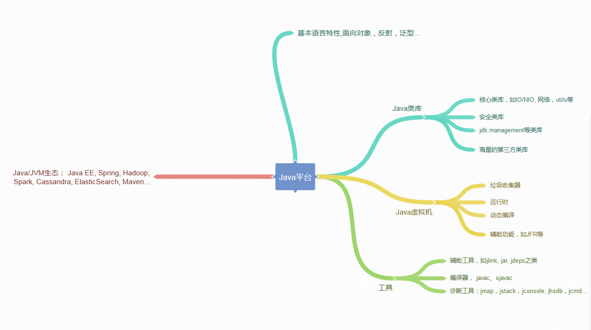

# 模块一 Java基础

## 第1讲 | 谈谈你对Java平台的理解？

> 标准回答

1. Java本身是一种面向对象语言，最显著的特性有两个方面
   - “书写一次，到处运行”（Write once，run anywhere），能够非常容易的获取跨平台能力
   - 垃圾收集（GC，Garbage Collection），Java通过垃圾回收器（GC）回收分配内存，大部分情况下，程序员不需要自己操心内存的分配和回收
2. Java的运行环境
   - JRE（Java Runtime Environment），Java运行环境，包含JVM和java类库，以及一些模块等
   - JDK（Java Development Kit），可以看做JRE的超集，提供了更多的工具，比如编译器各种诊断工具等
3. “Java是解释执行”的理解
   - java的源代码，首先会通过javac编译成字节码（bytecode）
   - 然后再运行时，通过Java虚拟机（JVM）内嵌的`解释器`将`字节码`解释转换成最终的`机器码`
   - 但是常见的JVM，例如Oracle JDK提供的Hotspot JVM，提供了JIT（Just In Time）编译器，就是通常所说的`动态编译器`
   - JIT能够在运行的时候，将`热点代码`编译成`机器码`，这种情况下部分的热点代码就属于`编译执行`，而不再是解释执行了

> 知识拓展

对于java平台的理解，可以从其他方面简明扼要的描述，例如

- Java语言特性：包括泛型，Lambda等语言特性
- 基础类库：包括集合，IO/NIO，网络，并发，安全等基础类库
- JVM的基础概念还有机制：java类的加载机制，常用JDK版本内嵌的Class-Loader，垃圾回收器的原理等




> java的解释执行和编译执行

java通常被分为编译期和运行时，javac将java源代码编译成“.class”文件，文件中是字节码，然后运行在jvm虚拟机上。Java通过字节码和Java虚拟机（JVM）这种跨平台的抽象，屏蔽了操作系统和硬件的细节，这个也是实现“一次编译，到处运行”的基础。


在运行时，java会通过类加载器（Class-Loader）加载字节码，解释或者编译执行。

- 在主流Java的版本中，如JDK8实际是解释和编译混合的一种模式，即所谓的混合模式（-Xmixed）。
- 通常运行在server模式的JVM，会进行成千上万次调用以收集足够的信息进行高效的编译，
- client模式的门限是1500次
- Oracle HotSpot JVM 内置了两个不同的 JIT compiler
  - C1模式对应client模式，适用于对于启动速度敏感的应用，比如普通的java桌面应用
  - C2对应server模式，它的优化是为了长时间运行的服务端应用设置的


JVM虚拟机启动的时候，可能指定不同的参数对运行模式进行选择

- 指定 “-Xint” ，就是告诉JVM只能解释执行，不对代码进行编译，这种模式抛弃是JIT可能带来的性能优势。毕竟解释器（interpreter）是逐条读入的，逐条解释运行的。
- “-Xcomp”，告诉JVM关闭解释器，不要进行解释执行，或者叫做最大优化级别。但是这个方式会导致JVM启动变慢了很多。同时有些JIT编译器优化方式，比如分支预测，如果不进行profiling（剖析），往往并不能进行有效优化。

除了常用的java的使用模式（混合模式，解释执行，编译执行），还有一种新的编译方式，就是AOT（Ahead-of-Time Compilation），直接将字节码编译成机器代码，避免了JIT的预热的各方面的开销。比如Oracle JDK 9就引入实验性的AOT特性，并且增加了jaotc工具。利用一下命令可以把某个类或者某个模块编译成AOT库

```java

jaotc --output libHelloWorld.so HelloWorld.class
jaotc --output libjava.base.so --module java.base
```

然后在启动的时候指定即可

```java

java -XX:AOTLibrary=./libHelloWorld.so,./libjava.base.so HelloWorld
```

而且，Oracle JDK 支持分层编译和 AOT 协作使用，这两者并不是二选一的关系。

参考相关文档：http://openjdk.java.net/jeps/295


> 对于解释器和编译器的理解

https://www.cnblogs.com/zhanghongqiang/p/4431216.html

**Java编译器（javac.exe）**: 将java源程序编译成中间代码字节码文件（.class文件），是最基本的开发工具

**Java解释器（java.exe）**: 又译为`直译器`是一种电脑程序，能够把高级编译语言一行一行直接转译运行。解释器不会一次把整个程序转译出来，而是每次运行程序的时候都要先转成另一种语言再作运行，因此解释器的运行速度比较慢。它是需要一行一行的转译程序。

Java应用程序的开发周期包括编译、下载 、解释和执行几个部分

- **Java编译程序**将Java源程序翻译为JVM可执行的字节码。
- **Java编译器**却不将对变量和方法的引用编译为数值引用，也不确定程序执行过程中的内存布局，而是将这些符号引用信息保留在字节码中，由解释器在运行过程中创立内存布局，然后再通过查表来确定一个方法所在的地址。这样就有效的保证了Java的可移植性和安全性。
- 运行JVM字节码的工作是由**解释器**来完成的。解释执行过程分三部进行：`代码的装入`、`代码的校验`和`代码的执行`。


Java字节码的执行有两种方式：

- 即时编译方式：解释器先将字节码编译成机器码，然后再执行该机器码。
- 解释执行方式：解释器通过每次解释并执行一小段代码来完成Java字节码程 序的所有操作。
- 通常采用的是第二种方法。由于JVM规格描述具有足够的灵活性，这使得将字节码翻译为机器代码的工作具有较高的效率。


> 精华理解

需要强调的一点是，java并不是编译机制，而是解释机制。Java字节码的设计充分考虑了JIT这一即时编译方式，可以将字节码直接转化成高性能的本地机器码，这同样是虚拟机的一个构成部分。

Java特性：

- 面向对象（封装，继承，多态）
- 平台无关性（JVM运行.Class文件）
- 语言（泛型，Lambda表达式）
- 类库（集合，并发，网络，IO/NIO）
- JRE（Java运行环境，JVM，类库）
- JDK（Java开发工具，包括JRE，javac，诊断工具）


Java是解析运行么？

​	不正确

- Java源代码经过javac编译成字节码文件（.class文件）
- .class文件再经过JVM解释或者编译运行
  - 解释：.class文件经过JVM内嵌的解释器解释执行
  - 编译：存在JIT（Just In Time Compiler 即时编译器）把经常运行的代码作为`热点代码`编译与本地平台相关的机器码，并进行各种层次的优化
  - AOT编译器：Java 9 提供的 直接将所有代码编译成机器码执行

## 第2讲 | Exception和Error有什么区别？

> 典型回答

Exception和Error都是集成Throwable类，在java中只有Throwable类型的实例才可以被抛出（throw）或者捕获（catch），它是异常处理机制的基本组成类型。

Error是指绝大情况下，不可能出现的情况。绝大部分的Error会导致程序（比如JVM自身）处于非正常的、不可恢复的状态，既然是非正常的情况，所以不便于也不需要进行捕捉，常见的比如说OutOfMemoryError之类，都是Error的子类。

Exception是程序正在运行中，可以预料的意外情况，可能并且应该被捕获，进行相应的处理。

Exception又分为可检查（checked）异常和不可检查（unchecked）异常

- 可检查异常在源代码里必须显示的进行捕获处理，这是编译期检查的一部分
- 不可检查异常就是所谓的运行时异常，RuntimeExecpiton,除此异常外都是可检查异常。类似NullPointerException、ArrayIndexOutOfMemoryError之类，通常是可以编码避免的逻辑错误，具体根据需要来判断是否需要捕获，并不会在编译期强制要求


> 考点分析

**1、理解Throwable，Exception、Error的设计和分类**

Throwable常见子类

- Exception
  - NoSuchFileException（找不到字段）
  - InstantiationException（实例化异常）
  - NoSuchMethodException（找不到方法）
  - ClassNotFountException（找不到类）
  - SQLException（SQL异常）
  - IOException（IO异常）
    - EOFException（文件已结束）
    - FileNotFoundException（文件未找到）
  - RuntimeException
    - StringIndexOutOfBoundsException（字符串索引越界）
    - ClassCastException（类型转换异常）
    - ArrayIndexOutOfMemoryError（数组索引越界）
    - SecurityException（安全异常）
    - NullPointException（空指针异常）
    - NumberFormatException（转换数字异常）
- Error
  - ThreadDeath（线程死亡）
  - VirtualMachineError（虚拟机错误）
    - UnknownError（未知错误）
    - OutOfMemoryError（内存溢出错误）
    - StackOverflowError（栈溢出错误）
    - InternalError（内部错误）
      - ZipError（Zip错误）

**2、NoClassDefFoundError 和 ClassNotFoundException 有什么区别？**

当应用程序运行的过程中尝试使用类加载器去加载Class文件的时候，如果没有在classpath中查找到指定的类，就会抛出ClassNotFoundException。

一般情况下，当我们使用Class.forName()或者ClassLoader.loadClass以及使用ClassLoader.findSystemClass()在运行时加载类的时候，如果类没有被找到，那么就会导致JVM抛出ClassNotFoundException。


当JVM在加载一个类的时候，如果这个类在编译时是可用的，但是在运行时找不到这个类的定义的时候，JVM就会抛出一个NoClassDefFoundError错误。比如当我们在new一个类的实例的时候，如果在运行是类找不到，则会抛出一个NoClassDefFoundError的错误。

3、针对异常的处理方式

try-catch-finally 块，throw、throws

> 知识扩展

**异常处理的基本原则**

- 尽量不要捕获类似Exception这样的通用异常，而是应该捕获特定异常。保证程序不会捕获到我们不希望捕获的异常。
- 不要生吞（swallow）异常，就是不要在catch之后不做出任处理，这样会导致出现问题后很难去判断错误究竟在哪。
- 捕获异常之后尽量不要使用`e.printStackTrace();`，会导致很难判断异常到底输出到哪里去了。


**Throw early，catch late原则**

所谓的**Throw early**原则指的是"让错误尽早被抛出"，不要等到我们的代码执行到一半再抛出异常，这样很有可能导致一部分的变量处于异常状态，从而引发出更多的错误

```java

/**
 *
 * 针对fileName为null的情况应该在使用这个参数之前就进行校验，并且抛出异常
 */
public void readPreferences(String fileName){
    //...perform operations...
    InputStream in = new FileInputStream(fileName);
    //...read the preferences file...
}
```

**Catch late**原则的意思是捕获异常后，如果不知道如何处理，应该选择保留原有异常的cause信息，直接选择抛出或者构成新的异常抛出。等到了更高的层面再选择捕获处理。
 原因在于，到了更高的层面，我们的业务逻辑会变得更加清晰，这个时候我们会更清楚合适的处理方法。


**从性能角度分析Java的异常处理：**

- try-catch代码段会产生额外的性能开销，或者换个角度说，它往往会影响JVM对代码进行优化，所以建议仅捕获有必要的代码段，尽量不要一个大的try包住整段的代码。
- Java 每实例化一个 Exception，都会对当时的栈进行快照，这是一个相对比较重的操作。如果发生的非常频繁，这个开销可就不能被忽略了。

> 问题思考：

对于异常处理编程，不同的编程范式也会影响到异常处理策略，比如，现在非常火热的反应式编程（Reactive Stream），因为其本身是异步、基于事件机制的，所以出现异常情况，决不能简单抛出去。可以有什么好的方式处理？


另外，由于代码堆栈不再是同步调用那种垂直的结构，这里的异常处理和日志需要更加小心，我们看到的往往是特定 executor 的堆栈，而不是业务方法调用关系。对于这种情况，有什么好的方式处理？


## 第3讲 | 谈谈final、finally、 finalize有什么不同？

> 典型回答

final用来修饰类，方法，变量。final修饰的类代表不可以集成，final修饰的变量代表不可以修改，而final修饰的方法表示不可以重写。

finally则是Java保证重点代码一定要被执行的一种机制。我们可以使用try-finally或者try-catch-finally来进行类似关闭JDBC链接，保证unlock锁等动作。

finalize是基础类java.lang.Obect的一个方法。它的设计目的是保证对象在垃圾收集之前完成特定资源的回收。finalize机制现在已经不推荐使用，并且在JDK9开始被标记为的deprecated。