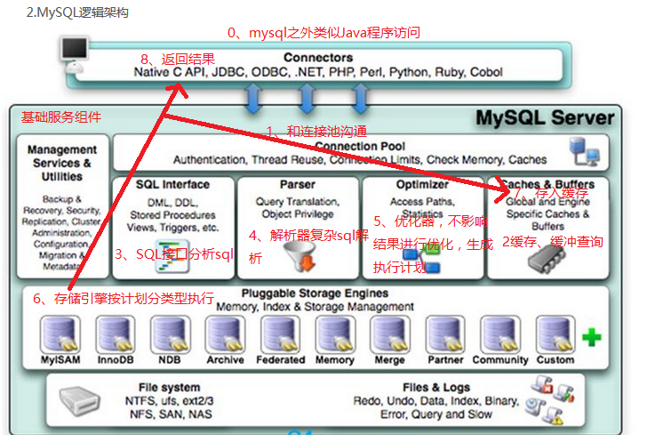
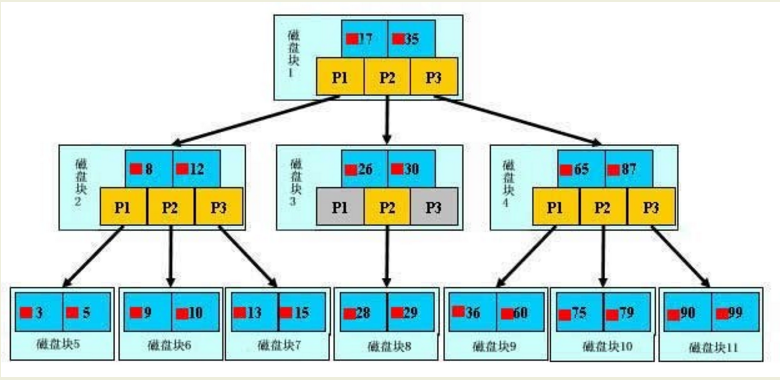
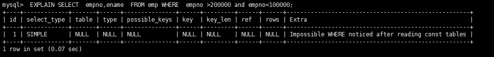

# Mysql  SQL语法

## SQL语法分类


- DDL（Data Definition Language）：数据定义语言，用来定义数据库对象：库、表、列等；
- DML（Data Manipulation Language）：数据操作语言，用来定义数据库记录（数据）；
- DCL（Data Control Language）：数据控制语言，用来定义访问权限和安全级别；
- DQL（Data Query Language）：数据查询语言，用来查询记录（数据）。

## DQL

DQL就是数据查询语言，数据库执行DQL语句不会对数据进行改变，而是让数据库发送结果集给客户端。

语法：

```mysql
SELECT 
selection_list /*要查询的列名称*/

FROM 
table_list /*要查询的表名称*/

WHERE 
condition /*行条件*/

GROUP BY 
grouping_columns /*对结果分组*/
HAVING 
condition /*分组后的行条件*/

ORDER BY
sorting_columns /*对结果分组*/

LIMIT 
offset_start, row_count /*结果限定*/
```


# Mysql 高级

## Mysql的架构介绍

### Mysql的逻辑架构

和其它数据库相比，MySQL有点与众不同，它的架构可以在多种不同场景中应用并发挥良好作用。主要体现在存储引擎的架构上，
插件式的存储引擎架构将查询处理和其它的系统任务以及数据的存储提取相分离。这种架构可以根据业务的需求和实际需要选择合适的存储引擎。



> 1.连接层

最上层是一些客户端和连接服务，包含本地sock通信和大多数基于客户端/服务端工具实现的类似于tcp/ip的通信。主要完成一些类似于连接处理、授权认证、及相关的安全方案。在该层上引入了线程池的概念，为通过认证安全接入的客户端提供线程。同样在该层上可以实现基于SSL的安全链接。服务器也会为安全接入的每个客户端验证它所具有的操作权限。

> 2.服务层

连接层访问mysql，会优先去访问Cache和Buffer，在缓存没有命中的情况下。再按照 SQL Interface ->Parser ->Optimizer的顺序执行

- Management Serveices & Utilities： 系统管理和控制工具 
- SQL Interface: SQL接口
        接受用户的SQL命令，并且返回用户需要查询的结果。比如select from就是调用SQL Interface
- Parser: 解析器
         SQL命令传递到解析器的时候会被解析器验证和解析。 
- Optimizer: 查询优化器。
       SQL语句在查询之前会使用查询优化器对查询进行优化,生成`执行计划 `
       用一个例子就可以理解： select uid,name from user where  gender= 1;
       优化器来决定先投影还是先过滤。
- Cache和Buffer： 查询缓存。
        如果查询缓存有命中的查询结果，查询语句就可以直接去查询缓存中取数据。
        这个缓存机制是由一系列小缓存组成的。比如表缓存，记录缓存，key缓存，权限缓存等

> 3.引擎层

  存储引擎层，存储引擎真正的负责了MySQL中数据的存储和提取，服务器通过API与存储引擎进行通信。不同的存储引擎具有的功能不同，这样我们可以根据自己的实际需要进行选取。后面介绍MyISAM和InnoDB

> 4.存储层

  数据存储层，主要是将数据存储在运行于裸设备的文件系统之上，并完成与存储引擎的交互。

### 查看mysql语句的执行周期

```mysql
#  修改配置文件/etc/my.cnf
# query_cache_type=1
# 重启mysql
# 查看 profiling 的状态
    show variables like '%profiling%';
# 设置profiling
set profiling=1;
# 执行查询语句
select * from xxx ;
# 显示最近的几次查询
show profiles;
# 查看程序的执行步骤
show profile cpu,block io for query 编号

mysql> show profiles;
+----------+------------+-----------------------------------+
| Query_ID | Duration   | Query                             |
+----------+------------+-----------------------------------+
|        1 | 0.00187800 | show variables like '%profiling%' |
|        2 | 0.00017850 | SELECT DATABASE()                 |
|        3 | 0.00034075 | show databases                    |
|        4 | 0.00014425 | show tables                       |
|        5 | 0.00050350 | select * from mytbl2 where id = 2 |
+----------+------------+-----------------------------------+
5 rows in set, 1 warning (0.00 sec)

# 缓存中没有查询到
mysql> show profile cpu,block io for query 5
    -> ;
+--------------------------------+----------+----------+------------+--------------+---------------+
| Status                         | Duration | CPU_user | CPU_system | Block_ops_in | Block_ops_out |
+--------------------------------+----------+----------+------------+--------------+---------------+
| starting                       | 0.000034 | 0.000009 |   0.000018 |            0 |             0 |# 开始
| Waiting for query cache lock   | 0.000004 | 0.000001 |   0.000002 |            0 |             0 |# 等待缓存锁
| starting                       | 0.000003 | 0.000001 |   0.000002 |            0 |             0 |# 执行
| checking query cache for query | 0.000121 | 0.000043 |   0.000080 |            0 |             0 |# 到缓存中查询
| checking permissions           | 0.000010 | 0.000003 |   0.000005 |            0 |             0 |# 查询权限
| Opening tables                 | 0.000025 | 0.000009 |   0.000017 |            0 |             0 |# 打开表
| init                           | 0.000036 | 0.000012 |   0.000023 |            0 |             0 |# 初始化
| System lock                    | 0.000012 | 0.000004 |   0.000008 |            0 |             0 |# 系统锁？
| Waiting for query cache lock   | 0.000003 | 0.000002 |   0.000002 |            0 |             0 |# 等待缓存锁
| System lock                    | 0.000028 | 0.000009 |   0.000018 |            0 |             0 |# 系统锁？
| optimizing                     | 0.000018 | 0.000007 |   0.000012 |            0 |             0 |# 优化生成执行计划
| statistics                     | 0.000019 | 0.000006 |   0.000012 |            0 |             0 |# 统计执行计划
| preparing                      | 0.000014 | 0.000005 |   0.000009 |            0 |             0 |# 准备
| executing                      | 0.000003 | 0.000001 |   0.000002 |            0 |             0 |# 开始执行
| Sending data                   | 0.000084 | 0.000084 |   0.000000 |            0 |             0 |# 发送数据
| end                            | 0.000005 | 0.000005 |   0.000000 |            0 |             0 |# 发送结束
| query end                      | 0.000009 | 0.000009 |   0.000000 |            0 |             0 |# 查询结束
| closing tables                 | 0.000009 | 0.000009 |   0.000000 |            0 |             0 |# 关闭表
| freeing items                  | 0.000018 | 0.000018 |   0.000000 |            0 |             0 |#
| Waiting for query cache lock   | 0.000003 | 0.000003 |   0.000000 |            0 |             0 |# 等待缓存锁
| freeing items                  | 0.000021 | 0.000020 |   0.000000 |            0 |             0 |#
| Waiting for query cache lock   | 0.000003 | 0.000003 |   0.000000 |            0 |             0 |# 等待缓存锁
| freeing items                  | 0.000003 | 0.000003 |   0.000000 |            0 |             0 |#
| storing result in query cache  | 0.000005 | 0.000005 |   0.000000 |            0 |             0 |# 查询结果写入缓存
| cleaning up                    | 0.000015 | 0.000015 |   0.000000 |            0 |             0 |# 清除信息
+--------------------------------+----------+----------+------------+--------------+---------------+
25 rows in set, 1 warning (0.00 sec)

# 缓存命中信息（想要命中缓存就需要mysql一模一样）
mysql> show profile cpu,block io for query 6
    -> ;
+--------------------------------+----------+----------+------------+--------------+---------------+
| Status                         | Duration | CPU_user | CPU_system | Block_ops_in | Block_ops_out |
+--------------------------------+----------+----------+------------+--------------+---------------+
| starting                       | 0.000044 | 0.000014 |   0.000021 |            0 |             0 |# 开始
| Waiting for query cache lock   | 0.000004 | 0.000001 |   0.000002 |            0 |             0 |# 等待缓存锁
| starting                       | 0.000003 | 0.000001 |   0.000001 |            0 |             0 |# 开始执行
| checking query cache for query | 0.000009 | 0.000004 |   0.000005 |            0 |             0 |# 检查缓存中查询
| checking privileges on cached  | 0.000003 | 0.000001 |   0.000002 |            0 |             0 |# 检查缓存上的特权？
| checking permissions           | 0.000012 | 0.000005 |   0.000007 |            0 |             0 |# 检查权限
| sending cached result to clien | 0.000010 | 0.000004 |   0.000006 |            0 |             0 |# 发送缓存结果给客户端
| cleaning up                    | 0.000005 | 0.000002 |   0.000003 |            0 |             0 |# 结束清除
+--------------------------------+----------+----------+------------+--------------+---------------+
8 rows in set, 1 warning (0.00 sec)
```

### mysql的查询流程

mysql的查询流程大致是：

- mysql客户端通过协议与mysql服务器建连接，发送查询语句，先检查查询缓存，如果命中，直接返回结果，否则进行语句解析,也就是说，在解析查询之前，服务器会先访问查询缓存(query cache)——它存储SELECT语句以及相应的查询结果集。如果某个查询结果已经位于缓存中，服务器就不会再对查询进行解析、优化、以及执行。它仅仅将缓存中的结果返回给用户即可，这将大大提高系统的性能。
- 语法解析器和预处理：首先mysql通过关键字将SQL语句进行解析，并生成一颗对应的“解析树”。mysql解析器将使用mysql语法规则验证和解析查询；预处理器则根据一些mysql规则进一步检查解析数是否合法。
- 查询优化器当解析树被认为是合法的了，并且由优化器将其转化成执行计划。一条查询可以有很多种执行方式，最后都返回相同的结果。优化器的作用就是找到这其中最好的执行计划。
- 然后，mysql默认使用的BTREE索引，并且一个大致方向是:无论怎么折腾sql，至少在目前来说，mysql最多只用到表中的一个索引。

### SQL的执行顺序

手写的SQL语句

```sql
SELECT DISTINCT
	<selecy_list>
FROM
	<left_table> <join_type>
JOIN 
	<rignt_table> on <join_condition>
WHERE
	<where_condition>
GROUP BY
	<group_by_list>
HAVING
	<having_condition>
ORDER BY
	<order_by_condition>
LIMIT
	<limit_number>
```

mysql实际执行的顺序

随着Mysql版本的更新换代，其优化器也在不断的升级，优化器会分析不同执行顺序产生的性能消耗不同而动态调整执行顺序。

下面是经常出现的查询顺序：

```mysql
FROM	<left_table>
on <join_condition>
<join_type> JOIN <rignt_table>
WHERE 	<where_condition>
GROUP BY 	<group_by_list>
HAVING 	<having_condition>
SELECT DISTINCT		<selecy_list>
ORDER BY	<order_by_condition>
LIMIT	<limit_number>
```

### mysql 的存储引擎

> 存储引擎介绍

**1、InnoDB存储引擎**
InnoDB是MySQL的默认事务型引擎，它被设计用来处理大量的短期(short-lived)事务。除非有非常特别的原因需要使用其他的存储引擎，否则应该优先考虑InnoDB引擎。

**2、MyISAM存储引擎**
MyISAM提供了大量的特性，包括全文索引、压缩、空间函数(GIS)等，但MyISAM不支持事务和行级锁，有一个毫无疑问的缺陷就是崩溃后无法安全恢复。

**3、Archive引擎**
Archive档案存储引擎只支持INSERT和SELECT操作，在MySQL5.1之前不支持索引。
Archive表适合日志和数据采集类应用。
根据英文的测试结论来看，Archive表比MyISAM表要小大约75%，比支持事务处理的InnoDB表小大约83%。

**4、Blackhole引擎**
Blackhole引擎没有实现任何存储机制，它会丢弃所有插入的数据，不做任何保存。但服务器会记录Blackhole表的日志，所以可以用于复制数据到备库，或者简单地记录到日志。但这种应用方式会碰到很多问题，因此并不推荐。 

**5、CSV引擎** 
CSV引擎可以将普通的CSV文件作为MySQL的表来处理，但不支持索引。
CSV引擎可以作为一种数据交换的机制，非常有用。
CSV存储的数据直接可以在操作系统里，用文本编辑器，或者excel读取。

**6、Memory引擎**
如果需要快速地访问数据，并且这些数据不会被修改，重启以后丢失也没有关系，那么使用Memory表是非常有用。Memory表至少比MyISAM表要快一个数量级。

**7、Federated引擎**
Federated引擎是访问其他MySQL服务器的一个代理，尽管该引擎看起来提供了一种很好的跨服务器的灵活性，但也经常带来问题，因此默认是禁用的。

> MyISAM 和 InnoDB的区别

| 对比项           | MyISAM                                                 | InnoDB                                                       |
| ---------------- | ------------------------------------------------------ | ------------------------------------------------------------ |
| 外键             | 不支持                                                 | 支持                                                         |
| 事务             | 不支持                                                 | 支持                                                         |
| 行表锁           | 表锁，即使操作一条记录也会锁住整个表，不适合高并发操作 | 行锁（可能会发生死锁），操作时只锁某一行数据，不对其他行的数据有影响。适合高并发的操作 |
| 缓存             | 只缓存索引，不缓存真实数据                             | 不仅缓存索引，还要缓存真实数据，对内存要求较高。而且内存的大小对性能有绝对性的影响 |
| 关注点           | 节省资源，消耗少，简单业务                             | 并发写，事务，更大的资源                                     |
| 默认安装         | Y                                                      | Y                                                            |
| 默认使用         | N                                                      | Y                                                            |
| 系统自带的表使用 | Y                                                      | N                                                            |


## 索引优化分析

### 性能下降，慢SQL

- 数据太多
  - 分库分表
- 关联太多表，太多的join
  - SQL优化
- 没有充分利用索引
  - 索引建立
- 服务器调优以及各个参数设置
  - 调整my.cnf


### SQL预热：常见通用的Join查询

一般常使用左外连接


### 索引简介

MySQL官方对索引的定义为：索引（Index）是帮助MySQL高效获取数据的数据结构。
可以得到索引的本质：索引是数据结构。

在数据之外，数据库系统还维护着满足特定查找算法的数据结构，这些数据结构以某种方式引用（指向）数据，
这样就可以在这些数据结构上实现高级查找算法。这种数据结构，就是索引。下图就是一种可能的索引方式示例：


左边是数据表，一共有两列七条记录，最左边的是数据记录的物理地址
 为了加快Col2的查找，可以维护一个右边所示的二叉查找树，每个节点分别包含索引键值和一个指向对应数据记录物理地址的指针，这样就可以运用二叉查找在一定的复杂度内获取到相应数据，从而快速的检索出符合条件的记录。


> 索引的优势

- 类似大学图书馆建书目索引，提高数据检索的效率，降低数据库的IO成本
- 通过索引列对数据进行排序，降低数据排序的成本，降低了CPU的消耗


> 索引的劣势

- 虽然索引大大提高了查询速度，同时却会降低更新表的速度，如对表进行INSERT、UPDATE和DELETE。
  因为更新表时，MySQL不仅要保存数据，还要保存一下索引文件每次更新添加了索引列的字段，
  都会调整因为更新所带来的键值变化后的索引信息
- 实际上索引也是一张表，该表保存了主键与索引字段，并指向实体表的记录，所以索引列也是要占用空间的


### mysql的索引结构

#### BTree索引



> 【初始化介绍】

一颗b树，浅蓝色的块我们称之为一个`磁盘块`，可以看到每个磁盘块包含几个`数据项`（深蓝色所示）和`指针`（黄色所示），
如磁盘块1包含数据项17和35，包含指针P1、P2、P3，
P1表示小于17的磁盘块，P2表示在17和35之间的磁盘块，P3表示大于35的磁盘块。
真实的数据存在于叶子节点即3、5、9、10、13、15、28、29、36、60、75、79、90、99。
`非叶子节点只不存储真实的数据，只存储指引搜索方向的数据项`，如17、35并不真实存在于数据表中。

> 【查找过程】

如果要查找数据项29，那么首先会把磁盘块1由磁盘加载到内存，此时发生一次IO，在内存中用二分查找确定29在17和35之间，锁定磁盘块1的P2指针，内存时间因为非常短（相比磁盘的IO）可以忽略不计，通过磁盘块1的P2指针的磁盘地址把磁盘块3由磁盘加载到内存，发生第二次IO，29在26和30之间，锁定磁盘块3的P2指针，通过指针加载磁盘块8到内存，发生第三次IO，同时内存中做二分查找找到29，结束查询，总计三次IO。

真实的情况是，3层的b+树可以表示上百万的数据，如果上百万的数据查找只需要三次IO，性能提高将是巨大的，如果没有索引，每个数据项都要发生一次IO，那么总共需要百万次的IO，显然成本非常非常高。


#### B+Tree


> BTree和B+Tree的区别

B+Tree与B-Tree 的区别

　1）B-树的关键字和记录是放在一起的，叶子节点可以看作外部节点，不包含任何信息；B+树的非叶子节点中只有关键字和指向下一个节点的索引，记录只放在叶子节点中。
　 2）在B-树中，越靠近根节点的记录查找时间越快，只要找到关键字即可确定记录的存在；而B+树中每个记录的查找时间基本是一样的，都需要从根节点走到叶子节点，而且在叶子节点中还要再比较关键字。从这个角度看B-树的性能好像要比B+树好，而在实际应用中却是B+树的性能要好些。因为B+树的非叶子节点不存放实际的数据，这样每个节点可容纳的元素个数比B-树多，树高比B-树小，这样带来的好处是减少磁盘访问次数。尽管B+树找到一个记录所需的比较次数要比B-树多，但是一次磁盘访问的时间相当于成百上千次内存比较的时间，因此实际中B+树的性能可能还会好些，而且B+树的叶子节点使用指针连接在一起，方便顺序遍历（例如查看一个目录下的所有文件，一个表中的所有记录等），这也是很多数据库和文件系统使用B+树的缘故。 
　
思考：为什么说B+树比B-树更适合实际应用中操作系统的文件索引和数据库索引？ 
1) B+树的磁盘读写代价更低 
　　B+树的内部结点并没有指向关键字具体信息的指针。因此其内部结点相对B 树更小。如果把所有同一内部结点的关键字存放在同一盘块中，那么盘块所能容纳的关键字数量也越多。一次性读入内存中的需要查找的关键字也就越多。相对来说IO读写次数也就降低了。 
2) B+树的查询效率更加稳定 
　　由于非终结点并不是最终指向文件内容的结点，而只是叶子结点中关键字的索引。所以任何关键字的查找必须走一条从根结点到叶子结点的路。所有关键字查询的路径长度相同，导致每一个数据的查询效率相当。


#### 聚簇索引与非聚簇索引

聚簇索引并不是一种单独的索引类型，而是一种数据存储方式。
术语‘聚簇’表示数据行和相邻的键值聚簇的存储在一起。
 如下图，左侧的索引就是聚簇索引，因为数据行在磁盘的排列和索引排序保持一致。


聚簇索引的好处：

- 按照聚簇索引排列顺序，查询显示一定范围数据的时候，由于数据都是紧密相连，数据库不不用从多个数据块中提取数据，所以节省了大量的io操作。

聚簇索引的限制：

- 对于mysql数据库目前只有innodb数据引擎支持聚簇索引，而Myisam并不支持聚簇索引。
- 由于数据物理存储排序方式只能有一种，所以每个Mysql的表只能有一个聚簇索引。一般情况下就是该表的主键。
- 为了充分利用聚簇索引的聚簇的特性，所以innodb表的主键列尽量选用有序的顺序id，而不建议用无序的id，比如uuid这种。

### mysql索引分类

> 单值索引

即一个索引只包含单个列，一个表可以有多个单列索引

```mysql
# 创建表时增加索引
KEY `idx_renter_id` (`renter_id`) USING BTREE,

# 单独建单值索引：
CREATE  INDEX idx_customer_name ON customer(customer_name); 
 
# 删除索引：
DROP INDEX idx_customer_name  on customer;
```


> 唯一索引

索引列的值必须唯一，但允许有空值

```mysql
# 创建表时增加唯一索引
UNIQUE (customer_no)

# 单独建唯一索引：
CREATE UNIQUE INDEX idx_customer_no ON customer(customer_no); 
 
# 删除索引：
DROP INDEX idx_customer_no on customer ;
```


> 主键索引

设定为主键后数据库会自动建立索引，innodb为聚簇索引

```mysql
# 创建表时定义主键索引
PRIMARY KEY(id)

# 单独建主键索引
ALTER TABLE customer add PRIMARY KEY customer(customer_no);  
 
# 删除建主键索引，修改建主键索引，必须先删除掉(drop)原索引，再新建(add)索引
ALTER TABLE customer drop PRIMARY KEY ; 
```


> 复合索引

即一个索引包含多个列

```mysql
# 创建表时定义复合索引
KEY (customer_no,customer_name)
# 单独建索引：
CREATE  INDEX idx_no_name ON customer(customer_no,customer_name); 
 
# 删除索引：
DROP INDEX idx_no_name  on customer ;
```


> 基本语法

```mysql
# 创建索引
CREATE  [UNIQUE ]  INDEX [indexName] ON table_name(column))

# 删除索引
DROP INDEX [indexName] ON mytable;

#查看索引
SHOW INDEX FROM table_name\G

# 该语句添加一个主键，这意味着索引值必须是唯一的，且不能为NULL。
ALTER TABLE tbl_name ADD PRIMARY KEY (column_list)
 
# 这条语句创建索引的值必须是唯一的（除了NULL外，NULL可能会出现多次）。
ALTER TABLE tbl_name ADD UNIQUE index_name (column_list) 

# 添加普通索引，索引值可出现多次。
ALTER TABLE tbl_name ADD INDEX index_name (column_list) 

# 该语句指定了索引为 FULLTEXT ，用于全文索引。
ALTER TABLE tbl_name ADD FULLTEXT index_name (column_list)
```

### 哪些情况需要创建索引

1. 主键自动建立唯一索引
2. 频繁作为查询条件的字段应该创建索引
3. 查询中与其它表关联的字段，外键关系建立索引
4. 单键/组合索引的选择问题， 组合索引性价比更高
5. 查询中排序的字段，排序字段若通过索引去访问将大大提高排序速度
6. 查询中统计或者分组字段


### 哪些情况不要创建索引

1. 表记录太少
2. 经常增删改的表或者字段
3. Where条件里用不到的字段不创建索引
4. 过滤性不好的不适合建索引

### 性能分析（Explain）

使用EXPLAIN关键字可以模拟优化器执行SQL查询语句，从而知道MySQL是
如何处理你的SQL语句的。分析你的查询语句或是表结构的性能瓶颈

> Explain 的作用

1. 查看SQL语句表的读取顺序
2. 哪些索引可以使用
3. 数据读取操作的操作类型
4. 哪些索引被实际使用
5. 表之间的引用
6. 每张表有多少行被物理查询


#### Explain中各个字段的分析

##### id

select查询的序列号,包含一组数字，表示查询中执行select子句或操作表的顺序

`重点：id号每个号码，表示一趟独立的查询。一个sql 的查询趟数越少越好。`

id的三种情况：

1、id相同，执行顺序由上至下


2、id不同，如果是子查询，id的序号会递增，id值越大优先级越高，越先被执行


3、id相同不同，同时存在。

id如果相同，可以认为是一组，从上往下顺序执行；
在所有组中，id值越大，优先级越高，越先执行


##### select_type

查询的类型，主要是用于区别普通查询、联合查询、子查询等的复杂查询

1、SIMPLE

简单的 select 查询,查询中不包含子查询或者UNION


2、PRIMARY

查询中若包含任何复杂的子部分，最外层查询则被标记为Primary


3、DERIVED

在FROM列表中包含的子查询被标记为DERIVED(衍生)，MySQL会递归执行这些子查询, 把结果放在临时表里。


3、SUBQUERY（子查询）

在SELECT或WHERE列表中包含了子查询


4、DEPENDENT SUBQUERY（依赖子查询）

在SELECT或WHERE列表中包含了子查询,子查询基于外层


5、UNCACHEABLE SUBQUREY（不可用缓存子查询）


6、UNION

若第二个SELECT出现在UNION之后，则被标记为UNION；
若UNION包含在FROM子句的子查询中,外层SELECT将被标记为：DERIVED


7、UNION RESULT

从UNION表获取结果的SELECT


##### table

显示这一行的数据是关于哪张表的

##### partitions

代表分区表中的命中情况，非分区表，该项为null

##### type

type显示的是访问类型，是较为重要的一个指标，结果值从最好到最坏依次是： 

system > const > eq_ref > ref > fulltext > ref_or_null > index_merge > unique_subquery > index_subquery > range > index > ALL 

system>const>eq_ref>ref>range>index>ALL

一般来说，得保证查询至少达到range级别，最好能达到ref。

> system

表只有一行记录（等于系统表），这是const类型的特列，平时不会出现，这个也可以忽略不计

> const

表示通过索引一次就找到了,const用于比较primary key或者unique索引。因为只匹配一行数据，所以很快
如将主键置于where列表中，MySQL就能将该查询转换为一个常量


> eq_ref

唯一性索引扫描，对于每个索引键，表中只有一条记录与之匹配。常见于主键或唯一索引扫描


> ref

非唯一性索引扫描，返回匹配某个单独值的所有行.
本质上也是一种索引访问，它返回所有匹配某个单独值的行，然而，
它可能会找到多个符合条件的行，所以他应该属于查找和扫描的混合体


> range

只检索给定范围的行,使用一个索引来选择行。key 列显示使用了哪个索引
一般就是在你的where语句中出现了between、<、>、in等的查询
这种范围扫描索引扫描比全表扫描要好，因为它只需要开始于索引的某一点，而结束语另一点，不用扫描全部索引。


> index

出现index是sql使用了索引但是没用通过索引进行过滤，一般是使用了覆盖索引或者是利用索引进行了排序分组


> all

Full Table Scan，将遍历全表以找到匹配的行


> index_merge

在查询过程中需要多个索引组合使用，通常出现在有 or 的关键字的sql中


> ref_or_null

对于某个字段既需要关联条件，也需要null值得情况下。查询优化器会选择用ref_or_null连接查询。


> index_subquery

利用索引来关联子查询，不再全表扫描。


> unique_subquery

该联接类型类似于index_subquery。 子查询中的唯一索引


##### possible_keys

显示可能应用在这张表中的索引，一个或多个。
查询涉及到的字段上若存在索引，则该索引将被列出，但不一定被查询实际使用

##### key

- 实际使用的索引。如果为NULL，则没有使用索引
- 查询中若使用了覆盖索引，则该索引和查询的select字段重叠


##### key_len

- 表示索引中使用的字节数，可通过该列计算查询中使用的索引的长度。  key_len数值越大，效率越高。
- key_len字段能够帮你检查是否充分的利用上了索引

##### ref

显示索引的哪一列被使用了，如果可能的话，是一个常数。哪些列或常量被用于查找索引列上的值

##### rows

rows列显示MySQL认为它执行查询时必须检查的行数。行数越少越好。

##### filtered

这个字段表示存储引擎返回的数据在server层过滤后，剩下多少满足查询的记录数量的比例，注意是百分比，不是具体记录数

##### Extra

包含不适合在其他列中显示但十分重要的额外信息

> Using filesort

说明mysql会对数据使用一个外部的索引排序，而不是按照表内的索引顺序进行读取。
MySQL中无法利用索引完成的排序操作称为“文件排序”。使用文件排序，order by 没用上索引 

Order By 之后的列不使用索引就会出现这种情况，数据量大的情况下查询效率会很慢


> Using temporary

使了用临时表保存中间结果,MySQL在对查询结果排序时使用临时表。常见于排序 order by 和分组查询 group by。

Group By之后的列没有使用索引就会出现这种情况

> Using index

表示相应的select操作中使用了覆盖索引(Covering Index)，避免访问了表的数据行，效率不错！
如果同时出现using where，表明索引被用来执行索引键值的查找;
如果没有同时出现using where，表明索引只是用来读取数据而非利用索引执行查找。

利用索引进行了排序或分组


> Using where

表明使用了where过滤


> Using join buffer

关联查询没有创建索引会出现这种情况。使用了连接缓存：


> impossible where

where子句的值总是false，不能用来获取任何元组



> select tables optimized away

在没有GROUPBY子句的情况下，基于索引优化MIN/MAX操作或者
对于MyISAM存储引擎优化COUNT(*)操作，不必等到执行阶段再进行计算，
查询执行计划生成的阶段即完成优化。

在innodb中：


在Myisam中：


### 查询优化

#### 单表使用索引及常见索引失效

> 最佳左前缀法则（针对复合索引）

如果索引了多列，要遵守最左前缀法则。指的是查询从索引的最左前列开始并且`不跳过索引中的列`。

```mysql 
# 表创建了复合索引
create index idx_age_deptid on emp(age,deptid,name)

# 因为复合索引的顺序是age，deptid，name。而这个查询语句中没有deptid，所以导致无法使用到name的索引，只能使用age这个索引
mysql> EXPLAIN SELECT SQL_NO_CACHE * FROM emp WHERE emp.age=30 AND emp.name = 'abcd';
+----+-------------+-------+------------+------+----------------+----------------+---------+-------+-------+----------+-----------------------+
| id | select_type | table | partitions | type | possible_keys  | key            | key_len | ref   | rows  | filtered | Extra                 |
+----+-------------+-------+------------+------+----------------+----------------+---------+-------+-------+----------+-----------------------+
|  1 | SIMPLE      | emp   | NULL       | ref  | idx_age_deptid | idx_age_deptid | 5       | const | 49392 |    10.00 | Using index condition |
+----+-------------+-------+------------+------+----------------+----------------+---------+-------+-------+----------+-----------------------+
1 row in set (0.03 sec)
# 由于查询条件中没有符合索引的开头age，所以这个语句根本就不会走索引
mysql> EXPLAIN SELECT SQL_NO_CACHE * FROM emp WHERE deptid=4 AND emp.name = 'abcd';
+----+-------------+-------+------------+------+---------------+------+---------+------+--------+----------+-------------+
| id | select_type | table | partitions | type | possible_keys | key  | key_len | ref  | rows   | filtered | Extra       |
+----+-------------+-------+------------+------+---------------+------+---------+------+--------+----------+-------------+
|  1 | SIMPLE      | emp   | NULL       | ALL  | NULL          | NULL | NULL    | NULL | 498938 |     1.00 | Using where |
+----+-------------+-------+------------+------+---------------+------+---------+------+--------+----------+-------------+
1 row in set (0.03 sec)
```

> 不在索引列上做任何操作（计算、函数、(自动or手动)类型转换），会导致索引失效而转向全表扫描

```mysql
# 表创建了索引
create index idx_name on emp(name)

# 可以命中name的索引
EXPLAIN  SELECT SQL_NO_CACHE * FROM emp WHERE   emp.name  LIKE 'abc%'

# 因为对name做了函数处理，导致索引失效变成全表扫描
EXPLAIN   SELECT SQL_NO_CACHE * FROM emp WHERE   LEFT(emp.name,3)  = 'abc'

```

> 存储引擎不能使用复合索引中范围条件右边的列

```mysql
# 创建索引
create index idx_age_deptid_name on emp(age,deptid,name)

# 针对于索引 idx_age_deptid_name 只能命中age和deptid这两个列，
# 因为复合索引是顺序执行的，在age索引精确命中一类数据之后，才会去执行deptid的索引，如果deptid索引是精确命中，则会再使用name的索引。由于这个sql中deptid是返回查询，没有办法精确命中，导致在deptid是范围查询，就不会使用name索引。
EXPLAIN SELECT  SQL_NO_CACHE * FROM emp WHERE emp.age=30 AND emp.deptId>20 AND emp.name = 'abc' ; 

# 解决这个问题的办法就是创建索引的时候将范围查询的索引列放置到最后
create index idx_age_name_deptid on emp(age,name,deptid)
```

> mysql 在使用不等于(!= 或者<>)的时候无法使用索引会导致全表扫描

```mysql
# 创建的name索引
CREATE INDEX idx_name ON emp(NAME)

# 由于使用的是<> 导致无法使用索引
EXPLAIN SELECT SQL_NO_CACHE * FROM emp WHERE   emp.name <>  'abc'

```

> is not null 也无法使用索引,但是is null是可以使用索引的

```mysql
# 可以命中age的索引
EXPLAIN SELECT * FROM emp WHERE age IS NULL
# 无法命中age的索引  
EXPLAIN SELECT * FROM emp WHERE age IS NOT NULL
```

> like以通配符开头('%abc...')mysql索引失效会变成全表扫描的操作

```mysql
# 无法命中索引
EXPLAIN SELECT SQL_NO_CACHE * FROM emp WHERE  emp.name like '%abcd%';
# 可以命中索引
EXPLAIN SELECT SQL_NO_CACHE * FROM emp WHERE  emp.name like 'abcd%';
```

> 字符串不加单引号索引失效

```mysql
# 不会命中name索引
EXPLAIN SELECT SQL_NO_CACHE * FROM emp WHERE  emp.name = 123;
```

#### 创建索引的建议

- 对于单键索引，尽量选择针对当前query过滤性更好的索引
- 在选择组合索引的时候，当前Query中过滤性最好的字段在索引字段顺序中，位置越靠前越好。
- 在选择组合索引的时候，尽量选择可以能够包含当前query中的where字句中更多字段的索引
- 在选择组合索引的时候，如果某个字段可能出现范围查询时，尽量把这个字段放在索引次序的最后面
- 书写sql语句时，尽量避免造成索引失效的情况


#### 关联查询优化

1、保证被驱动表的join字段已经被索引

```mysql
# 当使用left join的时候 left join 之前的表是驱动表，left join之后的表是被驱动表
EXPLAIN SELECT * FROM class LEFT JOIN book ON class.card = book.card;
```

2、left join 时，选择小表作为驱动表，大表作为被驱动表。

3、inner join 时，mysql会自己帮你把小结果集的表选为驱动表。

4、子查询尽量不要放在被驱动表，有可能使用不到索引。

5、能够直接多表关联的尽量直接关联，不用子查询。

#### 子查询优化

尽量不要使用not in  或者 not exists

```mysql
# 取所有不为掌门人的员工，按年龄分组 ，每个年龄段多少人  
SELECT SQL_NO_CACHE age,count(*)  FROM emp a WHERE  id  NOT  IN(SELECT ceo FROM dept b2 WHERE ceo IS NOT NULL)
group by age 
having count(*)<10000


# 用left  join  on  xxx is null 替代
# 可以理解为 id not in xxx  就可以用 left join ()  where xxx is null
EXPLAIN SELECT SQL_NO_CACHE age,count(*) FROM  emp a LEFT OUTER JOIN dept b ON a.id =b.ceo
WHERE    b.ceo IS   NULL
group by age 
having count(*)<10000

```

#### 排序分组优化

```mysql
# 创建索引
create index idx_age_deptid_name on emp(age,deptid,name)
############################### 无过滤不索引 ###########################################
# 该查询语句并没有使用上 idx_age_deptid_name 索引，
explain  select SQL_NO_CACHE * from emp order by age,deptid; 
 
# 需要增加where 条件或者limit 过滤才能够使用索引
explain  select SQL_NO_CACHE * from emp order by age,deptid limit 10; 


############################## 顺序错，必排序 ############################################
# 可以命中 idx_age_deptid_name的索引
4、 explain  select * from emp where age=45 order by   deptid,name; 
#  会命中age的索引 会出现Using Filesort的情况  字段empno没有匹配到索引中
5、 explain  select * from emp where age=45 order by  deptid,empno;

#  会命中age的索引，但是会出现Using Filesort的情况  
# order by之后的name,deptid顺序不符合索引的顺序，会导致数据发生变化，优化器不会自动调整
6、 explain  select * from emp where age=45 order by  name,deptid;

# 不会命中索引，会出现Using Filesort的情况 deptid 和age的顺序不同会导致结果不同。
7、 explain select * from emp where deptid=45 order by age;

############################### 方向反，必排序 ###########################################
# 不会出现 Using filesort 
# 因为之后的deptid和name是倒序排列，刚好符合顺序从  name->deptid
8、  explain select * from emp where age=45 order by  deptid desc, name desc ;
# 会出现 Using filesort
9、 explain select * from emp where age=45 order by  deptid asc, name desc ;
```

ORDER BY子句，尽量使用Index方式排序,避免使用FileSort方式排序

> 索引的选择

当范围条件和group by 或者 order by  的字段出现二选一时 ，优先观察条件字段的过滤数量，如果过滤的数据足够多，而需要排序的数据并不多时，优先把索引放在范围字段上。反之，亦然。

```mysql

SELECT SQL_NO_CACHE * FROM emp WHERE age =30 AND empno <101000 ORDER BY NAME ;

# 联合索引（age,empno,name） name的索引是无法用到的，会出现Using Filesort的情况
# 联合索引（age，empno） 同上，order by的name是无法使用索引的，同样会出现Using Filesort的情况
# 联合索引（age，name） ，age和name的索引都会使用到，不会出现UsingFilesort的情况

# 虽然（age，name）不会出现UsingFilesort的情况，但是实际的效率，要低于(age,empno)的索引
# mysql 在idx_age_empno 和 idx_age_name同时存在的情况，会根据实际的查询效率选择相应的索引
```

> 如果不在索引列上，filesort有两种算法：mysql就要启动双路排序和单路排序

1、双路排序

- MySQL 4.1之前是使用双路排序,字面意思就是两次扫描磁盘，最终得到数据，
  读取行指针和orderby列，对他们进行排序，然后扫描已经排序好的列表，按照列表中的值重新从列表中读取对应的数据输出
- 从磁盘取排序字段，在buffer进行排序，再从磁盘取其他字段。

取一批数据，要对磁盘进行了两次扫描，众所周知，I\O是很耗时的，所以在mysql4.1之后，出现了第二种改进的算法，就是单路排序。

2、单路排序

- 从磁盘读取查询需要的所有列，按照order by列在buffer对它们进行排序，然后扫描排序后的列表进行输出，
  它的效率更快一些，避免了第二次读取数据。并且把随机IO变成了顺序IO,但是它会使用更多的空间，
  因为它把每一行都保存在内存中了。

3、单路排序会出现的问题

在sort_buffer中，单路排序比双路排序要多占用很多空间，因为单路排序是把所有字段都取出, 所以有可能取出的数据的总大小超出了sort_buffer的容量，导致每次只能取sort_buffer容量大小的数据，进行排序（创建tmp文件，多路合并），排完再取取sort_buffer容量大小，再排……从而多次I/O。

本来想省一次I/O操作，反而导致了大量的I/O操作，反而得不偿失。

4、优化单路排序的策略

- 增大sort_buffer_size参数的设置
- 增大max_length_for_sort_data参数的设置
- 减少select 后面的查询的字段。

5、使用策略优化的原因

提高Order By的速度

1. Order by时select * 是一个大忌只Query需要的字段， 这点非常重要。在这里的影响是：
    1.1 当Query的字段大小总和小于max_length_for_sort_data 而且排序字段不是 TEXT|BLOB 类型时，会用改进后的算法——单路排序， 否则用老算法——多路排序。
    1.2 两种算法的数据都有可能超出sort_buffer的容量，超出之后，会创建tmp文件进行合并排序，导致多次I/O，但是用单路排序算法的风险会更大一些,所以要提高sort_buffer_size。

2. 尝试提高 sort_buffer_size
不管用哪种算法，提高这个参数都会提高效率，当然，要根据系统的能力去提高，因为这个参数是针对每个进程的  1M-8M之间调整

3. 尝试提高 max_length_for_sort_data
提高这个参数， 会增加用改进算法的概率。但是如果设的太高，数据总容量超出sort_buffer_size的概率就增大，明显症状是高的磁盘I/O活动和低的处理器使用率.                  1024-8192之间调整

> GROUP BY关键字优化

group by 使用索引的原则几乎跟order by一致 ，唯一区别是groupby 即使没有过滤条件用到索引，也可以直接使用索引

#### 最后使用索引的手段：覆盖索引

什么是覆盖索引？
简单说就是，select 到 from 之间查询的列 <=使用的索引列+主键

## 查询截取分析

### 慢查询日志

#### 慢查询的概念

- MySQL的慢查询日志是MySQL提供的一种日志记录，它用来记录在MySQL中响应时间超过阀值的语句，具体指运行时间超过long_query_time值的SQL，则会被记录到慢查询日志中。
- 具体指运行时间超过long_query_time值的SQL，则会被记录到慢查询日志中。long_query_time的默认值为10，意思是运行10秒以上的语句。
- 由他来查看哪些SQL超出了我们的最大忍耐时间值，比如一条sql执行超过5秒钟，我们就算慢SQL，希望能收集超过5秒的sql，结合之前explain进行全面分析。

#### 如何使用慢查询日志