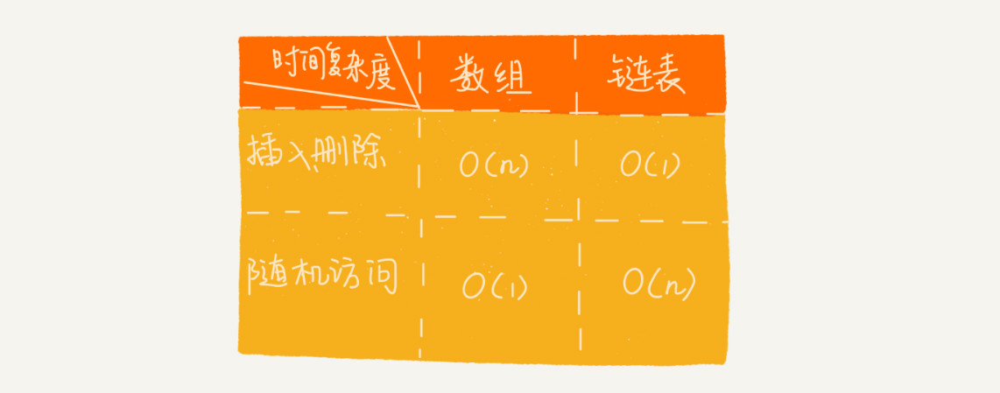

# 数据结构和算法的概念

> 广义概念

数据结构就是指一组数据的存储结构。算法就是操作数据的一组方法。

> 狭义概念

是指某些著名的数据结构和算法，比如队列、栈、堆、二分查找、动态规划等


> 为什么大部分书都把这两个东西放到一块儿来讲呢?

**数据结构是为算法服务的，算法要作用在特定的数据结构之上**


> 10个常用的数据结构

数组、链表、栈、队列、散列表、二叉树、堆、跳表、图、Trie树

> 10个常用的算法

递归，排序，二分查找，搜索，哈希算法，贪心算法，分支算法，回溯算法，动态规划，字符串匹配算法

# 复杂度分析

> 大O时间复杂度

大 O 时间复杂度实际上并不具体表示代码真正的执行时间，而是表示**代码执行时间随数据规模增长的变化趋势**，所以，也叫作**渐进时间复杂度**

## 时间复杂度分析

> 1. 只关注循环执行次数最多的一段代码

大 O 这种复杂度表示方法只是表示一种变化趋势。我们通常会忽略掉公式中的常量、低阶、系数，只需要记录一个最大阶的量级就可以了。

**我们在分析一个算法、一段代码的时间复杂度的时候，也只关注循环执行次数最多的那一段代码就可以了**


> 2. 加法法则：总复杂度等于量级最大的那段代码的复杂度


> 3. 乘法法则：嵌套代码的复杂度等于嵌套内外代码复杂度的乘积

### 几种常见时间复杂度实例分析


对于刚罗列的复杂度量级，我们可以粗略地分为两类，多项式量级和非多项式量级。其中，非多项式量级只有两个：O(2n) 和 O(n!)。

#### 1. O(1)

首先你必须明确一个概念，O(1) 只是常量级时间复杂度的一种表示方法，并不是指只执行了一行代码。比如这段代码，即便有 3 行，它的时间复杂度也是 O(1），而不是 O(3)。

```java
 int i = 8;
 int j = 6;
 int sum = i + j;
```

**一般情况下，只要算法中不存在循环语句、递归语句，即使有成千上万行的代码，其时间复杂度也是Ο(1)**

#### 2. O(logn)、O(nlogn)

对数阶时间复杂度非常常见，同时也是最难分析的一种时间复杂度。我通过一个例子来说明一下。

```java

 i=1;
 while (i <= n)  {
   i = i * 2;
 }
//x=log2n，所以，这段代码的时间复杂度就是 O(log2n)。


 i=1;
 while (i <= n)  {
   i = i * 3;
 }
//这段代码的时间复杂度就是 O(log3n)。
```

在对数阶时间复杂度的表示方法里，我们忽略对数的“底”，统一表示为 O(logn)。

#### 3. O(m+n)  O(m*n)

代码的复杂度由**两个数据的规模**来决定

```java

int cal(int m, int n) {
  int sum_1 = 0;
  int i = 1;
  for (; i < m; ++i) {
    sum_1 = sum_1 + i;
  }

  int sum_2 = 0;
  int j = 1;
  for (; j < n; ++j) {
    sum_2 = sum_2 + j;
  }

  return sum_1 + sum_2;
}
```


### 时间复杂度的情况

#### 最好时间复杂度

最好情况时间复杂度就是，在最理想的情况下，执行这段代码的时间复杂度。在数组长度为N的数组中查找某个数据，在最理想的情况下，要查找的变量 x 正好是数组的第一个元素，这个时候对应的时间复杂度就是最好情况时间复杂度。

#### 最坏时间复杂度

最坏情况时间复杂度就是，在最糟糕的情况下，执行这段代码的时间复杂度。在数组长度为N的数组中查找某个数据，如果数组中没有要查找的变量 x，我们需要把整个数组都遍历一遍才行，所以这种最糟糕情况下对应的时间复杂度就是最坏情况时间复杂度。

#### 平均时间复杂度

要查找的变量 x 在数组中的位置，有 n+1 种情况：在数组的 0～n-1 位置中和不在数组中。我们把每种情况下，查找需要遍历的元素个数累加起来，然后再除以 n+1，就可以得到需要遍历的元素个数的平均值


#### 均摊时间复杂度

均摊时间复杂度就是一种特殊的平均时间复杂度

在代码执行的所有复杂度情况中绝大部分是低级别的复杂度，个别情况是高级别复杂度且发生具有时序关系时，可以将个别高级别复杂度均摊到低级别复杂度上。基本上均摊结果就等于低级别复杂度。

## 空间复杂度分析

空间复杂度全称就是**渐进空间复杂度**（asymptotic space complexity），**表示算法的存储空间与数据规模之间的增长关系**

# 数组

> 概念

**数组（Array）**是一种**线性表**数据结构。它用一组**连续的内存空间**，来存储一组具有**相同类型**的数据。

线性表：数组，链表，队列，栈等

非线性表：二叉树，堆，树

> 数组和容器的选择？

对于业务开发，直接使用容器就足够了，省时省力。毕竟损耗一丢丢性能，完全不会影响到系统整体的性能。但如果你是做一些非常底层的开发，比如开发网络框架，性能的优化需要做到极致，这个时候数组就会优于容器，成为首选。

> 为什么数组的下标是从0开始的？

如果用 a 来表示数组的首地址，a[0]就是偏移为 0 的位置，也就是首地址，a[k]就表示偏移 k 个 type_size 的位置，所以计算 a[k]的内存地址只需要用这个公式：

```c++
a[k]_address = base_address + k * type_size
```

但是，如果数组从 1 开始计数，那我们计算数组元素 a[k]的内存地址就会变为：

```c++
a[k]_address = base_address + (k-1)*type_size
```

**从 1 开始编号，每次随机访问数组元素都多了一次减法运算，对于 CPU 来说，就是多了一次减法指令。**

# 链表

经典的链表应用场景： LRU 缓存淘汰算法


**缓存**是一种提高数据读取性能的技术，在硬件设计、软件开发中都有着非常广泛的应用，比如常见的 CPU 缓存、数据库缓存、浏览器缓存等等。


> 链表的分类

1. 单向链表
2. 循环链表
3. 双向链表（LinkedHashMap）

**对于执行较慢的程序，可以通过消耗更多的内存（空间换时间）来进行优化；而消耗过多内存的程序，可以通过消耗更多的时间（时间换空间）来降低内存的消耗。**

## 链表 VS 数组性能大比拼



数组简单易用，在实现上使用的是连续的内存空间，可以借助 CPU 的缓存机制，预读数组中的数据，所以访问效率更高。而链表在内存中并不是连续存储，所以对 CPU 缓存不友好，没办法有效预读。

## 链表代码技巧

> 技巧一：理解指针或引用的含义

将某个变量赋值给指针，实际上就是将这个变量的地址赋值给指针，或者反过来说，指针中存储了这个变量的内存地址，指向了这个变量，通过指针就能找到这个变量。

> 技巧二：警惕指针丢失和内存泄漏


> 技巧三：利用哨兵简化实现难度

如果我们引入哨兵结点，在任何时候，不管链表是不是空，head 指针都会一直指向这个哨兵结点。我们也把这种有哨兵结点的链表叫带头链表。相反，没有哨兵结点的链表就叫作不带头链表。


哨兵结点是不存储数据的。因为哨兵结点一直存在，所以插入第一个结点和插入其他结点，删除最后一个结点和删除其他结点，都可以统一为相同的代码实现逻辑了。


> 技巧四：重点留意边界条件处理


> 技巧五：举例画图，辅助思考

## 常见链表操作

### 单链表反转


### 链表中环的检测


### 两个有序的链表合并


### 删除链表倒数第n个几点


### 求链表的中间结点


# 队列

## 阻塞队列

**阻塞队列**其实就是在队列基础上增加了阻塞操作。简单来说，就是在队列为空的时候，从队头取数据会被阻塞。因为此时还没有数据可取，直到队列中有了数据才能返回；如果队列已经满了，那么插入数据的操作就会被阻塞，直到队列中有空闲位置后再插入数据，然后再返回。

## 并发队列

线程安全的队列我们叫作**并发队列**。最简单直接的实现方式是直接在 enqueue()、dequeue() 方法上加锁，但是锁粒度大并发度会比较低，同一时刻仅允许一个存或者取操作。实际上，基于数组的循环队列，利用 CAS 原子操作，可以实现非常高效的并发队列。这也是循环队列比链式队列应用更加广泛的原因。


# 递归

## 递归需要满足的三个条件

1. 一个问题的解可以分解为几个子问题的解
2. 这个问题与分解之后的子问题，除了数据规模不同，求解思路完全一样
3. 存在递归终止条件

**写递归代码的关键就是找到如何将大问题分解为小问题的规律，并且基于此写出递推公式，然后再推敲终止条件，最后将递推公式和终止条件翻译成代码**

**编写递归代码的关键是，只要遇到递归，我们就把它抽象成一个递推公式，不用想一层层的调用关系，不要试图用人脑去分解递归的每个步骤。**


## 递归的注意事项

1. 递归代码要警惕堆栈溢出
2. 递归代码要警惕重复计算


# 排序

排序算法的执行效率：

1. 最好情况、最坏情况、平均情况时间复杂度
2. 时间复杂度的系数、常数 、低阶
   1. 在对同一阶时间复杂度的排序算法性能对比的时候，我们就要把系数、常数、低阶也考虑进来。
3. 比较次数和交换（或移动）次数


排序算法的稳定性：

1. 稳定的排序算法：大小相同的数值比较后位置不发生变化的排序算法。
2. 不稳定的排序算法：大小相同的数值比较厚位置发生交换的排序算法。


>  **有序度：数组中具有有序关系的元素对的个数**

```
对应的数学表达式
有序元素对：a[i] <= a[j], 如果i < j。
```


对于一个完全有序的数组，比如 1，2，3，4，5，6，有序度就是 **n*(n-1)/2**

我们把这种完全有序的数组的有序度叫作**满有序度**。

>  **逆序度：数组中具有有序关系的元素对的个数**

```
逆序元素对：a[i] > a[j], 如果i < j。
```

**逆序度 = 满有序度 - 有序度**


## 冒泡排序

> 概念

冒泡排序只会操作相邻的两个数据。每次冒泡操作都会对相邻的两个元素进行比较，看是否满足大小关系要求。如果不满足就让它俩互换。一次冒泡会让至少一个元素移动到它应该在的位置，重复 n 次，就完成了 n 个数据的排序工作。


冒泡排序包含两个操作原子，**比较**和**交换**。每交换一次，**有序度**就加 1。不管算法怎么改进，交换次数总是确定的，即为**逆序度，也就是n*(n-1)/2–初始有序度**。

## 插入排序


插入算法的核心思想是取未排序区间中的元素，在已排序区间中找到合适的插入位置将其插入，并保证已排序区间数据一直有序。重复这个过程，直到未排序区间中元素为空，算法结束。

```java
    /**
     * 插入的数据从后往前的依次和前面的有序比较，如果插入数据小，则将比较的数据后移
     * @param arr
     */
    public static void sort1(int[] arr){
        for (int i = 1; i < arr.length; i++) {
            int value = arr[i];
            int j = i-1;
            for (;j>=0;j--){
                if (value<arr[j]){
                    //数据移动
                    arr[i] = arr[j];
                }else{
                    break;
                }
            }
            //插入数据
            arr[j+1] = value;
        }
    }
```


## 选择排序

选择排序算法的实现思路有点类似插入排序，也分已排序区间和未排序区间。但是选择排序每次会从未排序区间中找到最小的元素，将其放到已排序区间的末尾。

