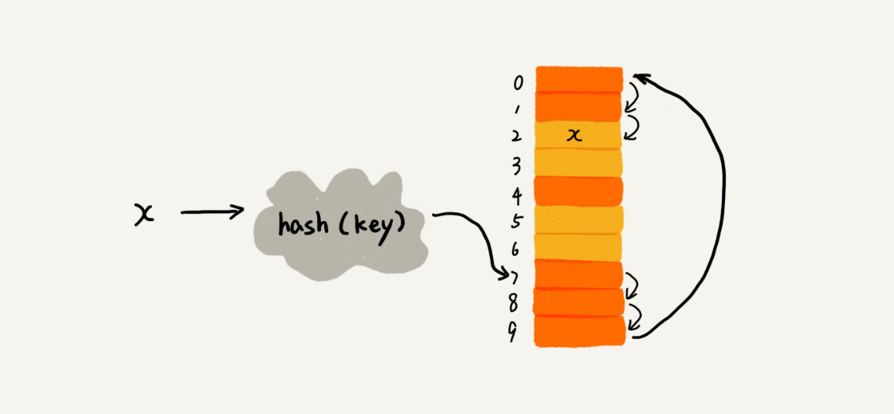
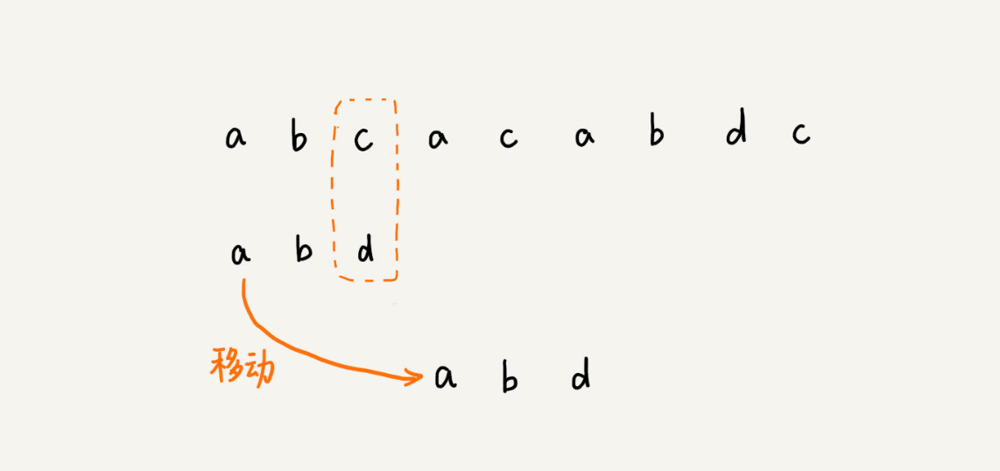

# 数据结构和算法的概念

> 广义概念

数据结构就是指一组数据的存储结构。算法就是操作数据的一组方法。

> 狭义概念

是指某些著名的数据结构和算法，比如队列、栈、堆、二分查找、动态规划等


> 为什么大部分书都把这两个东西放到一块儿来讲呢?

**数据结构是为算法服务的，算法要作用在特定的数据结构之上**


> 10个常用的数据结构

数组、链表、栈、队列、散列表、二叉树、堆、跳表、图、Trie树

> 10个常用的算法

递归，排序，二分查找，搜索，哈希算法，贪心算法，分支算法，回溯算法，动态规划，字符串匹配算法

# 复杂度分析

> 大O时间复杂度

大 O 时间复杂度实际上并不具体表示代码真正的执行时间，而是表示**代码执行时间随数据规模增长的变化趋势**，所以，也叫作**渐进时间复杂度**

## 时间复杂度分析

> 1. 只关注循环执行次数最多的一段代码

大 O 这种复杂度表示方法只是表示一种变化趋势。我们通常会忽略掉公式中的常量、低阶、系数，只需要记录一个最大阶的量级就可以了。

**我们在分析一个算法、一段代码的时间复杂度的时候，也只关注循环执行次数最多的那一段代码就可以了**


> 2. 加法法则：总复杂度等于量级最大的那段代码的复杂度


> 3. 乘法法则：嵌套代码的复杂度等于嵌套内外代码复杂度的乘积

### 几种常见时间复杂度实例分析


对于刚罗列的复杂度量级，我们可以粗略地分为两类，多项式量级和非多项式量级。其中，非多项式量级只有两个：O(2n) 和 O(n!)。

#### 1. O(1)

首先你必须明确一个概念，O(1) 只是常量级时间复杂度的一种表示方法，并不是指只执行了一行代码。比如这段代码，即便有 3 行，它的时间复杂度也是 O(1），而不是 O(3)。

```java
 int i = 8;
 int j = 6;
 int sum = i + j;
```

**一般情况下，只要算法中不存在循环语句、递归语句，即使有成千上万行的代码，其时间复杂度也是Ο(1)**

#### 2. O(logn)、O(nlogn)

对数阶时间复杂度非常常见，同时也是最难分析的一种时间复杂度。我通过一个例子来说明一下。

```java

 i=1;
 while (i <= n)  {
   i = i * 2;
 }
//x=log2n，所以，这段代码的时间复杂度就是 O(log2n)。


 i=1;
 while (i <= n)  {
   i = i * 3;
 }
//这段代码的时间复杂度就是 O(log3n)。
```

在对数阶时间复杂度的表示方法里，我们忽略对数的“底”，统一表示为 O(logn)。

#### 3. O(m+n)  O(m*n)

代码的复杂度由**两个数据的规模**来决定

```java

int cal(int m, int n) {
  int sum_1 = 0;
  int i = 1;
  for (; i < m; ++i) {
    sum_1 = sum_1 + i;
  }

  int sum_2 = 0;
  int j = 1;
  for (; j < n; ++j) {
    sum_2 = sum_2 + j;
  }

  return sum_1 + sum_2;
}
```


### 时间复杂度的情况

#### 最好时间复杂度

最好情况时间复杂度就是，在最理想的情况下，执行这段代码的时间复杂度。在数组长度为N的数组中查找某个数据，在最理想的情况下，要查找的变量 x 正好是数组的第一个元素，这个时候对应的时间复杂度就是最好情况时间复杂度。

#### 最坏时间复杂度

最坏情况时间复杂度就是，在最糟糕的情况下，执行这段代码的时间复杂度。在数组长度为N的数组中查找某个数据，如果数组中没有要查找的变量 x，我们需要把整个数组都遍历一遍才行，所以这种最糟糕情况下对应的时间复杂度就是最坏情况时间复杂度。

#### 平均时间复杂度

要查找的变量 x 在数组中的位置，有 n+1 种情况：在数组的 0～n-1 位置中和不在数组中。我们把每种情况下，查找需要遍历的元素个数累加起来，然后再除以 n+1，就可以得到需要遍历的元素个数的平均值


#### 均摊时间复杂度

均摊时间复杂度就是一种特殊的平均时间复杂度

在代码执行的所有复杂度情况中绝大部分是低级别的复杂度，个别情况是高级别复杂度且发生具有时序关系时，可以将个别高级别复杂度均摊到低级别复杂度上。基本上均摊结果就等于低级别复杂度。

## 空间复杂度分析

空间复杂度全称就是**渐进空间复杂度**（asymptotic space complexity），**表示算法的存储空间与数据规模之间的增长关系**

# 数组

> 概念

**数组（Array）**是一种**线性表**数据结构。它用一组**连续的内存空间**，来存储一组具有**相同类型**的数据。

线性表：数组，链表，队列，栈等

非线性表：二叉树，堆，树

> 数组和容器的选择？

对于业务开发，直接使用容器就足够了，省时省力。毕竟损耗一丢丢性能，完全不会影响到系统整体的性能。但如果你是做一些非常底层的开发，比如开发网络框架，性能的优化需要做到极致，这个时候数组就会优于容器，成为首选。

> 为什么数组的下标是从0开始的？

如果用 a 来表示数组的首地址，a[0]就是偏移为 0 的位置，也就是首地址，a[k]就表示偏移 k 个 type_size 的位置，所以计算 a[k]的内存地址只需要用这个公式：

```c++
a[k]_address = base_address + k * type_size
```

但是，如果数组从 1 开始计数，那我们计算数组元素 a[k]的内存地址就会变为：

```c++
a[k]_address = base_address + (k-1)*type_size
```

**从 1 开始编号，每次随机访问数组元素都多了一次减法运算，对于 CPU 来说，就是多了一次减法指令。**

# 链表

经典的链表应用场景： LRU 缓存淘汰算法


**缓存**是一种提高数据读取性能的技术，在硬件设计、软件开发中都有着非常广泛的应用，比如常见的 CPU 缓存、数据库缓存、浏览器缓存等等。


> 链表的分类

1. 单向链表
2. 循环链表
3. 双向链表（LinkedHashMap）

**对于执行较慢的程序，可以通过消耗更多的内存（空间换时间）来进行优化；而消耗过多内存的程序，可以通过消耗更多的时间（时间换空间）来降低内存的消耗。**

## 链表 VS 数组性能大比拼


数组简单易用，在实现上使用的是连续的内存空间，可以借助 CPU 的缓存机制，预读数组中的数据，所以访问效率更高。而链表在内存中并不是连续存储，所以对 CPU 缓存不友好，没办法有效预读。

## 链表代码技巧

> 技巧一：理解指针或引用的含义

将某个变量赋值给指针，实际上就是将这个变量的地址赋值给指针，或者反过来说，指针中存储了这个变量的内存地址，指向了这个变量，通过指针就能找到这个变量。

> 技巧二：警惕指针丢失和内存泄漏


> 技巧三：利用哨兵简化实现难度

如果我们引入哨兵结点，在任何时候，不管链表是不是空，head 指针都会一直指向这个哨兵结点。我们也把这种有哨兵结点的链表叫带头链表。相反，没有哨兵结点的链表就叫作不带头链表。


哨兵结点是不存储数据的。因为哨兵结点一直存在，所以插入第一个结点和插入其他结点，删除最后一个结点和删除其他结点，都可以统一为相同的代码实现逻辑了。


> 技巧四：重点留意边界条件处理


> 技巧五：举例画图，辅助思考

## 常见链表操作

### 单链表反转


### 链表中环的检测


### 两个有序的链表合并


### 删除链表倒数第n个几点


### 求链表的中间结点


# 队列

## 阻塞队列

**阻塞队列**其实就是在队列基础上增加了阻塞操作。简单来说，就是在队列为空的时候，从队头取数据会被阻塞。因为此时还没有数据可取，直到队列中有了数据才能返回；如果队列已经满了，那么插入数据的操作就会被阻塞，直到队列中有空闲位置后再插入数据，然后再返回。

## 并发队列

线程安全的队列我们叫作**并发队列**。最简单直接的实现方式是直接在 enqueue()、dequeue() 方法上加锁，但是锁粒度大并发度会比较低，同一时刻仅允许一个存或者取操作。实际上，基于数组的循环队列，利用 CAS 原子操作，可以实现非常高效的并发队列。这也是循环队列比链式队列应用更加广泛的原因。


# 递归

## 递归需要满足的三个条件

1. 一个问题的解可以分解为几个子问题的解
2. 这个问题与分解之后的子问题，除了数据规模不同，求解思路完全一样
3. 存在递归终止条件

**写递归代码的关键就是找到如何将大问题分解为小问题的规律，并且基于此写出递推公式，然后再推敲终止条件，最后将递推公式和终止条件翻译成代码**

**编写递归代码的关键是，只要遇到递归，我们就把它抽象成一个递推公式，不用想一层层的调用关系，不要试图用人脑去分解递归的每个步骤。**


## 递归的注意事项

1. 递归代码要警惕堆栈溢出
2. 递归代码要警惕重复计算


# 排序

**排序算法的执行效率：**

1. 最好情况、最坏情况、平均情况时间复杂度
2. 时间复杂度的系数、常数 、低阶
   1. 在对同一阶时间复杂度的排序算法性能对比的时候，我们就要把系数、常数、低阶也考虑进来。
3. 比较次数和交换（或移动）次数


排序算法的稳定性：

1. **稳定的排序算法**：大小相同的数值比较后位置不发生变化的排序算法。
2. **不稳定的排序算法**：大小相同的数值比较厚位置发生交换的排序算法。


>  **有序度：数组中具有有序关系的元素对的个数**

```
对应的数学表达式
有序元素对：a[i] <= a[j], 如果i < j。
```


对于一个完全有序的数组，比如 1，2，3，4，5，6，有序度就是 **n*(n-1)/2**

我们把这种完全有序的数组的有序度叫作**满有序度**。

>  **逆序度：数组中具有有序关系的元素对的个数**

```
逆序元素对：a[i] > a[j], 如果i < j。
```

**逆序度 = 满有序度 - 有序度**


## 冒泡排序

> 概念

冒泡排序只会操作相邻的两个数据。每次冒泡操作都会对相邻的两个元素进行比较，看是否满足大小关系要求。如果不满足就让它俩互换。一次冒泡会让至少一个元素移动到它应该在的位置，重复 n 次，就完成了 n 个数据的排序工作。


冒泡排序包含两个操作原子，**比较**和**交换**。每交换一次，**有序度**就加 1。不管算法怎么改进，交换次数总是确定的，即为**逆序度，也就是n*(n-1)/2–初始有序度**。


```java
    public static void sort5(int[] arr){
        boolean isExchange = true;
        for (int i = 0; i < arr.length; i++) {
            isExchange = true;
            for (int j = 0; j < arr.length-i-1 ; j++) {
                if(arr[j]>arr[j+1]){
                    int temp = arr[j];
                    arr[j] = arr[j+1];
                    arr[j+1] = temp;
                    isExchange = false;
                }
            }
            if (isExchange){
                break;
            }
            System.out.println(Arrays.toString(arr));

        }
    }
```


## 插入排序


插入算法的核心思想是取未排序区间中的元素，在已排序区间中找到合适的插入位置将其插入，并保证已排序区间数据一直有序。重复这个过程，直到未排序区间中元素为空，算法结束。

```java
    /**
     * 插入的数据从后往前的依次和前面的有序比较，如果插入数据小，则将比较的数据后移
     * @param arr
     */
    public static void sort1(int[] arr){
        for (int i = 1; i < arr.length; i++) {
            int value = arr[i];
            int j = i-1;
            for (;j>=0;j--){
                if (value<arr[j]){
                    //数据移动
                    arr[i] = arr[j];
                }else{
                    break;
                }
            }
            //插入数据
            arr[j+1] = value;
        }
    }
```

### 冒泡排序和插入排序哪个更好？

1. 冒泡排序不管怎么优化，元素交换的次数是一个固定值，是原始数据的逆序度。插入排序是同样的，不管怎么优化，元素移动的次数也等于原始数据的逆序度。**冒泡排序和插入排序元素移动的次数是一样的**
2. 从代码实现上来看，冒泡排序的数据交换要比插入排序的数据移动要复杂，冒泡排序需要 3 个赋值操作，而插入排序只需要 1 个。**插入排序每次数据交换只需要一个复制操作，所以交换的时间的总消耗实际要比冒泡排序小。**

### 希尔排序（插入排序的优化版）

> 基本思想

**希尔排序是把记录按下标的一定增量分组，对每组使用直接插入排序算法排序；随着增量逐渐减少，每组包含的关键词越来越多，当增量减至1时，整个文件恰被分成一组，算法便终止。**

```java
    /**
     * 希尔排序
     * 希尔排序是把记录按下标的一定增量分组，对每组使用直接插入排序算法排序；随着增量逐渐减少，每组包含的关键词越来越多，
     * 当增量减至1时，整个文件恰被分成一组，算法便终止
     * @param arr
     */
    public static void sort2(int[] arr){
        for(int gap = arr.length/2;gap>0;gap/=2){
            for (int i = gap; i < arr.length; i++) {
                int j = i;
                while (j-gap>=0 && arr[j]<arr[j-gap]){
                    //插入排序采用交换法
                    swap(arr,j,j-gap);
                    j-=gap;
                }
            }
        }
    }
    private static void swap(int[] arr,int a,int b){
        arr[a] = arr[a]+arr[b];
        arr[b] = arr[a]-arr[b];
        arr[a] = arr[a]-arr[b];
    }
```

为什么希尔能突破O(n2)的界，可以用逆序数来理解，假设我们要从小到大排序，一个数组中取两个元素如果前面比后面大，则为一个逆序，容易看出**排序的本质就是消除逆序数**，可以证明对于随机数组，逆序数是O(n2)的，而如果采用“交换相邻元素”的办法来消除逆序，**每次正好只消除一个**，**因此必须执行O(n2)的交换次数**，这就是为什么冒泡、插入等算法只能到平方级别的原因，反过来，**基于交换元素的排序要想突破这个下界，必须执行一些比较，交换相隔比较远的元素，使得一次交换能消除多个逆序**。


## 选择排序

选择排序算法的实现思路有点类似插入排序，也分已排序区间和未排序区间。但是选择排序每次会从未排序区间中找到最小的元素，将其放到已排序区间的末尾。


```java
    public static void sort1(int[] arr){
        for (int i = 0; i < arr.length-1; i++) {
            int index = i;
            //找到最小值
            for (int j = i+1; j < arr.length; j++) {
                if(arr[index]>arr[j]){
                    index = j;
                }
            }
            //交换数据
            if(index!=i){
                int temp = arr[index];
                arr[index] = arr[i];
                arr[i] = temp;
            }
        }
    }
```

## 冒泡，插入，选择排序的时间复杂度


## 归并排序

> 原理

如果要排序一个数组，我们先把数组从中间分成前后两部分，然后对前后两部分分别排序，再将排好序的两部分合并在一起，这样整个数组就都有序了。


归并排序使用的就是**分治思想。**

**分治是一种解决问题的处理思想，递归是一种编程技巧**

```java
    public static void sort1(int[] arr,int start,int end){
        if(start>=end){
            return;
        }
        int mid = (start+end)/2;

        //分治递归
        sort1(arr,start,mid);
        sort1(arr,mid+1,end);

        //合并数组
        int i = start;
        int j = mid+1;
        int k = 0;
        int[] temp = new int[end-start+1];
        while (i<=mid && j<=end){
            if(arr[i]<arr[j]){
                temp[k++] = arr[i++];
            }else{
                temp[k++] = arr[j++];
            }
        }
        //判断比较后是否还有剩余
        while (i<=mid){
            temp[k++] = arr[i++];
        }
        while(j<=end){
            temp[k++] = arr[j++];
        }
        //将temp的值赋值给数组
        for (int l = 0; l < end-start+1; l++) {
            arr[start+l] = temp[l];
        }

    }
```

归并排序的执行效率与要排序的原始数组的有序程度无关，所以其时间复杂度是非常稳定的，不管是最好情况、最坏情况，还是平均情况，**时间复杂度都是 O(nlogn)。**

在任意时刻，CPU 只会有一个函数在执行，也就只会有一个临时的内存空间在使用。临时内存空间最大也不会超过 n 个数据的大小，所以**空间复杂度是 O(n)。**


## 快速排序

> 原理

快排的思想是这样的：如果要排序数组中下标从 p 到 r 之间的一组数据，我们选择 p 到 r 之间的任意一个数据作为 pivot（分区点）。

我们遍历 p 到 r 之间的数据，将小于 pivot 的放到左边，将大于 pivot 的放到右边，将 pivot 放到中间。经过这一步骤之后，数组 p 到 r 之间的数据就被分成了三个部分，前面 p 到 q-1 之间都是小于 pivot 的，中间是 pivot，后面的 q+1 到 r 之间是大于 pivot 的。


归并排序的处理过程是由下到上的，先处理子问题，然后再合并。而快排正好相反，它的处理过程是由上到下的，先分区，然后再处理子问题。

```java
/**
     * 递归实现
     * @param arr
     * @param start
     * @param end
     */
    private static void quickSort(int[] arr,int start,int end){
        //递归结束条件 start大于或者等于end的时候
        if(start>=end){
            return;
        }
        //得到基准元素的位置
        int pivot = partition(arr,start,end);

        //根据基准元素，分成两部分进行递归排序
        quickSort(arr,start,pivot-1);
        quickSort(arr,pivot+1,end);
    }
    /**
     * 分治（双边循环法）
     * @param arr 待交换的数组
     * @param start 起始下标
     * @param end 结束下标
     * @return
     */
    private static int partition(int[] arr ,int start,int end){
        int pivot = arr[start];
        int left = start;
        int right = end;

        while(left<right){

            //控制right指针比较左移
            while (left<right && arr[right]>pivot){
                right--;
            }

            //控制left指针比较右移
            while(left<right && arr[left]<=pivot){
                left++;
            }

            //交换left和right指针所指向的元素
            if(left<right){
                int p = arr[left];
                arr[left] = arr[right];
                arr[right] = p;
            }
        }

        //pivot和指针重合点交换
        arr[start] = arr[left];
        arr[left] = pivot;

        return left;
    }

/**
     * 分治（单边循环法）
     * @param arr 待交换的数组
     * @param start 起始下标
     * @param end 结束下标
     * @return
     */
    private static int partition1(int[] arr,int start,int end){
        //取第一个位置（也可以随机选择位置）的元素为基准元素
        int pivot = arr[start];
        int mark = start;

        for (int i = start+1; i <= end; i++) {
            if(arr[i]<pivot){
                if (mark == i){
                    continue;
                }
                mark++;
                int p = arr[mark];
                arr[mark] = arr[i];
                arr[i] = p;
            }
        }

        arr[start] = arr[mark];
        arr[mark] = pivot;

        return mark;

    }
```


## 桶排序

> 核心思想

将要排序的数据分到几个有序的桶内，每个桶内的数据再进行单独排序。桶内排序完之后，再把每个桶内的数据按照顺序依次取出，组成的序列就是有序的了


> 局限性

- 桶排序对要排序数据的要求是非常苛刻的。

- 要排序的数据需要很容易就能划分成 m 个桶，并且，桶与桶之间有着天然的大小顺序。

- 数据在各个桶之间的分布是比较均匀的。如果数据经过桶的划分之后，有些桶里的数据非常多，有些非常少，很不平均，那桶内数据排序的时间复杂度就不是常量级了
- **桶排序比较适合用在外部排序中。**所谓的外部排序就是数据存储在外部磁盘中，数据量比较大，内存有限，无法将数据全部加载到内存中。

```java
 /**
     * 1.获取数组的最大值和最小值
     * 2.根据最大值和最小值初始化桶二维数组，以及用来记录每个桶内数据数量的数组
     * 3.将数据分值分配到各个桶中
     * 4.对桶中的数据进行快速排序
     * 5.将数据添加到原数组
     * 桶排序
     *
     * @param arr 数组
     * @param bucketSize 桶容量
     */
    public static void bucketSort(int[] arr, int bucketSize) {
        if (arr.length < 2) {
            return;
        }

        // 数组最小值
        int minValue = arr[0];
        // 数组最大值
        int maxValue = arr[1];
        for (int i = 0; i < arr.length; i++) {
            if (arr[i] < minValue) {
                minValue = arr[i];
            } else if (arr[i] > maxValue) {
                maxValue = arr[i];
            }
        }

        // 桶数量
        int bucketCount = (maxValue - minValue) / bucketSize + 1;
        int[][] buckets = new int[bucketCount][bucketSize];
        int[] indexArr = new int[bucketCount];

        // 将数组中值分配到各个桶里
        for (int i = 0; i < arr.length; i++) {
            int bucketIndex = (arr[i] - minValue) / bucketSize;
            if (indexArr[bucketIndex] == buckets[bucketIndex].length) {
                ensureCapacity(buckets, bucketIndex);
            }
            buckets[bucketIndex][indexArr[bucketIndex]++] = arr[i];
        }

        // 对每个桶进行排序，这里使用了快速排序
        int k = 0;
        for (int i = 0; i < buckets.length; i++) {
            if (indexArr[i] == 0) {
                continue;
            }
            quickSortC(buckets[i], 0, indexArr[i] - 1);
            for (int j = 0; j < indexArr[i]; j++) {
                arr[k++] = buckets[i][j];
            }
        }
    }

    /**
     * 数组扩容
     *
     * @param buckets
     * @param bucketIndex
     */
    private static void ensureCapacity(int[][] buckets, int bucketIndex) {
        int[] tempArr = buckets[bucketIndex];
        int[] newArr = new int[tempArr.length * 2];
        for (int j = 0; j < tempArr.length; j++) {
            newArr[j] = tempArr[j];
        }
        buckets[bucketIndex] = newArr;
    }

    /**
     * 快速排序递归函数
     *
     * @param arr
     * @param p
     * @param r
     */
    private static void quickSortC(int[] arr, int p, int r) {
        if (p >= r) {
            return;
        }

        int q = partition(arr, p, r);
        quickSortC(arr, p, q - 1);
        quickSortC(arr, q + 1, r);
    }

    /**
     * 分区函数
     *
     * @param arr
     * @param p
     * @param r
     * @return 分区点位置
     */
    private static int partition(int[] arr, int p, int r) {
        int pivot = arr[r];
        int i = p;
        for (int j = p; j < r; j++) {
            if (arr[j] <= pivot) {
                swap(arr, i, j);
                i++;
            }
        }

        swap(arr, i, r);
        return i;
    }

    /**
     * 交换
     *
     * @param arr
     * @param i
     * @param j
     */
    private static void swap(int[] arr, int i, int j) {
        if (i == j) {
            return;
        }

        int tmp = arr[i];
        arr[i] = arr[j];
        arr[j] = tmp;
    }
```


## 计数排序

**计数排序其实是桶排序的一种特殊情况**


**计数排序只能用在数据范围不大的场景中，如果数据范围 k 比要排序的数据 n 大很多，就不适合用计数排序了。而且，计数排序只能给非负整数排序，如果要排序的数据是其他类型的，要将其在不改变相对大小的情况下，转化为非负整数。**


```java
public static int[] countSort1(int[] array){
        //1.得到数列的最小值和最大值
        int max = array[0];
        int min = array[0];
        for (int i = 0; i < array.length; i++) {
            if(array[i]>max){
                max = array[i];
            }
            if(array[i]<min){
                min = array[i];
            }
        }

        int d = max-min;
        //2.创建统计数组，并统计对应元素的个数
        int[] countArray = new int[d+1];
        for (int i = 0; i < array.length; i++) {
            countArray[array[i]-min]++;
        }
        System.out.println("2--countArray:"+Arrays.toString(countArray));
        //3.统计数组做变形，后面的元素等于前面的元素之和
        for (int i = 1; i < countArray.length; i++) {
            countArray[i] += countArray[i-1];
        }
        System.out.println("3--countArray:"+Arrays.toString(countArray));
        //4.倒序遍历原始数列，从统计组中找到正确位置，输出到结果数组
        int[] sortArray = new int[array.length];
        for (int i = array.length-1; i >=0 ; i--) {
            System.out.println("4--countArray:"+Arrays.toString(countArray));
            System.out.println("4--sortArray:"+Arrays.toString(sortArray));
            System.out.println("4--i:"+i);

            sortArray[countArray[array[i]-min]-1] = array[i];
            countArray[array[i]-min]--;

            System.out.println("-------------------------");
        }
        System.out.println("4--countArray:"+Arrays.toString(countArray));
        System.out.println("4--sortArray:"+Arrays.toString(sortArray));
        return sortArray;
    }
```


## 基数排序（Radix sort）

基数排序对要排序的数据是有要求的，需要可以分割出独立的“位”来比较，而且位之间有递进的关系，如果 a 数据的高位比 b 数据大，那剩下的低位就不用比较了。除此之外，每一位的数据范围不能太大，要可以用线性排序算法来排序，否则，基数排序的时间复杂度就无法做到 O(n) 了。


```java
/**
     * 1.获取数组的最大值
     * 2.从个位开始，对数组按照“指数”进行排序
     * @param arr
     */
    public static void radixSort(int[] arr){
        int max = arr[0];
        for (int i = 0; i < arr.length; i++) {
            if (arr[i]>max){
                max = arr[i];
            }
        }

        //从个位开始，对数组按照“指数”进行排序
        for(int exp = 1;max/exp>0;exp*=10){

        }
    }

    /**
     * 计数排序-对数组按照“某个位数”进行排序
     * @param arr
     * @param exp
     */
    public static void countingSort(int[] arr,int exp){
        if (arr.length<=1){
            return;
        }

        //计算每个元素的个数
        int[] c = new int[10];
        for (int i = 0; i < arr.length; i++) {
            c[(arr[i]/exp)%10]++;
        }

        //计算排序后的位置
        for (int i = 1; i < c.length; i++) {
            c[i]+=c[i-1];
        }

        //临时数组r 存储排序之后的结果
        int[] r = new int[arr.length];
        for (int i = arr.length-1; i >=0 ; i--) {
            r[c[(arr[i]/exp)%10]-1] = arr[i];
            c[(arr[i]/exp)%10] --;
        }

        for (int i = 0; i < arr.length; i++) {
            arr[i] = r[i];
        }

    }
```


## 如何选择合适的排序算法


根据不同的需求场景，选择使用不同的排序算法


## Arrays.sort() 源码解析

1. 排序分区的数组长度小于286，大于47使用快速排序（双轴排序，选两个分区点进行排序）
2. 排序分区的数组长度大于286使用的是归并排序
3. 排序分区的数组长度小于47使用插入排序


> 优点

**1.对于小数组来说，插入排序效率更高，每次递归到小于47的大小时，用插入排序代替快排，明显提升了性能。
2.双轴快排使用两个pivot，每轮把数组分成3段，在没有明显增加比较次数的情况下巧妙地减少了递归次数。
3.pivot的选择上增加了随机性，却没有带来随机数的开销。
4.对重复数据进行了优化处理，避免了不必要交换和递归。**


# 二分查找（Binary Search）

> 二分查找应用场景的局限性

1. 二分查找依赖的是顺序表结构，简单点说就是数组
2. 二分查找针对的是有序数据。
3. 数据量太小不适合二分查找。

```java
   public static int search(int[] array,int value){
        int low = 0;
        int high = array.length-1;

        while (low<=high){
            int mid = low+(high-low)>>1;
            if(array[mid] == value){
                return mid;
            }else if(array[mid]>value){
                high = mid-1;
            }else{
                low = mid+1;
            }
        }
        return -1;
    }
```


> 如何编程实现“求一个数的平方根”？要求精确到小数点后 6 位。

```java
public static double squareRoot(double num,double precision){
        double low,high,mid,tmp;
        if (num>1){
            low = 1;
            high = num;
        }else{
            low = num;
            high = 1;
        }
        while (low<=high){
            mid = low+(high-low)/2.000;
            tmp = mid*mid;
            if(tmp-num<=precision && tmp-num >= precision*-1){
                return mid;
            }else if (tmp >num){
                high = mid;
            }else{
                low = mid;
            }
        }

        return -1.000;
    }
```

## 常见的二分查找变形问题

> 查找第一个值等于给定值的元素

```java
    public static int search1(int[] array,int value){
        int low = 0;
        int high = array.length-1;

        while (low<=high){
            int mid = low+((high-low)>>1);

            if(array[mid]>value){
                high = mid-1;
            }else if(array[mid]<value){
                low = mid+1;
            }else{
                if(mid == 0 || array[mid-1]!=value){
                    return mid;
                }else {
                    high = mid-1;
                }
            }
        }
        return -1;
    }
```


>查找最后一个值等于给定值的元素

```java
    /**
     * 查找最后一个值等于给定值的元素
     * @param array
     * @param value
     * @return
     */
    public static int search2(int[] array,int value){
        int low = 0;
        int high = array.length-1;

        while (low<=high){
            int mid = low+((high-low)>>1);

            if(array[mid]>value){
                high = mid-1;
            }else if(array[mid]<value){
                low = mid+1;
            }else{
                if(mid+1<= array.length-1 && array[mid+1]!=value){
                    return mid;
                }else {
                    low = mid+1;
                }
            }
        }
        return -1;
    }
```


> 查找第一个大于等于给定值的元素

```java
/**
     * 查找第一个大于等于给定值的元素
     * @param array
     * @param value
     * @return
     */
        public static int search3(int[] array,int value){
        int low = 0;
        int high = array.length-1;

        while (low<=high){
            int mid = low+((high-low)>>1);

            if(array[mid]>=value){
                if(mid == 0 || array[mid-1] < value){
                    return mid;
                }else{
                    high = mid-1;
                }
            }else {
                low = mid+1;
            }
        }
        return -1;
    }
```


> 查找最后一个小于等于给定值的元素

```java
/**
     * 查找最后一个小于等于给定值的元素
     * @param array
     * @param value
     * @return
     */
    public static int search4(int[] array,int value) {
        int low = 0;
        int high = array.length - 1;

        while (low <= high) {
            int mid = low + ((high - low) >> 1);

            if (array[mid] <= value) {
                if(mid  == array.length-1 || array[mid+1]>value){
                    return mid;
                }else{
                    low = mid + 1;
                }
                
            } else {
                high = mid - 1;
            }

        }
        return -1;
    }
```


# 跳表（Skip list）

是一种各方面性能都比较优秀的动态数据结构，可以支持快速地插入、删除、查找操作，写起来也不复杂，甚至可以替代红黑树（Red-black tree）。

**这种链表加多级索引的结构，就是跳表**


在跳表中查询任意数据的时间复杂度就是 O(logn)

实际上，在软件开发中，我们不必太在意索引占用的额外空间。在讲数据结构和算法时，我们习惯性地把要处理的数据看成整数，但是在实际的软件开发中，原始链表中存储的有可能是很大的对象，而索引结点只需要存储关键值和几个指针，并不需要存储对象，所以当对象比索引结点大很多时，那索引占用的额外空间就可以忽略了。


跳表更容易代码实现。虽然跳表的实现也不简单，但比起红黑树来说还是好懂、好写多了，而简单就意味着可读性好，不容易出错。还有，跳表更加灵活，它可以通过改变索引构建策略，有效平衡执行效率和内存消耗。


跳表也不能完全替代红黑树。因为红黑树比跳表的出现要早一些，很多编程语言中的 Map 类型都是通过红黑树来实现的。我们做业务开发的时候，直接拿来用就可以了，不用费劲自己去实现一个红黑树，但是跳表并没有一个现成的实现，所以在开发中，如果你想使用跳表，必须要自己实现。


> Redis 为什么使用跳表？

Redis 中的有序集合是通过跳表来实现的，严格点讲，其实还用到了散列表。不过散列表我们后面才会讲到，所以我们现在暂且忽略这部分。

如果你去查看 Redis 的开发手册，就会发现，Redis 中的有序集合支持的核心操作主要有下面这几个：

- 插入一个数据；
- 删除一个数据；
- 查找一个数据；
- 按照区间查找数据（比如查找值在[100, 356]之间的数据）；
- 迭代输出有序序列。


其中，插入、删除、查找以及迭代输出有序序列这几个操作，红黑树也可以完成，时间复杂度跟跳表是一样的。但是，按照区间来查找数据这个操作，红黑树的效率没有跳表高。对于按照区间查找数据这个操作，跳表可以做到 O(logn) 的时间复杂度定位区间的起点，然后在原始链表中顺序往后遍历就可以了。这样做非常高效。


# 散列表（Hash Table）

散列表用的是数组支持按照下标随机访问数据的特性，所以散列表其实就是数组的一种扩展，由数组演化而来。可以说，如果没有数组，就没有散列表。


散列表用的就是数组支持按照下标随机访问的时候，时间复杂度是 O(1) 的特性。我们通过散列函数把元素的键值映射为下标，然后将数据存储在数组中对应下标的位置。当我们按照键值查询元素时，我们用同样的散列函数，将键值转化数组下标，从对应的数组下标的位置取数据。


## 散列函数

散列函数，顾名思义，它是一个函数。我们可以把它定义成 hash(key)，其中 key 表示元素的键值，hash(key) 的值表示经过散列函数计算得到的散列值。


> 散列函数设计的基本要求

1. 散列函数计算得到的散列值是一个非负整数
2. 如果 key1 = key2，那 hash(key1) == hash(key2)；
3. 如果 key1 ≠ key2，那 hash(key1) ≠ hash(key2)。

## 散列冲突

再好的散列函数也无法避免散列冲突。那究竟该如何解决散列冲突问题呢？我们常用的散列冲突解决方法有两类，**开放寻址法（open addressing）**和**链表法（chaining）**。

### 1.开放寻址法

开放寻址法的核心思想是，如果出现了散列冲突，我们就重新探测一个空闲位置，将其插入。

> **线性探测法**

当我们往散列表中插入数据时，如果某个数据经过散列函数散列之后，存储位置已经被占用了，我们就从当前位置开始，依次往后查找，看是否有空闲位置，直到找到为止。




> 二次探测法

所谓二次探测，跟线性探测很像，线性探测每次探测的步长是 1，那它探测的下标序列就是 hash(key)+0，hash(key)+1，hash(key)+2……而二次探测探测的步长就变成了原来的“二次方”，也就是说，它探测的下标序列就是 hash(key)+0，hash(key)+12，hash(key)+22……


> 双重散列

所谓双重散列，意思就是不仅要使用一个散列函数。我们使用一组散列函数 hash1(key)，hash2(key)，hash3(key)……我们先用第一个散列函数，如果计算得到的存储位置已经被占用，再用第二个散列函数，依次类推，直到找到空闲的存储位置。


### 2.链表法

链表法是一种更加常用的散列冲突解决办法，相比开放寻址法，它要简单很多。我们来看这个图，在散列表中，每个“桶（bucket）”或者“槽（slot）”会对应一条链表，所有散列值相同的元素我们都放到相同槽位对应的链表中。


### 思考题

> 假设我们有 10 万条 URL 访问日志，如何按照访问次数给 URL 排序？

遍历 10 万条数据，以 URL 为 key，访问次数为 value，存入散列表，同时记录下访问次数的最大值 K，时间复杂度 O(N)。

如果 K 不是很大，可以使用桶排序，时间复杂度 O(N)。如果 K 非常大（比如大于 10 万），就使用快速排序，复杂度 O(NlogN)。


> 有两个字符串数组，每个数组大约有 10 万条字符串，如何快速找出两个数组中相同的字符串？

以第一个字符串数组构建散列表，key 为字符串，value 为出现次数。再遍历第二个字符串数组，以字符串为 key 在散列表中查找，如果 value 大于零，说明存在相同字符串。时间复杂度 O(N)。

## 如何打造一个工业级水平的散列表？

>如何设计散列函数？

首先，**散列函数的设计不能太复杂**。过于复杂的散列函数，势必会消耗很多计算时间，也就间接地影响到散列表的性能。其次，**散列函数生成的值要尽可能随机并且均匀分布**，这样才能避免或者最小化散列冲突，而且即便出现冲突，散列到每个槽里的数据也会比较平均，不会出现某个槽内数据特别多的情况。

> 装载因子过大了怎么办？

如果内存空间不紧张，对执行效率要求很高，可以降低负载因子的阈值；相反，如果内存空间紧张，对执行效率要求又不高，可以增加负载因子的值，甚至可以大于 1。

> 如何避免低效的扩容？

为了解决一次性扩容耗时过多的情况，我们可以将扩容操作穿插在插入操作的过程中，分批完成。当装载因子触达阈值之后，我们只申请新空间，但并不将老的数据搬移到新散列表中。

当有新数据要插入时，我们将新数据插入新散列表中，并且从老的散列表中拿出一个数据放入到新散列表。每次插入一个数据到散列表，我们都重复上面的过程。经过多次插入操作之后，老的散列表中的数据就一点一点全部搬移到新散列表中了。这样没有了集中的一次性数据搬移，插入操作就都变得很快了。


> 如何选择冲突解决方法？

Java 中 LinkedHashMap 就采用了链表法解决冲突，ThreadLocalMap 是通过线性探测的开放寻址法来解决冲突。

**开放寻址法的优点：**

1. 散列表中的数据都存储在数组中，可以有效地利用 CPU 缓存加快查询速度。
2. 这种方法实现的散列表，序列化起来比较简单

**开放寻址法的缺点：**

1. 用开放寻址法解决冲突的散列表，删除数据的时候比较麻烦，需要特殊标记已经删除掉的数据。
2. 使用开放寻址法解决冲突的散列表，装载因子的上限不能太大。这也导致这种方法比链表法更浪费内存空间。

**当数据量比较小、装载因子小的时候，适合采用开放寻址法。这也是 Java 中的ThreadLocalMap使用开放寻址法解决散列冲突的原因。**


**链表法的优点：**

1. 链表法对内存的利用率比开放寻址法要高
2. 链表法比起开放寻址法，对大装载因子的容忍度更高

**链表法的缺点：**

1. 链表因为要存储指针，所以对于比较小的对象的存储，是比较消耗内存的，还有可能会让内存的消耗翻倍
2. 因为链表中的结点是零散分布在内存中的，不是连续的，所以对 CPU 缓存是不友好的，这方面对于执行效率也有一定的影响。

**基于链表的散列冲突处理方法比较适合存储大对象、大数据量的散列表，而且，比起开放寻址法，它更加灵活，支持更多的优化策略，比如用红黑树代替链表。**


## HashMap分析

>1. 初始大小

HashMap 默认的初始大小是 16，当然这个默认值是可以设置的，如果事先知道大概的数据量有多大，可以通过修改默认初始大小，减少动态扩容的次数，这样会大大提高 HashMap 的性能。

> 2. 装载因子和动态扩容

最大装载因子默认是 0.75，当 HashMap 中元素个数超过 0.75*capacity（capacity 表示散列表的容量）的时候，就会启动扩容，每次扩容都会扩容为原来的两倍大小。


> 3. 散列冲突解决方法

在 JDK1.8 版本中，为了对 HashMap 做进一步优化，我们引入了红黑树。而当链表长度太长（默认超过 8）时，链表就转换为红黑树。我们可以利用红黑树快速增删改查的特点，提高 HashMap 的性能。当红黑树结点个数少于 8 个的时候，又会将红黑树转化为链表。因为在数据量较小的情况下，红黑树要维护平衡，比起链表来，性能上的优势并不明显。


> 4. 散列函数

```java

int hash(Object key) {
    int h = key.hashCode()；
    return (h ^ (h >>> 16)) & (capicity -1); //capicity表示散列表的大小
}
```

其中，hashCode() 返回的是 Java 对象的 hash code。比如 String 类型的对象的 hashCode() 就是下面这样：

```java

public int hashCode() {
  int var1 = this.hash;
  if(var1 == 0 && this.value.length > 0) {
    char[] var2 = this.value;
    for(int var3 = 0; var3 < this.value.length; ++var3) {
      var1 = 31 * var1 + var2[var3];
    }
    this.hash = var1;
  }
  return var1;
}
```


# 哈希算法

将任意长度的二进制值串映射为固定长度的二进制值串，这个映射的规则就是**哈希算法**，而通过原始数据映射之后得到的二进制值串就是**哈希值**。

> 一个合格的哈希算法应该具有的要求

- 从哈希值不能反向推导出原始数据（所以哈希算法也叫单向哈希算法）
- 对输入数据非常敏感，哪怕原始数据只修改了一个 Bit，最后得到的哈希值也大不相同
- 散列冲突的概率要很小，对于不同的原始数据，哈希值相同的概率非常小
- 哈希算法的执行效率要尽量高效，针对较长的文本，也能快速地计算出哈希值


> 哈希算法的应用

- 安全加密
- 唯一标识
- 数据校验
- 散列函数
- 负载均衡
- 数据分片
- 分布式存储


加salt，也可理解为为密码加点佐料后再进行hash运算。比如原密码是123456，不加盐的情况加密后假设是是xyz。 黑客拿到脱机的数据后，通过彩虹表匹配可以轻松破解常用密码。如果加盐，密码123456加盐后可能是12ng34qq56zz，再对加盐后的密码进行hash后值就与原密码hash后的值完全不同了。而且加盐的方式有很多种，可以是在头部加，可以在尾部加，还可在内容中间加，甚至加的盐还可以是随机的。这样即使用户使用的是最常用的密码，黑客拿到密文后破解的难度也很高。


## 应用一：安全加密

最常用于加密的哈希算法是 **MD5**（MD5 Message-Digest Algorithm，MD5 消息摘要算法）和 **SHA**（Secure Hash Algorithm，安全散列算法）。


加密的哈希算法来说，有两点格外重要。第一点是很难根据哈希值反向推导出原始数据，第二点是散列冲突的概率要很小。

即便哈希算法存在散列冲突的情况，但是因为哈希值的范围很大，冲突的概率极低，所以相对来说还是很难破解的


## 应用二：唯一标识

我们知道，任何文件在计算中都可以表示成二进制码串，所以，比较笨的办法就是，拿要查找的图片的二进制码串与图库中所有图片的二进制码串一一比对。如果相同，则说明图片在图库中存在。但是，每个图片小则几十 KB、大则几 MB，转化成二进制是一个非常长的串，比对起来非常耗时。有没有比较快的方法呢？

我们可以给每一个图片取一个唯一标识，或者说信息摘要。比如，我们可以从图片的二进制码串开头取 100 个字节，从中间取 100 个字节，从最后再取 100 个字节，然后将这 300 个字节放到一块，通过哈希算法（比如 MD5），得到一个哈希字符串，用它作为图片的唯一标识。通过这个唯一标识来判定图片是否在图库中，这样就可以减少很多工作量。


## 应用三：数据校验

我们通过哈希算法，对 100 个文件块分别取哈希值，并且保存在种子文件中。我们在前面讲过，哈希算法有一个特点，对数据很敏感。只要文件块的内容有一丁点儿的改变，最后计算出的哈希值就会完全不同。所以，当文件块下载完成之后，我们可以通过相同的哈希算法，对下载好的文件块逐一求哈希值，然后跟种子文件中保存的哈希值比对。如果不同，说明这个文件块不完整或者被篡改了，需要再重新从其他宿主机器上下载这个文件块。


## 应用四：散列函数

散列函数中用到的散列算法，更加关注散列后的值是否能平均分布，也就是，一组数据是否能均匀地散列在各个槽中。除此之外，散列函数执行的快慢，也会影响散列表的性能，所以，散列函数用的散列算法一般都比较简单，比较追求效率。


## 应用五：负载均衡

我们可以通过哈希算法，对客户端 IP 地址或者会话 ID 计算哈希值，将取得的哈希值与服务器列表的大小进行取模运算，最终得到的值就是应该被路由到的服务器编号。 这样，我们就可以把同一个 IP 过来的所有请求，都路由到同一个后端服务器上。


## 应用六：数据分片


## 思考题

> 区块链使用的是哪种哈希算法吗？是为了解决什么问题而使用的呢？

- 对于区块链来讲，首先它的数据是一个一个的区块，区块由区块头和区块体组成
- 区块头里有很多摘要信息：前一个区块的哈希值, 梅克尔根等等
- 区块体包含很多的事务数据(交易事务)
- 区块之间是由前序和后序之间环环相扣的一个链接
- 所有的区块链系统不管是用的什么不一样的密码算法、共识机制、脚本系统等, 它在区块链这样一个存储结构上是完全一致的。


# 树（Tree）

A 节点就是 B 节点的**父节点**，B 节点是 A 节点的**子节点**。B、C、D 这三个节点的父节点是同一个节点，所以它们之间互称为**兄弟节点**。我们把没有父节点的节点叫做**根节点**，也就是图中的节点 E。我们把没有子节点的节点叫做**叶子节点**或者**叶节点**，比如图中的 G、H、I、J、K、L 都是叶子节点。


关于“树”，还有三个比较相似的概念：**高度**（Height）、**深度**（Depth）、**层**（Level）。它们的定义是这样的：


在我们的生活中，“高度”这个概念，其实就是从下往上度量，比如我们要度量第 10 层楼的高度、第 13 层楼的高度，起点都是地面。所以，树这种数据结构的高度也是一样，从最底层开始计数，并且计数的起点是 0。

“深度”这个概念在生活中是从上往下度量的，比如水中鱼的深度，是从水平面开始度量的。所以，树这种数据结构的深度也是类似的，从根结点开始度量，并且计数起点也是 0。

“层数”跟深度的计算类似，不过，计数起点是 1，也就是说根节点位于第 1 层。


## 二叉树（Binary Tree）


编号 2 的二叉树中，叶子节点全都在最底层，除了叶子节点之外，每个节点都有左右两个子节点，这种二叉树就叫做**满二叉树**。


编号 3 的二叉树中，叶子节点都在最底下两层，最后一层的叶子节点都靠左排列，并且除了最后一层，其他层的节点个数都要达到最大，这种二叉树叫做**完全二叉树**。

### 二叉树的遍历

- 前序遍历是指，对于树中的任意节点来说，先打印这个节点，然后再打印它的左子树，最后打印它的右子树。
- 中序遍历是指，对于树中的任意节点来说，先打印它的左子树，然后再打印它本身，最后打印它的右子树。
- 后序遍历是指，对于树中的任意节点来说，先打印它的左子树，然后再打印它的右子树，最后打印这个节点本身。


```
前序遍历的递推公式：
preOrder(r) = print r->preOrder(r->left)->preOrder(r->right)

中序遍历的递推公式：
inOrder(r) = inOrder(r->left)->print r->inOrder(r->right)

后序遍历的递推公式：
postOrder(r) = postOrder(r->left)->postOrder(r->right)->print r
```


## 二叉查找树（Binary Search Tree）

**二叉查找树要求，在树中的任意一个节点，其左子树中的每个节点的值，都要小于这个节点的值，而右子树节点的值都大于这个节点的值。**


**中序遍历二叉查找树，可以输出有序的数据序列，时间复杂度是 O(n)，非常高效。**


很多时候，在实际的软件开发中，我们在二叉查找树中存储的，是一个包含很多字段的对象。我们利用对象的**某个字段**作为键值（key）来构建二叉查找树。我们把对象中的其他字段叫作**卫星数据**。


> 如何求一棵包含 n 个节点的完全二叉树的高度？

树的高度就等于最大层数减一，为了方便计算，我们转换成层来表示。从图中可以看出，包含 n 个节点的完全二叉树中，第一层包含 1 个节点，第二层包含 2 个节点，第三层包含 4 个节点，依次类推，下面一层节点个数是上一层的 2 倍，第 K 层包含的节点个数就是 2^(K-1)。

不过，对于完全二叉树来说，最后一层的节点个数有点儿不遵守上面的规律了。它包含的节点个数在 1 个到 2^(L-1) 个之间（我们假设最大层数是 L）。如果我们把每一层的节点个数加起来就是总的节点个数 n。也就是说，如果节点的个数是 n，那么 n 满足这样一个关系

```
n >= 1+2+4+8+...+2^(L-2)+1
n <= 1+2+4+8+...+2^(L-2)+2^(L-1)
```

借助等比数列的求和公式，我们可以计算出，L 的范围是[log2(n+1), log2n +1]。完全二叉树的层数小于等于 log2n +1，也就是说，**完全二叉树的高度小于等于 log2n。**


> 有高效的散列表之后，为什么还需要二叉树？

- 散列表中的数据是无序存储的，如果要输出有序的数据，需要先进行排序。而对于二叉查找树来说，我们只需要中序遍历，就可以在 O(n) 的时间复杂度内，输出有序的数据序列。
- 散列表扩容耗时很多，而且当遇到散列冲突时，性能不稳定，尽管二叉查找树的性能不稳定，但是在工程中，我们最常用的平衡二叉查找树的性能非常稳定，时间复杂度稳定在 O(logn)。
- 笼统地来说，尽管散列表的查找等操作的时间复杂度是常量级的，但因为哈希冲突的存在，这个常量不一定比 logn 小，所以实际的查找速度可能不一定比 O(logn) 快。加上哈希函数的耗时，也不一定就比平衡二叉查找树的效率高。
- 散列表的构造比二叉查找树要复杂，需要考虑的东西很多。比如散列函数的设计、冲突解决办法、扩容、缩容等。平衡二叉查找树只需要考虑平衡性这一个问题，而且这个问题的解决方案比较成熟、固定。

> 如何通过编程，求出一棵给定二叉树的确切高度呢？

确定二叉树高度有两种思路：第一种是深度优先思想的递归，分别求左右子树的高度。当前节点的高度就是左右子树中较大的那个+1；第二种可以采用层次遍历的方式，每一层记录都记录下当前队列的长度，这个是队尾，每一层队头从0开始。然后每遍历一个元素，队头下标+1。直到队头下标等于队尾下标。这个时候表示当前层遍历完成。每一层刚开始遍历的时候，树的高度+1。最后队列为空，就能得到树的高度。

```java
    public static int findTreeHigh(Node node){

        if (node.left == null && node.right == null){
            return 1;
        }
        //求左子树的高度
        int leftHigh = 0;
        if(node.left!=null){
            leftHigh = findTreeHigh(node.left);
        }
        int rightHigh = 0;
        //求右子树的高度
        if(node.right != null){
            rightHigh = findTreeHigh(node.right);
        }
        return leftHigh>rightHigh?leftHigh+1:rightHigh+1;
    }
```


## 红黑树

官方讲解文档：https://algs4.cs.princeton.edu/33balanced/


**平衡二叉树**的严格定义是这样的：二叉树中任意一个节点的左右子树的高度相差不能大于 1


**从任一节点到其每个叶子的所有简单路径都包含相同数目的黑色节点**，**因为红色节点是可以与其父节点合并为一个3-节点的，红黑树实现的其实是一个完美的黑色平衡，如果你将红黑树中所有的红色链接放平，那么它所有的叶子节点到根节点的距离都是相同的。**


但是很多平衡二叉查找树其实并没有严格符合上面的定义（树中任意一个节点的左右子树的高度相差不能大于 1），比如我们下面要讲的红黑树，它从根节点到各个叶子节点的最长路径，有可能会比最短路径大一倍。

**发明平衡二叉查找树这类数据结构的初衷是，解决普通二叉查找树在频繁的插入、删除等动态更新的情况下，出现时间复杂度退化的问题。**


顾名思义，红黑树中的节点，一类被标记为黑色，一类被标记为红色。除此之外，一棵红黑树还需要满足这样几个要求：

- 根节点是黑色的；
- 每个叶子节点都是黑色的空节点（NIL），也就是说，叶子节点不存储数据；
- 任何相邻的节点都不能同时为红色，也就是说，红色节点是被黑色节点隔开的；
- 每个节点，从该节点到达其可达叶子节点的所有路径，都包含相同数目的黑色节点；


AVL 树是一种高度平衡的二叉树，所以查找的效率非常高，但是，有利就有弊，AVL 树为了维持这种高度的平衡，就要付出更多的代价。每次插入、删除都要做调整，就比较复杂、耗时。所以，对于有频繁的插入、删除操作的数据集合，使用 AVL 树的代价就有点高了。

红黑树只是做到了近似平衡，并不是严格的平衡，所以在维护平衡的成本上，要比 AVL 树要低。

所以，红黑树的插入、删除、查找各种操作性能都比较稳定。对于工程应用来说，要面对各种异常情况，为了支撑这种工业级的应用，我们更倾向于这种性能稳定的平衡二叉查找树。


> AVL 树的高度平衡是怎么实现的，红黑树的近似平衡和AVL树的高度平衡有什么区别？


# 堆和堆排序

堆是一种特殊的树。什么样的树才是堆。

- 堆是一个完全二叉树；
- 堆中每一个节点的值都必须大于等于（或小于等于）其子树中每个节点的值。

对于每个节点的值都大于等于子树中每个节点值的堆，我们叫做**“大顶堆”**。对于每个节点的值都小于等于子树中每个节点值的堆，我们叫做**“小顶堆”**。

## 如何实现一个堆

> **向堆中插入数据**

- 向堆中插入数据时，会需要进行一部分的调整，让其满足堆的特性，调整的过程叫做**堆化**
- 堆化分为两种，**从下往上**以及**从上往下**
  - 从下往上堆化，就是顺着节点的路径向上依次比较，互换
  - 从上往下堆化，就是顺着节点的路径向下依次比较，互换

```java
/**
 * 堆中插入数据
 *
 */
public class Heap {
  private int[] a; // 数组，从下标1开始存储数据
  private int n;  // 堆可以存储的最大数据个数
  private int count; // 堆中已经存储的数据个数

  public Heap(int capacity) {
    a = new int[capacity + 1];
    n = capacity;
    count = 0;
  }

  public void insert(int data) {
    if (count >= n) return; // 堆满了
    ++count;
    a[count] = data;
    int i = count;
    while (i/2 > 0 && a[i] > a[i/2]) { // 自下往上堆化
      swap(a, i, i/2); // swap()函数作用：交换下标为i和i/2的两个元素
      i = i/2;
    }
  }
 }
```

> **删除堆顶元素**

- 删除对顶元素时，可以先将最后一个元素放置到堆顶元素，然后从堆顶开始从上到下的堆化调整

```java

public void removeMax() {
  if (count == 0) return -1; // 堆中没有数据
  a[1] = a[count];
  --count;
  heapify(a, count, 1);
}

private void heapify(int[] a, int n, int i) { // 自上往下堆化
  while (true) {
    int maxPos = i;
    if (i*2 <= n && a[i] < a[i*2]) maxPos = i*2;
    if (i*2+1 <= n && a[maxPos] < a[i*2+1]) maxPos = i*2+1;
    if (maxPos == i) break;
    swap(a, i, maxPos);
    i = maxPos;
  }
}

```

## 如何基于堆实现排序

堆排序的过程大致可以分为两个步骤，`建堆`和`排序`

> 建堆

- 第一种方式，假设起初堆中只包含一个数据，就是下标为 1 的数据。然后，我们调用前面讲的插入操作，将下标从 2 到 n 的数据依次插入到堆中。这样我们就将包含 n 个数据的数组，组织成了堆。
- 第一种建堆思路的处理过程是从前往后处理数组数据，并且每个数据插入堆中时，都是从下往上堆化
- 第二种方式是对于数组，从第一个非叶子节点开始从上往下堆化
- 第二种实现思路，是从后往前处理数组，并且每个数据都是从上往下堆化。

```java

/**
 * 第二种建堆方式
 */
private static void buildHeap(int[] a, int n) {
  for (int i = n/2; i >= 1; --i) {
    heapify(a, n, i);
  }
}

private static void heapify(int[] a, int n, int i) {
  while (true) {
    int maxPos = i;
    if (i*2 <= n && a[i] < a[i*2]) maxPos = i*2;
    if (i*2+1 <= n && a[maxPos] < a[i*2+1]) maxPos = i*2+1;
    if (maxPos == i) break;
    swap(a, i, maxPos);
    i = maxPos;
  }
}
```

`堆排序的建堆过程的时间复杂度是 O(n)`

> 排序

建堆结束之后，数组中的数据已经是按照大顶堆的特性来组织的。数组中的第一个元素就是堆顶，也就是最大的元素。我们把它跟最后一个元素交换，那最大元素就放到了下标为 n 的位置。


```java

// n表示数据的个数，数组a中的数据从下标1到n的位置。
public static void sort(int[] a, int n) {
  buildHeap(a, n);
  int k = n;
  while (k > 1) {
    swap(a, 1, k);
    --k;
    heapify(a, k, 1);
  }
}

```


整个堆排序的过程，都只需要极个别临时存储空间，所以堆排序是原地排序算法。堆排序包括建堆和排序两个操作，建堆过程的时间复杂度是 O(n)，排序过程的时间复杂度是 O(nlogn)，所以，堆排序整体的时间复杂度是 O(nlogn)。


**堆排序不是稳定的排序算法**，因为在排序的过程，存在将堆的最后一个节点跟堆顶节点互换的操作，所以就有可能改变值相同数据的原始相对顺序。


## 在实际开发中，为什么快速排序要比堆排序性能好？

1. 堆排序数据访问方式没有快速排序友好，快速排序的数据访问方式是顺序访问的，堆排序的访问方式是跳着访问的，对CPU缓存不是很友好
2. 对于同样的数据，在排序的过程中，堆排序算法的数据交换次数要多于快速排序

## 堆的应用场景


# 图

## 如何理解图

树中的元素我们称为节点，图中的元素我们就叫做**顶点（vertex）**。从我画的图中可以看出来，图中的一个顶点可以与任意其他顶点建立连接关系。我们把这种建立的关系叫做**边（edge）**，定点相连接的变数叫做定点的**度（degree）**

> 无向图


> 有向图


在有向图中，我们把度分为**入度（In-degree）**和**出度（Out-degree）**。

- 顶点的入度，表示有多少条边指向这个顶点；
- 顶点的出度，表示有多少条边是以这个定点为起点指向其他定点

> 带权图


在带权图中，每一条边都有一个**权重（Wright）**，我们可以通过权重表示顶点之间的关系

## 邻接矩阵存储方法

图最直观的一种存储方法就是，**邻接矩阵（Adjacency Matrix）**。

邻接矩阵的底层依赖一个二维数组

- 对于无向图而言，如果顶点 i 和顶点 j 之间有边，我们就把A [i] [j] 和 A [j] [i] 标记为1
- 对于有向图而言，如果有一个箭头是从顶点 i 指向 顶点 j ，我们就把A [i] [j] 标记为1
- 对于带权图而言，数据中就存储对应的权重


## 邻接表存储方法

每个顶点对应一条链表，链表中存储的是与这个顶点相连接的其他顶点。


# 深度和广度优先搜索

深度优先搜索和广度优先搜索算法都是基于`图`的


```java

public class Graph { // 无向图
  private int v; // 顶点的个数
  private LinkedList<Integer> adj[]; // 邻接表

  public Graph(int v) {
    this.v = v;
    adj = new LinkedList[v];
    for (int i=0; i<v; ++i) {
      adj[i] = new LinkedList<>();
    }
  }

  public void addEdge(int s, int t) { // 无向图一条边存两次
    adj[s].add(t);
    adj[t].add(s);
  }
}
```

## 广度优先搜索（BFS）

广度优先搜索（Breadth-First-Search），其实是一种“地毯式”的层层递进的搜索策略，即先查找距离顶点最近的，然后是次近的，依次往外搜索。


```java
/**
     * 广度优先搜索
     * 搜索从s到t的路径，就是求从s到t的最短路径
     * @param s
     * @param t
     */
    public void bfs(int s, int t) {
        if (s == t){
            return;
        }
        //定义一个顶点个数大小的  boolean数据，用来记录被访问的顶点，避免顶点被重复访问
        //如果顶点q被访问了就会设置为true
        boolean[] visited = new boolean[v];
        visited[s]=true;
        //queue 是一个队列，用来存储已经被访问、但相连的顶点还没有被访问的顶点
        Queue<Integer> queue = new LinkedList<>();
        queue.add(s);
        //prev 用来记录搜索路径  假如 2 的 下一个连接顶点是3   那么prev[3] = 2。
        int[] prev = new int[v];

        for (int i = 0; i < v; ++i) {
            prev[i] = -1;
        }

        while (queue.size() != 0) {
            int w = queue.poll();
            //循环这个顶点相连的顶点
            for (int i = 0; i < adj[w].size(); ++i) {
                //获取顶点w 相连的顶点 q
                int q = adj[w].get(i);
                //判断q是否被访问过
                if (!visited[q]) {
                    prev[q] = w;
                    if (q == t) {
                        print(prev, s, t);
                        return;
                    }
                    visited[q] = true;
                    queue.add(q);
                }
            }
        }
    }

    private void print(int[] prev, int s, int t) { // 递归打印s->t的路径
        if (prev[t] != -1 && t != s) {
            print(prev, s, prev[t]);
        }
        System.out.print(t + " ");
    }
```


最坏情况下，终止顶点 t 离起始顶点 s 很远，需要遍历完整个图才能找到。这个时候，每个顶点都要进出一遍队列，每个边也都会被访问一次，所以，广度优先搜索的时间复杂度是 O(V+E)，其中，V 表示顶点的个数，E 表示边的个数。当然，对于一个连通图来说，也就是说一个图中的所有顶点都是连通的，E 肯定要大于等于 V-1，所以，**广度优先搜索的时间复杂度也可以简写为 O(E)**。


广度优先搜索的空间消耗主要在几个辅助变量 visited 数组、queue 队列、prev 数组上。这三个存储空间的大小都不会超过顶点的个数，**所以空间复杂度是 O(V)。**


## 深度优先搜索

深度优先搜索（Depth-First-Search），简称 DFS。最直观的例子就是“走迷宫”。


```java
/**
     * 全局变量或者类成员变量
     * 标识目标订单是否被发现
     */
    boolean found = false;

    public void dfs(int s, int t) {
        found = false;
        //用来记录被访问的订单
        boolean[] visited = new boolean[v];
        //用来记录当前顶点的路径,假如 2 的 下一个连接顶点是3   那么prev[3] = 2。
        int[] prev = new int[v];
        for (int i = 0; i < v; ++i) {
            prev[i] = -1;
        }
        recurDfs(s, t, visited, prev);
        print(prev, s, t);
    }

    private void recurDfs(int w, int t, boolean[] visited, int[] prev) {
        if (found == true){ return;}
        visited[w] = true;
        if (w == t) {
            found = true;
            return;
        }
        for (int i = 0; i < adj[w].size(); ++i) {
            //获取当前顶点关联的顶点
            int q = adj[w].get(i);
            if (!visited[q]) {
                prev[q] = w;
                recurDfs(q, t, visited, prev);
            }
        }
    }
```

每条边最多会被访问两次，一次是遍历，一次是回退。所以，图上的深度优先搜索算法的**时间复杂度是 O(E)**，E 表示边的个数。

深度优先搜索算法的消耗内存主要是 visited、prev 数组和递归调用栈。visited、prev 数组的大小跟顶点的个数 V 成正比，递归调用栈的最大深度不会超过顶点的个数，所以**总的空间复杂度就是 O(V)**。


# 字符串匹配基础

## BF算法

BF 算法中的 BF 是 Brute Force 的缩写，中文叫作暴力匹配算法

我们在字符串 A 中查找字符串 B，那字符串 A 就是**主串**，字符串 B 就是**模式串**。我们把主串的长度记作 n，模式串的长度记作 m。因为我们是在主串中查找模式串，所以 n>m。


尽管理论上，BF 算法的时间复杂度很高，是 O(n*m)，但在实际的开发中，它却是一个比较常用的字符串匹配算法。

- 第一，实际的软件开发中，大部分情况下，模式串和主串的长度都不会太长。而且每次模式串与主串中的子串匹配的时候，当中途遇到不能匹配的字符的时候，就可以就停止了，不需要把 m 个字符都比对一下。所以，尽管理论上的最坏情况时间复杂度是 O(n*m)，但是，统计意义上，大部分情况下，算法执行效率要比这个高很多。
- 朴素字符串匹配算法思想简单，代码实现也非常简单。简单意味着不容易出错，如果有 bug 也容易暴露和修复。在工程中，在满足性能要求的前提下，简单是首选。这也是我们常说的KISS（Keep it Simple and Stupid）设计原则。


## RK算法

RK 算法的全称叫 Rabin-Karp 算法，其实就是刚刚讲的 BF 算法的升级版。

RK 算法的思路是这样的：我们通过哈希算法对主串中的 n-m+1 个子串分别求哈希值，然后逐个与模式串的哈希值比较大小。如果某个子串的哈希值与模式串相等，那就说明对应的子串和模式串匹配了（这里先不考虑哈希冲突的问题，后面我们会讲到）。因为哈希值是一个数字，数字之间比较是否相等是非常快速的，所以模式串和子串比较的效率就提高了。


## BM算法

BM（Boyer-Moore）算法。它是一种非常高效的字符串匹配算法，有实验统计，它的性能是著名的KMP 算法的 3 到 4 倍。

BM算法的核心思想：

- 我们把主串和模式串匹配的时候，当主串中出现的某个字符，模式串中没有时，就可以将模式串直接后移到珠串这个字符的后面再进行比较




BM 算法包含两部分，分别是坏字符规则（bad character rule）和好后缀规则（good suffix shift）。

### 坏字符规则

我们从模式串的末尾往前倒着匹配，当我们发现某个字符没法匹配的时候。我们把这个没有匹配的字符叫作坏字符（主串中的字符）。


我们拿坏字符 c 在模式串中查找，发现模式串中并不存在这个字符，也就是说，字符 c 与模式串中的任何字符都不可能匹配。这个时候，我们可以将模式串直接往后滑动三位，将模式串滑动到 c 后面的位置，再从模式串的末尾字符开始比较。


这个时候，我们发现，模式串中最后一个字符 d，还是无法跟主串中的 a 匹配，这个时候，还能将模式串往后滑动三位吗？答案是不行的。因为这个时候，坏字符 a 在模式串中是存在的，模式串中下标是 0 的位置也是字符 a。这种情况下，我们可以将模式串往后滑动两位，让两个 a 上下对齐，然后再从模式串的末尾字符开始，重新匹配。


当发生不匹配的时候，我们把坏字符对应的模式串中的字符下标记作 si。如果坏字符在模式串中存在，我们把这个坏字符在模式串中的下标记作 xi。如果不存在，我们把 xi 记作 -1。那模式串往后移动的位数就等于 si-xi。（注意，我这里说的下标，都是字符在模式串的下标）。


### 好后缀规则

我们把已经匹配的 bc 叫作好后缀，记作{u}。我们拿它在模式串中查找，如果找到了另一个跟{u}相匹配的子串{u*}，那我们就将模式串滑动到子串{u*}与主串中{u}对齐的位置。


如果在模式串中找不到另一个等于{u}的子串，我们就直接将模式串，滑动到主串中{u}的后面，因为之前的任何一次往后滑动，都没有匹配主串中{u}的情况。


### BM 算法的实现

坏字符规则

```java

public int bm(char[] a, int n, char[] b, int m) {
  int[] bc = new int[SIZE]; // 记录模式串中每个字符最后出现的位置
  generateBC(b, m, bc); // 构建坏字符哈希表
  int i = 0; // i表示主串与模式串对齐的第一个字符
  while (i <= n - m) {
    int j;
    for (j = m - 1; j >= 0; --j) { // 模式串从后往前匹配
      if (a[i+j] != b[j]) break; // 坏字符对应模式串中的下标是j
    }
    if (j < 0) {
      return i; // 匹配成功，返回主串与模式串第一个匹配的字符的位置
    }
    // 这里等同于将模式串往后滑动j-bc[(int)a[i+j]]位
    i = i + (j - bc[(int)a[i+j]]); 
  }
  return -1;
}


private static final int SIZE = 256; // 全局变量或成员变量
private void generateBC(char[] b, int m, int[] bc) {
  for (int i = 0; i < SIZE; ++i) {
    bc[i] = -1; // 初始化bc
  }
  for (int i = 0; i < m; ++i) {
    int ascii = (int)b[i]; // 计算b[i]的ASCII值
    bc[ascii] = i;
  }
}
```


## KMP算法

https://time.geekbang.org/column/article/71845?utm_campaign=guanwang&utm_source=baidu-ad&utm_medium=ppzq-pc&utm_content=title&utm_term=baidu-ad-ppzq-title


# Trie树：如何实现搜索引擎的搜索关键词提示功能？


Trie 树，也叫“字典树”。顾名思义，它是一个树形结构。它是一种专门处理字符串匹配的数据结构，用来解决在一组字符串集合中快速查找某个字符串的问题。

我们有 6 个字符串，它们分别是：how，hi，her，hello，so，see。我们希望在里面多次查找某个字符串是否存在。如果每次查找，都是拿要查找的字符串跟这 6 个字符串依次进行字符串匹配，那效率就比较低，有没有更高效的方法呢？

这个时候，我们就可以先对这 6 个字符串做一下预处理，组织成 Trie 树的结构，之后每次查找，都是在 Trie 树中进行匹配查找。Trie 树的本质，就是利用字符串之间的公共前缀，将重复的前缀合并在一起。最后构造出来的就是下面这个图中的样子。


Trie 树主要有两个操作

- 一个是将字符串集合构造成 Trie 树。这个过程分解开来的话，就是一个将字符串插入到 Trie 树的过程。
- 另一个是在 Trie 树中查询一个字符串。

## 如何存储一个 Trie 树？

字符串中只有从 a 到 z 这 26 个小写字母，我们在数组中下标为 0 的位置，存储指向子节点 a 的指针，下标为 1 的位置存储指向子节点 b 的指针，以此类推，下标为 25 的位置，存储的是指向的子节点 z 的指针。如果某个字符的子节点不存在，我们就在对应的下标的位置存储 null。

```java

class TrieNode {
  char data;
  TrieNode children[26];
}
```

当我们在 Trie 树中查找字符串的时候，我们就可以通过字符的 ASCII 码减去“a”的 ASCII 码，迅速找到匹配的子节点的指针。比如，d 的 ASCII 码减去 a 的 ASCII 码就是 3，那子节点 d 的指针就存储在数组中下标为 3 的位置中。

```java

public class Trie {
  private TrieNode root = new TrieNode('/'); // 存储无意义字符

  // 往Trie树中插入一个字符串
  public void insert(char[] text) {
    TrieNode p = root;
    for (int i = 0; i < text.length; ++i) {
      int index = text[i] - 'a';
      if (p.children[index] == null) {
        TrieNode newNode = new TrieNode(text[i]);
        p.children[index] = newNode;
      }
      p = p.children[index];
    }
    p.isEndingChar = true;
  }

  // 在Trie树中查找一个字符串
  public boolean find(char[] pattern) {
    TrieNode p = root;
    for (int i = 0; i < pattern.length; ++i) {
      int index = pattern[i] - 'a';
      if (p.children[index] == null) {
        return false; // 不存在pattern
      }
      p = p.children[index];
    }
    if (p.isEndingChar == false) return false; // 不能完全匹配，只是前缀
    else return true; // 找到pattern
  }

  public class TrieNode {
    public char data;
    public TrieNode[] children = new TrieNode[26];
    public boolean isEndingChar = false;
    public TrieNode(char data) {
      this.data = data;
    }
  }
}
```


